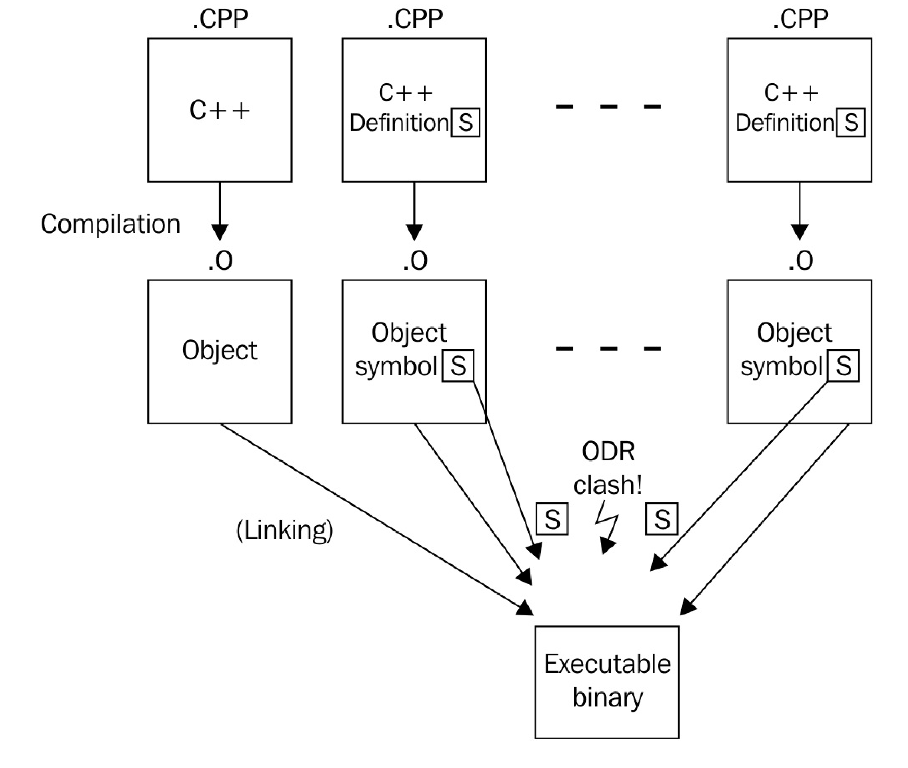

# 只有头文件的库中启用内联变量

这种库在声明函数时，始终是内联的，C++17中允许声明内联变量。C++17之前只能使用其他变通的方法实现内联变量，新标准的支持让实现只有头文件的库更加的容易。

## How  it's done...

本节中，我们创建一个类，可以作为典型头文件库的成员。其目的就是给定一个静态成员，然后使用`inline`关键字对其进行修饰，使得其实例在全局范围内都能访问到，在C++17之前这样做是不可能的。

1. `process_monitor`类必须包含一个静态成员，并且能全局访问。当该单元被重复包含时，会产生符号重定义的问题。

   ```c++
   // foo_lib.hpp
   class process_monitor {
   public:
   static const std::string standard_string{
       "some static globally available string"};
   };
   process_monitor global_process_monitor;
   ```

2. 多个`.cpp`文件中包含这个头文件时，链接阶段会出错。为了修复这个问题，添加了`inline`关键字：

   ```c++
   // foo_lib.hpp
   class process_monitor {
   public:
   static const inline std::string standard_string{
       "some static globally available string"};
   };
   inline process_monitor global_process_monitor;
   ```

 瞧，就是这样！

## How it works...

C++程序通常都有多个C++源文件组成(其以`.cpp`或`.cc`结尾)。这些文件会单独编译成模块/二进制文件(通常以`.o`结尾)。链接所有模块/二进制文件形成一个单独的可执行文件，或是动态库/静态库则是编译的最后一步。

当链接器发现一个特定的符号，被定义了多次时就会报错。举个栗子，现在我们有一个函数声明`int foo();`，当我们在两个模块中定义了同一个函数，那么哪一个才是正确的呢？链接器自己不能做主。这样没错，但是这也可能不是开发者想看到的。

为了能提供全局可以使用的方法，通常会在头文件中定义函数，这可以让C++的所有模块都调用头文件中函数的实现(C++中，头文件中实现的函数，编译器会隐式的使用inline来进行修饰，从而避免符号重复定义的问题)。这样就可以将函数的定义单独的放入模块中。之后，就可以安全的将这些模块文件链接在一起了。这种方式也被称为[**定义与单一定义规则**](http://zh.cppreference.com/w/cpp/language/definition)(ODR，One Definition Rule)。看了下图或许能更好的理解这个规则：



如果这是唯一的方法，就不需要只有头文件的库了。只有头文件的库非常方便，因为只需要使用`#include`语句将对应的头文件包含入C++源文件/头文件中后，就可以使用这个库了。当提供普通库时，开发者需要编写相应的编译脚本，以便连接器将库模块链接在一起，形成对应的可执行文件。这种方式对于很小的库来说是不必要的。

对于这样例子，`inline`关键字就能解决不同的模块中使用同一符号采用不同实现的方式。当连接器找到多个具有相同签名的符号时，这些函数定义使用`inline`进行声明，链接器就会选择首先找到的那个实现，然后认为其他符号使用的是相同的定义。所有使用`inline`定义的符号都是完全相同的，对于开发者来说这应该是常识。

我们的例子中，连接器将会在每个模块中找到`process_monitor::standard_string`符号，因为这些模块包含了`foo_lib.hpp`。如果没有了`inline`关键字，连接器将不知道选择哪个实现，所以其会将编译过程中断并报错。同样的原理也适用于`global_process_monitor`符号。

使用`inline`声明所有符号之后，连接器只会接受其找到的第一个符号，而将后续该符号的不同实现丢弃。

C++17之前，解决的方法是通过额外的C++模块文件提供相应的符号，这将迫使我们的库用户强制在链接阶段包含该文件。

传统的`inline`关键字还有另外一种功能。其会告诉编译器，可以通过实现直接放在调用它的地方来消除函数调用的过程。这样的话，代码中的函数调用会减少，这样我们会认为程序会运行的更快。如果函数非常短，那么生成的程序段也会很短(假设函数调用也需要若干个指令，保护现场等操作，其耗时会高于实际工作的代码)。当内联函数非常长，那么二进制文件的大小就会变得很大，有时并无法让代码运行的更快。因此，编译器会将`inline`关键字作为一个提示，可能会对内联函数消除函数调用。当然，编译器也会将一些函数进行内联，尽管开发者没有使用`inline`进行提示。

## There's more...

C++17之前的解决方法就是将对应函数声明为静态函数，这个函数会返回某个静态对象的引用：

```c++
class foo{
public:
    static std::string& standard_string(){
        static std::string s{"some standard string"};
        return s;
    }    
};
```

通过这种方式，将头文件包含在多个模块中是完全合法的，但仍然可以访问相同的实例。不过，对象并没有在程序开始时立即构造，而是在第一次调用这个获取函数时才进行构造。对于一些特定的情况来说，这也个问题。假设我们想要在程序开始时就构造静态和全局函数，从而完成一些比较重要的事情(就和我们的例程库一样)，不过当程序运行后，在调用时去构造这些对象，就会带来比较大的性能开销。

另一个解决方法是将非模板类看做一个模板类，因此非模板类也适用于这项规则。

不过，以上的两种策略在C++17中不太适用了，C++17已经使用新的`inline`完美解决。

