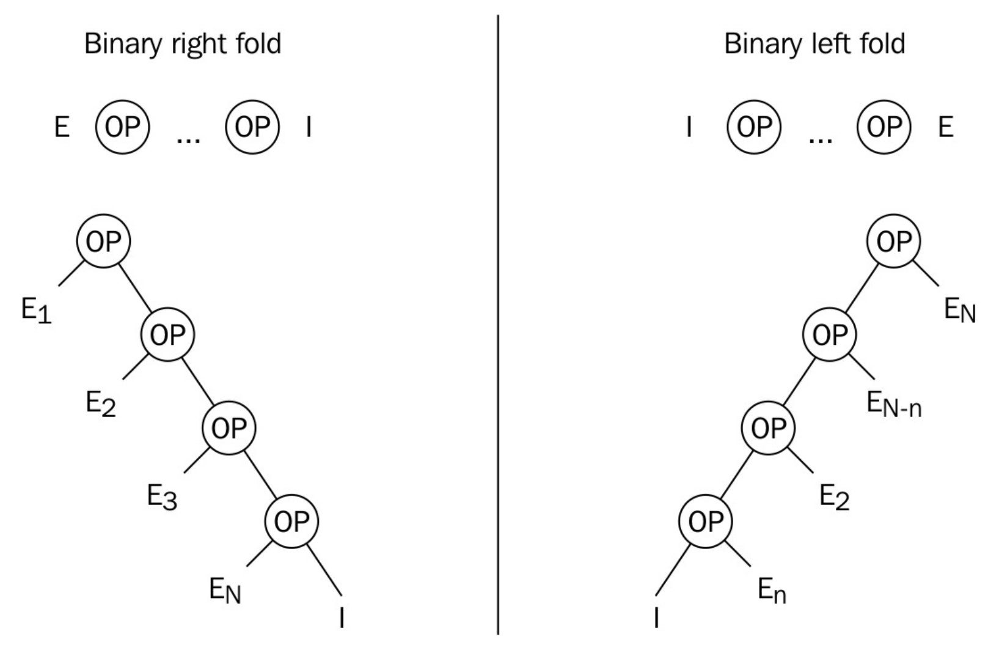

# 使用折叠表达式实现辅助函数

自C++11起，加入了变长模板参数包，能让函数结构任意数量的参数。有时，这些参数都组合成一个表达式，从中得出函数结果。C++17中使用折叠表达式，可以让这项任务变得更加简单。

## How to do it...

首先，实现一个函数，用于将所有参数进行累加：

1. 声明该函数：

   ```c++
   template <typename ... Ts>
   auto sum(Ts ... ts);
   ```

2. 那么现在我们拥有一个参数包`ts`，并且函数必须将参数包展开，然后使用表达式进行求和。如果我们对这些参数进行某个操作(比如：加法)，那么为了将这个操作应用于该参数包，就需要使用括号将表达式包围：

   ```c++
   template<typename ... Ts>
   auto sum(Ts ... ts){
   	return (ts + ...);
   }
   ```

3. 现在我们可以调用这个函数：

   ```c++
   int the_sum {sum(1, 2, 3, 4, 5)}; // value: 15
   ```

4. 这个操作不仅对`int`类型起作用，我们能对任何支持加号的类型使用这个函数，比如`std::string`:

   ```c++
   std::string a{"Hello "};
   std::string b{"World"};

   std::cout << sum(a, b) << '\n'; // output: Hello World
   ```

## How it works...

这里只是简单的对参数集进行简单的递归，然后应用二元操作符`+`将每个参数加在一起。这称为折叠操作。C++17中添加了**折叠表达式**，其能用更少的代码量，达到相同的结果。

其中有种称为**一元折叠**的表达式。C++17中的折叠参数包支持如下二元操作符：`+` `-` ` *` `/` `%` `^` `&` `|` `=` `<` `>` `<<` `>>` `+=` `-= ` `*=` `/=` `%= ` `^=` `&=` `|=` `<<=` `>>=` `==` `!=` `<=` `>=` `&&` `||` `, ` `.*` `->*`。

这样的话，在我们的例子中表达式`(ts+...)`和`(...+ts)`等价。不过，对于某些其他的例子，这就所有不同了——当`...`在操作符右侧时，称为有“右折叠”；当`...`在操作符左侧时，称为”左折叠“。

我们sum例子中，一元左折叠的扩展表达式为`1+(2+(3+(4+5)))`，一元右折叠的扩展表达式为`(((1+2)+3)+4)+5`。根据操作符的使用，我们就能看出差别。当用来进行整数相加，那么就没有区别。

## There's more...

如果在调用sum函数的时候没有传入参数，那么可变参数包中就没有可以被折叠的参数。对于大多数操作来说，这将导致错误(对于一些例子来说，可能会是另外一种情况，我们后面就能看到)。这时我们就需要决定，这时一个错误，还是返回一个特定的值。如果是特定值，显而易见应该是0。

如何返回一个特定值：

```c++
template <typenme ... Ts>
auto sume(Ts ... ts){
	return (ts + ... + 0);
}
```

`sum()`会返回0，`sum(1, 2, 3)`返回`(1+(2+(3+0)))`。这样具有初始值的折叠表达式称为**二元折叠**。

当我们写成`(ts + ... + 0)`或`(0 + ... + ts)`时，不同的写法就会让二元折叠表达式处于不同的位置(二元右折叠或二元左折叠)。下图可能更有助于理解左右二元折叠：



为了应对无参数传入的情况，我们使用二元折叠表达式，这里标识元素这个概念很重要——本例中，将0加到其他数字上不会有任何改变，那么0就一个标识元素。因为有这个属性，对于加减操作来说，可以将0添加入任何一个折叠表达式，当参数包中没有任何参数时，我们将返回0。从数学的角度来看，这没问题。但从工程的角度，我们需要根据我们需求，定义什么是正确的。

同样的原理也适用于乘法。这里，标识元素为1：

```c++
template <typename ... Ts>
auto product(Ts ... ts){
	return (ts * ... * 1);
}
```

`product(2, 3)`的结果是6，`product()`的结果是1。

逻辑操作符`and(&&)`和`or(||)`具有内置的标识元素。`&&`操作符为true，`||`操作符为false。

对于逗号表达式来说，其标识元素为`void()`。

为了更好的理解这特性，让我们可以使用这个特性来实现的辅助函数。

**匹配范围内的单个元素**

如何告诉函数在一定范围内，我们提供的可变参数至少包含一个值：

```c++
template <typename R, typename ... Ts>
auto matches(const R& range, Ts ... ts)
{
	return (std::count(std::begin(range), std::end(range), ts) + ...);
}
```

辅助函数中使用STL中的`std::count`函数。这个函数需要三个参数：前两个参数定义了迭代器所要遍历的范围，第三个参数则用于与范围内的元素进行比较。`std::count`函数会返回范围内与第三个参数相同元素的个数。

在我们的折叠表达式中，我们也会将开始和结束迭代器作为确定范围的参数传入`std::count`函数。不过，对于第三个参数，我们将会每次从参数包中放入一个不同参数。最后，函数会将结果相加返回给调用者。

可以这样使用:

```c++
std::vector<int> v{1, 2, 3, 4, 5};

matches(v, 2, 5); // return 2
matches(v, 100, 200); // return 0
matches("abcdefg", 'x', 'y', 'z'); // return 0
matches("abcdefg", 'a', 'b', 'f'); // return 3
```

如我们所见，`matches`辅助函数十分灵活——可以直接传入`vector`或`string`直接调用。其对于初始化列表也同样适用，也适用于`std::list`，`std::array`，`std::set`等STL容器的实例。

**检查集合中的多个插入操作是否成功**

我们完成了一个辅助函数，用于将任意数量参数插入`std::set`实例中，并且返回是否所有插入操作都成功完成：

```c++
template <typename T, typename ... Ts>
bool insert_all(T &set, Ts ... ts)
{
	return (set.insert(ts).second && ...);
}
```

那么这个函数如何工作呢？`std::set`的`insert`成员函数声明如下：

```c++
std::pair<iterator, bool> insert(const value_type& value);
```

手册上所述，当我们使用`insert`函数插入一个元素时，该函数会使用一个包含一个迭代器和一个布尔值的组对作为返回值。当该操作成功，那么迭代器指向的就是新元素在`set`实例中的位置。否则，迭代器指向某个已经存在的元素，这个元素与插入项有冲突。

我们的辅助函数在完成插入后，会访问`.second`区域，这里的布尔值反映了插入操作成功与否。如果所有插入操作都为true，那么都是成功的。折叠标识使用逻辑操作符`&&`链接所有插入结果的状态，并且返回计算之后的结果。

可以这样使用它：

```c++
std::set<int> my_set{1, 2, 3};

insert_all(my_set, 4, 5, 6); // Returns true
insert_all(my_set, 7, 8, 2); // Returns false, because the 2 collides
```

需要注意的是，当在插入3个元素时，第2个元素没有插入成功，那么`&&`会根据短路特性，终止插入剩余元素：

```c++
std::set<int> my_set{1, 2, 3};

insert_all(my_set, 4, 2, 5); // Returns flase
// set contains {1, 2, 3, 4} now, without the 5!
```

**检查所有参数是否在范围内**

当要检查多个变量是否在某个范围内时，可以多次使用查找单个变量是否在某个范围的方式。这里我们可以使用折叠表达式进行表示：

```c++
template <typename T, typename ... Ts>
bool within(T min, T max, Ts ...ts)
{
	return ((min <= ts && ts <= max) && ...);
}
```

表达式`(min <= ts && ts <= max) `将会告诉调用者参数包中的每一个元素是否在这个范围内。我们使用`&&`操作符对每次的结果进行处理，从而返回最终的结果。

如何使用这个辅助函数：

```c++
within(10, 20, 1, 15, 30); // --> false
within(10, 20, 11, 12, 13); // --> true
within(5.0, 5.5, 5.1, 5.2, 5.3) // --> true
```

这个函数也是很灵活的，其只需要传入的参数类型可以进行比较，且支持`<=`操作符即可。并且该规则对于`std::string`都是适用的：

```c++
std::string aaa {"aaa"};
std::string bcd {"bcd"};
std::string def {"def"};
std::string zzz {"zzz"};

within(aaa, zzz, bcd, def); // --> true
within(aaa, def, bcd, zzz); // --> false
```

**将多个元素推入vector中**

可以编写一个辅助函数，不会减少任何结果，又能同时处理同一类的多个操作。比如向`std::vector`传入元素:

```c++
template <typename T, typename ... Ts>
void insert_all(std::vector<T> &vec, Ts ... ts){
	(vec.push_back(ts), ...);
}

int main(){
	std::vector<int> v{1, 2, 3};
	insert_all(v, 4, 5, 6);
}
```

需要注意的是，使用了逗号操作符将参数包展开，然后推入vector中。该函数也不惧空参数包，因为逗号表达式具有隐式标识元素，`void()`可以翻译为*什么都没做*。

