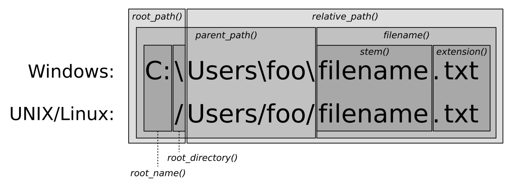

# 使用相对路径获取规范的文件路径

上一节中，我们对路径进行了标准化输出。使用了`filesystem::path`类，并且了解了如何获取路径，并进行检查，以及其他一些原理性的东西。也能帮助我们将字符串组成路径，从而对路径进行再次解析。

`path`已经将操作系统的一些细节为我们进行了封装，不过我们还是需要了解一些细节。

本节我们也将了解到，如何将绝对路径和相对路径进行合并和分解。

## How to do it...

本节中，我们将围绕着相对路径和绝对路径进行，从而了解`path`类的有时，以及其对应的辅助函数。

1. 包含必要的头文件，并声明所使用的命名空间：

   ```c++
   #include <iostream>
   #include <filesystem>
   
   using namespace std;
   using namespace filesystem;
   ```

2. 然后，我们实例化一个`path`对象。不过这次，路径中的文件是否存在就没有那么重要了。这里有些函数，在文件不存在的时候会抛出异常。

   ```c++
   int main()
   {
   	path p {"testdir/foobar.txt"};
   ```

3. 现在我们来了解一下不同的文件系统库函数。`current_path`将返回我们执行程序的路径，也就是工作目录。`absolute`能接受一个相对地址，就像我们定义的`p`一样。`system_complete`在Linux，MacOS和类UNIX操作系统上与`absolute`的功能相同。在Windows下我们将获取一个带有盘符(比如`c:`)的绝对地址。`canonical`与`absolute`的功能相同，不过其删除了所有的`.`和`..`。我们可以使用如下的方式使用这些函数：

   ```c++
       cout << "current_path : " << current_path()
            << "\nabsolute_path : " << absolute(p)
            << "\nsystem_complete : " << system_complete(p)
            << "\ncanonical(p) : " << canonical(p)
            << '\n';
   ```

4. `path`另一个优势在于，其对`/`操作符进行了重载。通过这种方式我们可以连接文件夹和文件。让我们组合一个，然后进行打印：

   ```c++
   	cout << path{"testdir"} / "foobar.txt" << '\n';
   ```

5. 我们将`canonical`与合并的路径一起使用。通过给定`canonical`一个相对地址，比如`"foobar.txt"`，和一个合并的绝对地址`current_path() / "testdir"`，其将会返回给我们一个绝对地址。在另一个调用中，我们给定我么的路径为`p`(假设为`  "testdir/foobar.txt"`)，并且通过`current_path()`获取当前位置的绝对路径，我们这里就使用`"testdir" `好了。其结果与` current_path()`相同，因为间接获得了绝对地址。在这两次调用中，`canonical`将会返回给我们相同的绝对地址：

   ```c++
   cout << "canonical testdir : "
        << canonical("foobar.txt",
       			 current_path() / "testdir")
        << "\ncanonical testdir 2 : "
        << canonical(p, current_path() / "testdir/..")
        << '\n';
   ```

6. 我们也可以对两个非标准化的路径进行比较。`equivalence`能接受两个路径，并在内部将两个路径进行标准化，如果这两个路径相同，就会返回true，否则会返回false。这个例子中，相应的路径必须存在，否则就会抛出一个异常：

   ```c++
       cout << "equivalence: "
            << equivalent("testdir/foobar.txt",
                          "testdir/../testdir/foobar.txt")
            << '\n';
   }
   ```

7. 编译并运行代码，将会得到如下的输出。`current_path()`会返回我笔记本上的HOME目录，因为我在这个路径下执行的程序。相对路径`p`会通过 `absolute_path`，`system_complete`和`canonical`预先进行准备。我们能看到`absolute_path`和`system_complete`的结果都一样，因为我使用的是Mac系统。在使用Windows操作系统的机器上，`system_complete`将会前置一个`C:`，或者是工作路径的磁盘盘符：

   ```c++
   $ ./canonical_filepath
   current_path: "/Users/tfc"
   absolute_path : "/Users/tfc/testdir/foobar.txt"
   system_complete : "/Users/tfc/testdir/foobar.txt"
   canonical(p): "/Users/tfc/testdir/foobar.txt"
   "testdir/foobar.txt"
   canonical testdir : "/Users/tfc/testdir/foobar.txt"
   canonical testdir 2 : "/Users/tfc/testdir/foobar.txt"
   equivalence: 1
   ```

8. 这个简单的程序中，就不对异常进行处理了。当从`testdir`文件夹中将`foobar.txt`文件删除时，程序将因为抛出异常的原因而终止。`canonical`函数需要路径真实存在。还有一个`weakly_canonical`，但其不符合我们的要求。

   ```c++
   $ ./canonial_filepath
   current_path: "/Users/tfc"
   absolute_path : "/Users/tfc/testdir/foobar.txt"
   system_complete : "/Users/tfc/testdir/foobar.txt"
   terminate called after throwing an instance of
   'std::filesystem::v1::__cxx11::filesystem_error'
   what():filesystem error: cannot canonicalize:
   No such file or directory [testdir/foobar.txt] [/Users/tfc]
   ```

## How it works...

本节的目的就是如何快速的组成新的路径。其主要还有通过`path`类重载的`/`操作符来完成。另外，文件系统函数的相对路径和绝对路径是一致的，并且路径中包含`.`和`..`。

很多函数会返回一个转换或未转换的`path`实例。我们不会将所有函数都列在这里，如果想要了解它们，去看下C++手册是个不错的选择。

`path`类中有很多的成员函数，很值得一看。让我们来了解一下，对于一个路径来说，成员函数返回的是哪一部分。下面的图就为我们描述了在Windows和UNIX/Linux下，对应函数所返回的路径：



这样我们就能很容易的了解到，`path`的那个函数返回的是绝对地址。相对地址中，`root_path`，`root_name` 和 `root_directory`部分都空的。`relative_path`将会返回一个相对地址。


