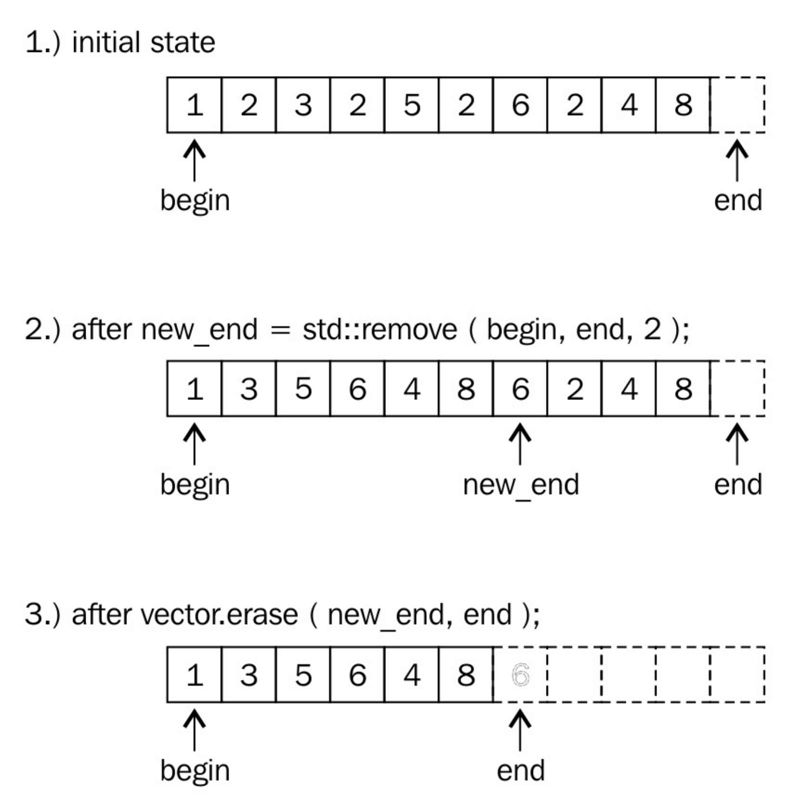

# 擦除/移除std::vector元素

由于`std::vector`能自动增长，并且使用方式简单，很受C++开发新手的喜爱。可以通过查阅手册，来了解这个容器该如何使用，比如删除元素。这样使用STL容器，只是了解容器的皮毛，容器应该帮助我们写出更简洁、维护性好和更快的代码。

本节的全部内容都是在一个`vector`实例中删除元素。当`vector`中部的一个元素消失了，那么位于消失元素右边的所有元素都要往左移(这种操作的时间复杂度为O(n)。新手们会用循环来做这件事，因为循环的确好用。不过，循环会降低代码的优化空间。最后，比起STL的方法，循环是既不快，也不美，

 ## How to do it...

首先，我们使用整数来填充一个`std::vector`实例，之后剔除一些特定元素。我们演示的从`vector`实例中删除元素正确的方法。

1. 包含文件是首要任务。

   ```c++
   #include <iostream>
   #include <vector>
   #include <algorithm>
   ```

2. 声明我们所要使用的命名空间。

   ```c++
   using namespace std;
   ```

3. 现在我们来创建一个`vector`实例，并用整数填满它。

   ```c++
   int main(){
       vector<int> v{1, 2, 3, 2, 5, 2, 6, 2, 4, 8};
   ```

4. 然后移除一些元素。需要我们移除哪些呢？2出现的太多次了，就选择2吧。让我们移除它们吧。

   ```c++
   	const auto new_end(remove(begin(v), end(v), 2)); 
   ```

5. 已经完成了两步中的一步。`vector`在删除这些元素之后，长度并没有发生变化。那么下一步就让这个`vector`变得短一些。

   ```c++
   	v.erase(new_end, end(v));
   ```

6. 我们在这里暂停一下，输出一下当前`vector`实例中所包含的元素。

   ```c++
       for(auto i : v){
           cout << i << ", "; 
       }
       cout << '\n';
   ```

7. 现在，让我们来移除一组指定的数据。为了完成这项工作，我们先定义了一个谓词函数，其可接受一个数作为参数，当这个数是奇数时，返回true。

   ```c++
   	const auto odd([](int i){return i % 2 != 0;});
   ```

8. 这里我们使用`remove_if`函数，使用上面定义的谓词函数，来删除特定的元素。这里我们将上面删除元素的步骤合二为一。

   ```c++
   	v.erase(remove_if(begin(v), end(v), odd), end(v));
   ```

9. 所有的奇数都被删除，不过`vector`实例的容量依旧是10。最后一步中，我们将其容量修改为正确的大小。需要注意的是，这个操作会让`vector`重新分配一段内存，以匹配相应元素长度，`vector`中已存的元素会移动到新的内存块中。

   ```c++
   	v.shrink_to_fit();
   ```

10. 打印一下现在`vector`实例中的元素。

    ```c++
    	for (auto i : v) {
    		cout << i << ", ";
    	}
    	cout << '\n';
    }
    ```

11. 编译完成后，运行程序，就可以了看到两次删除元素后`vector`实例中所存在的元素。

    ```txt
    $ ./main
    1, 3, 5, 6, 4, 8,
    6, 4, 8,
    ```

## How it works...

我们可以清楚的看到，要从一个`vector`实例中移除一个元素，首先要进行删除，然后进行擦除，这样才算真正的移除。这会让人感到困惑，那就让我们近距离观察一下这些步骤是如何工作的。

从`vector`中移除2的代码如下所示：

```c++
const auto new_end (remove(begin(v), end(v), 2));
v.erase(new_end, end(v));
```

`std::begin`和`std::end`函数都以一个`vector`实例作为参数，并且返回其迭代器，迭代器分别指向第一个元素和最后一个元素，就如下图所示。



`std::remove`在删除2的时候，会先将非2元素进行移动，然后修改end迭代器的指向。该算法将严格保留所有非2个值的顺序。

在2步中，2的值仍然存在，并且`vector`应该变短。并且4和8在现有的`vector`中重复了。这是怎么回事？

让我们再来看一下所有的元素，目前`vector`的范围并不是原来那样了，其是从`begin`迭代器，到`new_end`迭代器。`new_end`之后的值其实就不属于`vector`实例了。我们会注意到，在这个范围内的数值，就是我们想要的正确结果，也就是所有的2都被移除了。

最后，也就是为什么要调用`erase`函数：我们需要告诉`vector`实例，`new_end`到`end`之间的元素我们不需要了。我们仅需要保留`begin`到`new_end`间的元素就好了。`erase`函数会将`end`指向`new_end`。这里需要注意的是`std::remove`会直接返回`new_end`迭代器，所以我们可以直接使用它。

> Note:
>
> `vector`在这里不仅仅移动了内部指针。如果`vector`中元素比较复杂，那么在移除的时候，会使用其析构函数来销毁相应的对象。

最后，这个向量就如步骤3所示：的确变短了。那些旧的元素已经不在`vector`的访问范围内了，不过其仍存储在内存中。

为了不让`vector`浪费太多的内存，我们在最后调用了`shrink_to_fit`。该函数会为元素分配足够的空间，将剩余的元素移到该空间内，并且删除之前那个比较大的内存空间。

在上面的第8步中，我们定义了一个谓词函数，并在`std::remove_if`中使用了它。因为不论删除函数返回怎么样的迭代器，在对`vector`实例使用擦除函数都是安全的。如果`vector`中全是偶数，那么`std::remove_if`不会做任何事情，并且返回`end`迭代器。之后的调用就为`v.erase(end, end); `，同样没有做任何事情。

## There's more...

`std::remove`函数对其他容器同样有效。当使用`std::array`时，其不支持`erase`操作，因为其内存空间固定，无法进行自动化处理。因为`std::remove`只是将要删除的元素移动到容器末尾，而不是将其真正删除，所以这个函数也可以用于不支持空间大小变化的数据类型。当然也有其他类似的方法，例如字符串中，可以用哨兵值`\0`来覆盖原始的`end`迭代所指向的值。
