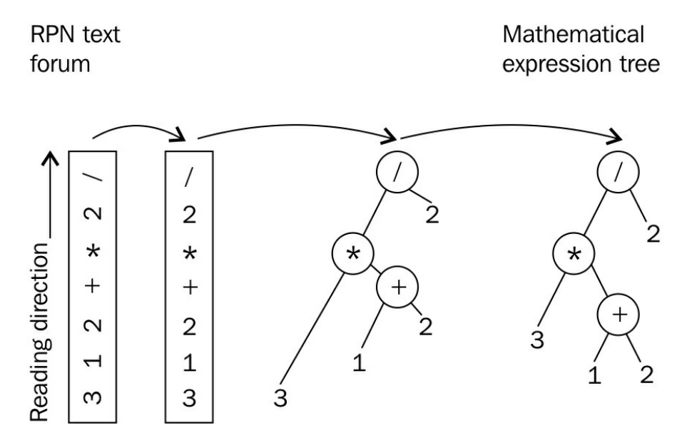

# 实现简单的逆波兰表示法计算器——std::stack

`std::stack`是一个适配类，其能让用户使用自己定义的类型作为栈中的元素。本节中，我们会使用`std::stack`构造一个逆波兰(RPN，reverse polish notation)计算器，为了展示如何使用`std::stack`。

RPN是一种记号法，可以用一种非常简单的解析方式来表达数学表达式。在RPN中，`1+2`解析为`1 2 +`。操作数优先，然后是操作符。另一个例子：`(1+2)*3`表示为`1 2 + 3 * `。这两个例子已经展示了RPN可以很容易的进行解析，并且不需要小括号来定义子表达式。



## How to do it...

本节中，我们将从标准输入中读取一个RPN表达式，然后根据表达式解析出正确的计算顺序，并得到结果。最后，我们将输出得到的结果。

1. 包含必要的头文件。

   ```c++
   #include <iostream>
   #include <stack>
   #include <iterator>
   #include <map>
   #include <sstream>
   #include <cassert>
   #include <vector>
   #include <stdexcept>
   #include <cmath>
   ```

2. 声明所使用的命名空间。

   ```c++
   using namespace std;
   ```

3. 然后，就来实现我们的RPN解析器。其能接受一对迭代器，两个迭代器分别指定了数学表达式的开始和结尾。

   ```c++
   template <typename IT>
   double evaluate_rpn(IT it, IT end)
   {
   ```

4. 在遍历输入时，需要记住所经过的所有操作数，直到我们看到一个操作符为止。这也就是使用栈的原因。所有数字将会被解析出来，然后以双精度浮点类型进行保存，所以保存到栈中的数据类型为`double`。

   ```c++
   	stack<double> val_stack;
   ```

5. 为了能更方便的访问栈中的元素，我们实现了一个辅助函数。其会修改栈中内容，弹出最顶端的元素，并返回这个元素。

   ```c++
       auto pop_stack ([&](){
           auto r (val_stack.top());
           val_stack.pop();
           return r;
       });
   ```

6. 另一项准备工作，就是定义所支持的数学操作符。我们使用`map`保存相关数学操作符的作用。每个操作符的实现我们使用Lambda函数实现。

   ```c++
       map<string, double (*)(double, double)> ops {
           {"+", [](double a, double b) { return a + b; }},
           {"-", [](double a, double b) { return a - b; }},
           {"*", [](double a, double b) { return a * b; }},
           {"/", [](double a, double b) { return a / b; }},
           {"^", [](double a, double b) { return pow(a, b); }},
           {"%", [](double a, double b) { return fmod(a, b); }},
       };
   ```

7. 现在就可以对输入进行遍历了。假设我们的输入是字符串，我们使用全新的`std::stringstream`获取每个单词，这样就可以将操作数解析为数字了。

   ```c++
       for (; it != end; ++it) {
       	stringstream ss {*it};
   ```

8. 我们获得的每个操作数，都要转换成`double`类型。如果当前解析的字符是操作数，那么我们将转换类型后，推入栈中。

   ```c++
           if (double val; ss >> val) {
           	val_stack.push(val);
           }
   ```

9. 如果不是操作数，那么就必定为一个操作符。我们支持的操作符都是二元的，所以当遇到操作符时，我们需要从栈中弹出两个操作数。

   ```c++
           else {
               const auto r {pop_stack()};
               const auto l {pop_stack()};
   ```

10. 现在我们可以从解引用迭代器`it`获取操作数。通过查询ops`map`表，我们可以获得参与Lambda计算的l和r值。

    ```c++
                try {
                    const auto & op (ops.at(*it));
                    const double result {op(l, r)};
                    val_stack.push(result);
                }
    ```

11. 我们使用`try`代码块将计算代码包围，因为我们的计算可能会出错。在调用`map`的成员函数`at`时，可能会抛出一个`out_of_range`异常，由于用户具体会输入什么样的表达式，并不是我们能控制的。所以，我们将会重新抛出一个不同的异常，我们称之为`invalid argument`异常，并且携带着程序未知的操作符。

    ```c++
                catch (const out_of_range &) {
                    throw invalid_argument(*it);
                }
    ```

12. 这就是遍历循环的全部，我们会将栈中的操作数用完，然后得到对应的结果，并将结果保存在栈顶。所以我们要返回栈顶的元素。(我们对栈的大小进行断言，如果大小不是1，那么就有缺失的操作符)

    ```c++
    		}
    	}
    	return val_stack.top();
    }
    ```

13. 现在我们可以使用这个RPN解析器了。为了使用这个解析器，我们需要将标准输入包装成一个`std::istream_iterator`迭代器对，并且传入RPN解析器函数。最后，我们将输出结果：

    ```c++
    int main()
    {
        try {
            cout << evaluate_rpn(istream_iterator<string>{cin}, {})
            	 << '\n';
        }
    ```

14. 这里我们再次使用了`try`代码块，因为用户输入的表达式可能会存在错误，所以当解析器抛出异常时，需要在这里获取。我们需要获取对应的异常，并且打印出一条错误信息：

    ```c++
        catch (const invalid_argument &e) {
        	cout << "Invalid operator: " << e.what() << '\n';
        }
    }	
    ```

15. 完成编译步骤后，我们就可以使用这个解析器了。输入`3 1 2 + * 2 /`，其为`(3*(1+2))/2`数学表达式的RPN表达式，然后我们获得相应的结果：

    ```c++
    $ echo "3 1 2 + * 2 /" | ./rpn_calculator
    4.5
    ```

## How it works...

整个例子通过解析我们的输入，持续向栈中压入操作数的方式完成相应的数学计算。本例中，我们会从栈中弹出最后两个操作数，然后使用操作符对这两个操作数进行计算，然后将其结果保存在栈中。为了理解本节中的所有代码，最重要的就是要理解，我们如何区分了输入中的操作数和操作符，如何管理我们的栈，以及如何选择正确的计算操作符。

**栈管理**

我们使用`std::stack`中的成员函数`push`将元素推入栈中：

```c++
val_stack.push(val);
```

出站元素的获取看起来有些复杂，因为我们使用了一个Lambda表达式完成这项操作，其能够引用`val_stack`对象。这里我们为代码添加了一些注释，可能会更好理解一些：

```c++
auto pop_stack ([&](){
    auto r (val_stack.top()); // 获取栈顶元素副本
    val_stack.pop(); // 从栈中移除顶部元素
    return r; // 返回顶部元素副本
});
```

这个Lambda表达式能够一键式获取栈顶元素，并且能删除顶部元素。在`std::stack`的设计当中，无法使用一步完成这些操作。不过，定义一个Lambda函数也是十分快捷和简介，所以我们可以使用这种方式获取值：

```c++
double top_value {pop_stack()};
```

**从输入中区别操作数和操作符**

主循环中执行`evaluate_rpn`时，我们会根据迭代器遍历标准输入，然后判断字符是一个操作数，还是一个操作符。如果字符可以被解析成`double`变量，那这就是一个数，也就是操作数。我们需要考虑有些比较难以解析的数值(比如，+1和-1)，这种数值可能会被解析成操作符(尤其是+1这种)。

用于区分操作数和操作符的代码如下所示：

```c++
stringstream ss {*it};
if (double val; ss >> val) {
	// It's a number!
} else {
	// It's something else than a number - an operation!
}
```

如果字符是一个数字，流操作符`>>`会告诉我们。首先，我们将字符串包装成一个`std::stringstream`。然后使用`stringstream`对象的能力，将流中`std::string`类型解析并转换成一个`double`变量。解析失败时也能知道是为什么，因为只解析器需要解析数字出来；否则，需要解析的就不是一个数字。

**选择和应用正确的数学操作符**

判断完当前用户的输入是否为一个数后，我们先假设输入了一个操作符，比如`+`或`*`。然后，查询`map`表ops，找到对应的操作，并返回相应的函数，其函数可以接受两个操作数，然后返回对应操作后的结果。

`map`表本身的类型看起来会相对复杂：

```c++
map<string, double (*)(double, double)> ops { ... };
```

其将`string`映射到` double (*)(double, double)`。后者是什么意思呢？这个类型是一个函数指针的声明，说明这个函数接受两个double类型的变量作为输入，并且返回值也是`double`类型。可以将`(*)`部分理解成函数的名字，例如` double sum(double, double`，这样就好理解多了吧。这里的重点在于我们的Lambda函数`[](double, double) {return /* some double */ } `，其可转换为实际匹配指针声明的函数。这里Lambda不获取任何东西，所以可以转化为函数指针。

这样，我们就可以方便的在`map`表中查询操作符是否支持：

```c++
const auto & op (ops.at(*it));
const double result {op(l, r)};
```

`map`会为我们隐式的做另一件事：当我们执行` ops.at("foo") `时，如果`"foo"`是一个合法键(实际中我们不会用这个名字存任何操作)，那么在这个例子中，`map`表将会抛出一个异常，例子中可以捕获这个异常。当我们捕获这个异常时，我们会重新抛出一个不同的异常，为了描述我们遇到了什么样的错误。相较于`out of range`，用户也能更好的了解`invalid argument`异常的含义，因此我们在使用的时候，程序的`map`表到底支持哪些操作，我们是不知道的。

## There's more...

`evaluate_rpn`函数可以传入迭代器，感觉这样传递的方式要比传入标准输入更加容易理解。这让程序更容易测试，或适应来自于用户的不同类型的输入。

使用字符串流或字符串数组的迭代器作为输入，例如下面的代码，`evaluate_rpn`不用做任何修改：

```c++
int main()
{
    stringstream s {"3 2 1 + * 2 /"};
    cout << evaluate_rpn(istream_iterator<string>{s}, {}) << '\n';
    vector<string> v {"3", "2", "1", "+", "*", "2", "/"};
    cout << evaluate_rpn(begin(v), end(v)) << '\n';
}
```

> Note:
>
> 在有意义的地方使用迭代器，会使得代码可重复利用度高，模块化好。

