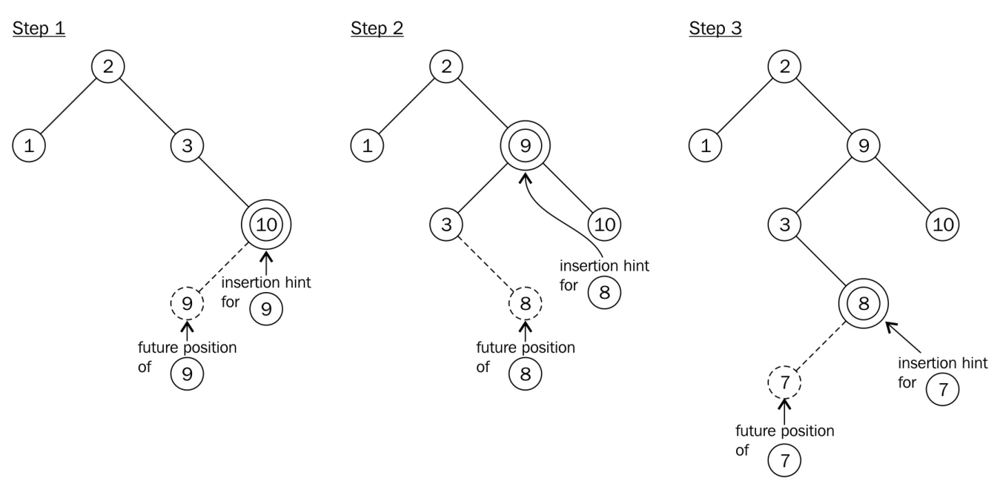

# 了解std::map::insert新的插入提示语义

`std::map`中查找元素的时间复杂度为O\(log\(n\)\)，与插入元素的时间复杂相同，因为要在对应位置上插入元素，那么就先要找到这个位置。通常，插入M个新元素的时间复杂度为O\(M\*log\(n\)\)。

为了让插入更加高效，`std::map`插入函数接受一个迭代器参数`hint`。自C++11起，该参数为指向将插入新元素到其前的位置的迭代器。如果这个迭代器给定正确，那么插入的时间复杂度就为O\(1\)。

## How to do it...

本节会是用传入迭代器的方式向`std::map`实例中插入多个新元素，从而减少耗时：

1. 包含必要的头文件。

   ```c++
   #include <iostream>
   #include <map>
   #include <string>
   ```

2. 创建一个`map`实例，并填充一些内容。

   ```c++
   int main()
   {
       std::map<std::string, size_t> m { {"b", 1}, {"c", 2}, {"d", 3} };
   ```

3. 我们将插入多个元素，对于每次插入，我们都会传入一个hint迭代器。第一次插入我们不指定其开始位置，只将插入位置指向`map`的`end`迭代器之前。

   ```c++
       auto insert_it (std::end(m));
   ```

4. 我们将以字母表的反序进行元素的插入，然后使用hint迭代器，然后使用`insert`函数的返回值重新初始化迭代器的值。下一个元素将在`hint`迭代器前插入。

   ```c++
       for (const auto &s : {"z", "y", "x", "w"}) {
           insert_it = m.insert(insert_it, {s, 1});
       }
   ```

5. 为了展示在什么情况下`insert`函数不工作，我们将要插入最左侧位置的元素插入到最右侧。

   ```c++
       m.insert(std::end(m), {"a", 1});
   ```

6. 最后我们打印当前的`map`。

   ```c++
       for (const auto & [key, value] : m) {
           std::cout << "\"" << key << "\": " << value << ", ";
       }
       std::cout << '\n';
   }
   ```

7. 编译运行程序，错误的插入并没有对结果又什么影响，`map`实例中对象的顺序仍然是对的。

   ```
   "a": 1, "b": 1, "c": 2, "d": 3, "w": 1, "x": 1, "y": 1, "z": 1,
   ```

## How it works...

本例与常用的方式不同，多了一个迭代器。并且我们提到了这个迭代器的正确与否。

正确的迭代器将会指向一个已存在的元素，其值要比要插入元素的键大，所以新元素会插在这个迭代器之前。如果用户提供的迭代器位置有误，那么插入函数会退化成未优化的版本，其时间复杂度恢复O\(log\(n\)\)。

对于第一次插入，我们选择了`map`实例的`end`迭代器，因为没有其他更好的选择。在插入“z”之后，函数会返回相应的迭代器，这样我们就知道了要插入“y”的位置。“x”也同理，后面的元素依次类推。

> Note:
>
> 在C++11之前，hint迭代器只是建议作为搜索开始位置的迭代器。

## There's more...

其中，比较有趣的事情是，在给定错误的迭代器，`map`实例依旧能保持其排序。那么他是如何工作的呢？还有插入的时间复杂度为O\(1\)意味着什么？

`std::map`通常使用二叉搜索树实现。当在搜索树中插入一个新键时，该键要和其他键进行比较，从末端到顶端。如果键小于或大于其他节点的键，搜索树的左侧或右侧分支则会成为更深的节点。不过，搜索算法会阻止节点达到当前搜索树的底端。否则会打破搜索树的平衡，所以为了保证正确性，需要使用一个平衡算法用来管理节点。

当我们将元素插入到树中时，这些键值就会成为邻居\(就如整数1和2互邻一样\)。如果有`hint`传入，那么很容易检查键是否正确。如果这种情况出现，则可以省去搜索的时间。而后，平衡算法会可能还要运行。虽然优化并不是总能成功，不过平均下来，性能上还是会有提升。可以使用多次插入的方式，来统计运行的耗时，这被称之为[**摊销复杂度**](http://programming.guide/amortized-time-complexity-analysis.html)。



如果插入的`hint`是错的，那么插入函数会放弃使用`hint`，转而使用搜索算法进行查找。虽然程序不会出什么问题，但这样做会让程序变慢。

