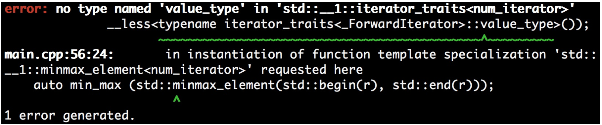

# 让自己的迭代器与STL的迭代器兼容

上一节中，我们实现了自己的迭代器，不过为了融合STL提供的迭代器的优点，我们需要提供一些迭代器接口。后面我们会来学习如果实现这些接口，不过将我们自定义的迭代器与STL的标准迭代器放在一起时，有时会发现有编译不通过的问题。这是为什么呢？

STL算法尝试寻找更多有关于我们所使用迭代器的信息。不同迭代器的能力是不同的，不大可能用同样的算法实现不同的迭代器。例如，我们只是简单的从一个`std::vector`将其中的数字拷贝到另一个时，我们的实现中可以直接调用`memcpy`快速实现这个功能。如果容器是`std::list`的话，`memcpy`的方式就不好用了，只能一个个的单独拷贝。实现者将大量的自动优化思想注入STL算法实现当中。为了能更好的使用，我们也会为我们的迭代器装备这些思想。

## How to do it...

本节中，我们将实现一个简单的计数迭代器(与STL算法一起使用)，一开始这个实现是无法编译通过的。我们需要做一些兼容性操作，使得程序通过编译。

1. 包含必要的头文件。

   ```c++ 
   #include <iostream>
   #include <algorithm>
   ```

2. 实现一个计数迭代器，作为基础版本。当我们使用其进行遍历时，我们只需要增加计数器即可。`num_range`用来处理`begin`和`end`迭代器。

   ```c++
   class num_iterator
   {
   	int i;
   public:
       explicit num_iterator(int position = 0) : i{position} {}
       int operator*() const { return i; }
       num_iterator& operator++() {
           ++i;
           return *this;
       }
       bool operator!=(const num_iterator &other) const {
       	return i != other.i;
       }
       bool operator==(const num_iterator &other) const {
       	return !(*this != other);
       }
   };

   class num_range {
       int a;
       int b;
   public:	
       num_range(int from, int to)
       	: a{from}, b{to}
       {}
       num_iterator begin() const { return num_iterator{a}; }
       num_iterator end() const { return num_iterator{b}; }
   };
   ```

3. 声明所使用的命名空间。

   ```c++ 
   using namespace std;
   ```

4. 现在让我们来遍历100到109间的数字。这里需要注意的是，110这里是开区间，所以值无法遍历到110。

   ```c++
   int main()
   {
   	num_range r {100, 110};
   ```

5. 现在，我们使用一个STL算法`std::minmax_element`。这个算法会返回一个`std::pair`，其具有两个迭代器：一个指向最小值的迭代器和一个指向最大值的迭代器。在这个范围中100和109即为这两个迭代器所指向的位置。

   ```c++
       auto min_max(minmax_element(r.begin(), r.end()));
   	cout << *min_max.first << " - " << *min_max.second << '\n';
   }
   ```

6. 我们在编译的时候遇倒如下的错误信息。这个错误与`std::iterator_traits`有关。这个错误可能在使用其他编译器时，错误信息的格式不同，或者就没有错误。这个错误在clang 5.0.0 (trunk 299766)版本出现。

   

7.  为了修正这个错误，我们需要激活迭代器的迭代功能。之后定义一个`num_iterator`结构体，我们会对`std::iterator_traits`进行特化。这个特化就是告诉STL我们的`num_iterator`是一种前向迭代器，并且指向的对象是`int`类型的值。

   ```c++
   namespace std {
   template <>
   struct iterator_traits<num_iterator> {
       using iterator_category = std::forward_iterator_tag;
       using value_type = int;
   };
   }
   ```

8. 让我们再对程序进行编译，之前的错误应该不存在了。输出了范围内的最大值和最小值:

   ```c++
   100 - 109
   ```

## How it works...

一些STL算法需要知道其处理容器的迭代器类型，有些还需要知道迭代器所指向的类型。这就是要有不同实现的原因。

不过，所有STL算法将会通过`std::iterator_traits<my_iterator>`访问对应类型的迭代器(这里假设迭代器类型为my_iterator)。这个特性类需要包含五种不同类型的成员定义：

- difference_type: `it1- it2`结果的类型
- value_type: 迭代器解引用的数据的类型(这里需要注意void类型)
- pointer: 指向元素指针的类型
- reference: 引用元素的类型
- iterator_category: 迭代器属于哪种类型

pointer、reference和difference_type并没有在num_iterator中定义，因为其实际的内存值不重复(我们只是返回int值，不想数组一样是连续的)。因此num_iterator并不需要定义这些类型，因为算法是依赖于解引用后指定内存上的值。如果我们的迭代器定义了这些类型，就可能会出现问题。

## There's more...

C++17标准之前，C++都鼓励自定义迭代器继承于`std::iterator<...>`，这样所有主流的类型都会自动定义。C++17中这条建议仍然能工作，但是不再推荐从`std::iterator<...>`继承了。

