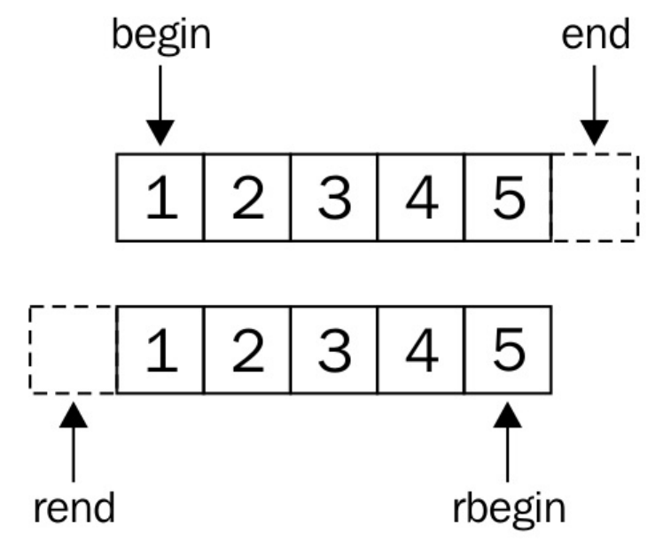

# 使用反向迭代适配器进行迭代

有时我们需要反向迭代一个范围内的内容。基于范围的for循环中，STL迭代通常都使用前向累加的方式进行迭代，那么当需要反向时，就需要对其进行递减。当然，这里可以将迭代器进行包装，将调用累加操作改为递减的操作。听起来要写好多冗余的代码，来对反向迭代进行支持。

STL中提供了反向迭代适配器，其能帮助我们对迭代器进行包装。

## How to do it...

本节中，我们将用另一种方式使用反向迭代器，只为了展示如何使用它们：

1. 包含必要的头文件：

   ```c++
   #include <iostream>
   #include <list>
   #include <iterator>
   ```

2. 声明所使用的命名空间：

   ```c++
   using namespace std;
   ```

3. 为了有东西可以迭代，我们实例化一个整数列表：

   ```c++
   int main()
   {
   	list<int> l {1, 2, 3, 4, 5};
   ```

4. 现在，让我们来反向打印这些数字。为了完成反向打印，我们调用`std::list`的成员函数`rbegin`和`rend`获得反向迭代器，并且将数字推入输出流`ostream_iterator`适配器中:

   ```c++
       copy(l.rbegin(), l.rend(), ostream_iterator<int>{cout, ", "});
       cout << '\n';
   ```

5. 如果容器不提供`rbegin`和`rend`函数的话，就需要使用双向迭代器来帮忙了，这里可以使用工厂函数`std::make_reverse_iterator`创建双向迭代器。其能接受普通迭代器，然后将其转换为反向迭代器：

   ```c++
       copy(make_reverse_iterator(end(l)),
           make_reverse_iterator(begin(l)),
           ostream_iterator<int>{cout, ", "});
       cout << '\n';
   }
   ```

6. 编译并运行该程序，就能得到如下的输出：

   ```c++
   5, 4, 3, 2, 1,
   5, 4, 3, 2, 1,
   ```

## How it works...

为了将一个普通迭代器转换为一个反向迭代器，容器至少要支持双向迭代。这就需要双向类别或更高级的迭代器才能满足条件。

反向迭代器是普通迭代器的一种，并且连接口和普通迭代器都一样，不过其累加操作会被当做递减操作来进行。

下面就来聊一下`begin`和`end`迭代器的位置。先来看一下图，迭代器区域里面是一串标准的数字序列。



如果序列是从1到5，`begin`迭代器将指向元素1所在的位置，并且`end`迭代器将指向元素5后面的位置。当定义了反向迭代器，`rbegin`迭代器就指向了元素5，并且`rend`迭代器指向元素1之前的位置。可以将书反过来看，可以发现这两个中方式是镜像的。

当我们想让我们自定义的容器类支持反向迭代，我们不用将所有细节一一实现；我们只需使用`std::make_reverse_iterator`工厂函数，将普通的迭代器包装成反向迭代器即可，背后的操作STL会帮我们完成。