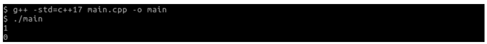
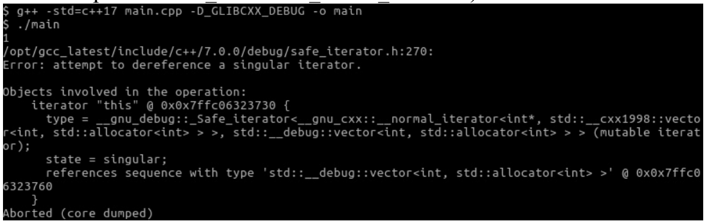
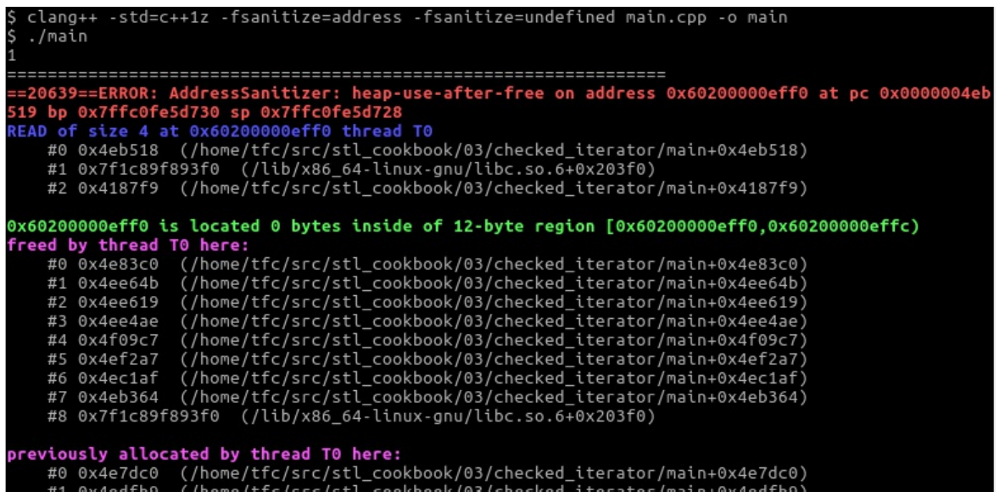

# 使用检查过的迭代器自动化检查迭代器代码

迭代器很有用，能提供一般化的接口供用户使用。不过，迭代器经常被当做指针误用。当指针指向一个非法的内存位置时，不能进行解引用。这对迭代器也适用，不过有大量的条件来界定迭代器指向的位置是否合法。这些可以通过看一下STL文档就能了解到，但是还会写出很容易出现bug的代码。

最好的情况是，这些问题没有在客户的机器上出现，而是开发者测试这些程序时就能暴露出来。不过，通常即使是解引用了悬垂指针和错误的迭代器，代码也不会报错。这种情况是最糟的，因为这种未定义行为的代码，没法确定会发生什么。

幸运的是，有工具可以帮助我们。GUN STL有调试模式可选，GUN C++编译器和LLVM clang C++编译器都提供这样的库，其会为我们生成具有调试信息的二进制程序，可以让错误更容易暴露出来。这种库非常容易使用，并且特别有用，我们将在本节展示。Microsoft Visual C++标准库还提供了更多的检查项。

## How to do it...

本节我们将使用迭代器故意访问一个非法位置：

1. 包含头文件。

   ```c++
   #include <iostream>
   #include <vector>
   ```

2. 首先实例化一个整型类`vector`，并且让指针指向值1。我们使用`shrink_to_fit()`将`vector`的容积设置为3，多分配的内存是不必要的，小一点的存储空间会让迭代速度更快：

   ```c++
   int main()
   {
       std::vector<int> v {1, 2, 3};
       v.shrink_to_fit();
       const auto it (std::begin(v));
   ```

3. 然后解引用迭代器，打印相应的内容：

   ```c++
   	std::cout << *it << '\n';
   ```

4. 接下来，让我们向`vector`中增加一个新数。这样`vector`的长度就不够再放下另外一个数，这里`vector`会自动增加其长度。通过分配一个新的更大的内存块来实现长度的增加，会将所有现存的项移到新的块，然后删除旧的内存块。

   ```c++
   	v.push_back(123);
   ```

5. 现在，让我们再次通过迭代器从1开始打印`vector`。这就坏了。为什么呢？因为在`vector`自增的过程中，会分配新的内存，删除旧的内存，但是迭代器却不知道这个改变。这就意味着，迭代器将会指向旧地址，并且我们不知道这样做会怎样。

   ```c++
   	std::cout << *it << '\n'; // bad bad bad!
   }
   ```

6.  编译变这个程序并运行，我们不会看到任何错误，不过迭代器解引用所打印出来的数字看上去像是随机数。看上去没有问题，反而最有问题。如果不指出来，可能没人会发现问题。

   

7. 这时调试工具就派上了用场。GUN STL支持一种预处理宏`_GLIBCXX_DEBUG`，其会激活STL中对健壮性检查的代码。这会让程序变慢，不过更容易找到Bug。我们可以通过`-D_GLIBCXX_DEBUG`编译选项来启用这些代码，或者在代码的最开始加上这个宏。如你所见，其输出相关的错误信息，并关闭了应用的进程。Microsoft Visual C++ 编译器可以通过`/D_ITERATOR_DEBUG_LEVEL=1 `启用检查。

   

8.  LLVM/clang实现的STL也有调试标识，其目的是为了调试STL代码，而非用户的代码。对于用户的代码的调试，我们会使用不同的选项来调试。向clang编译器传入`-fsanitize=address -fsanitize=undefined`，可以看看会发生什么：

   

WOW！clang编译器对于运行错误的描述非常详细。由于信息非常的多，这里只截取其中一部分。当然，这个选项并不是clang独有的特性，对于GCC同样适用。

> Note:
>
> 一些运行时的问题是因为一些库的丢失，编译器不会将libasan和libubsan( AddressSanitizer内存检测工具)自动添加到程序中，需要通过包管理器或类似的工具进行安装。

## How it works...

如我们之前所见，我们不需要通过修改任何代码，只需要通过为编译器添加一些编译器特性就能容易的找到代码中的Bug。

这些特性由调试器实现。一个调试器通常由一个编译器模块和一个运行时库组成。当调试器被激活时，编译器将会添加额外的信息到我们的代码中，然后形成二进制可执行文件。在运行时，调试器库由二进制文件自己去链接，例如：对应库实现会代替`malloc`和`free`函数，来分析程序到底想要多少内存。

调试器可以检测不同类型的Bug。这里只列举出一些常用的类型：

- **越界访问**: 当我们访问类似数组和`vector`类型的数据结构时，判别我们访问的位置是否在合法范围内。
- **释放后使用**: 当我们释放了堆上分配的指针后，再使用这个指针，则会出发这个Bug。
- **整数溢出**: 不同的机器上整数表达的范围可能是不同的，所以就会出现一些值使用整型无法进行表示。对于有符号整型，算法通常会出发一个未定义的行为。
- **指针对齐**: 一些架构中，需要指针以某种形式进行对齐，否则无法访问对应的地址。

当然，我们还能检测到更多类型的Bug。

不过，激活所有的调试器不太可行，因为这样会导致程序运行的非常缓慢。不过，在单元测试和集成测试中，激活调试器是一个很好的方式。

## There's more...

对于不同类型的Bug，调试器的种类也是多种多样，并且还有很多调试器还在开发中。我们可以上网了解更多的信息，以便我们自己去调试程序。GCC和LLVM网站首页就列举了很多调试器，可以从在线文档中了解其调试能力：

- https://gcc.gnu.org/onlinedocs/gcc/Instrumentation-Options.html
- http://clang.llvm.org/docs/index.html 可在目录中寻找调试器

使用调试器对程序进行整体测试是每个开发者都应该具有的意识。不过，在大多数公司中，开发者并没有这样的意识，即便是我们知道所有恶意软件和计算机病毒最重要的入口就是程序的Bug。

当时是一个开发新手时，看一下你的团队中是否有使用调试器的可能。如果没有，那你上班的第一天就有机会修复那些重大的Bug，并发现隐藏的Bug。

