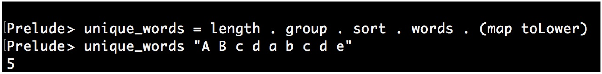

# 并置函数

其实很多函数没有必要完全自定义的去实现。让我们先来看一个使用Haskell实现的在文本中查找单一单词的例子。第一行定义了一个`unique_words`函数，在第二行中传入一个字符串：



Wow，就是这么简单！这里不对Haskell的语法做过多的解释，让我们来看一下代码。其定义了一个`unique_words`的函数，该函数对其传入的参数进行了一系列的处理。首先，使用`map toLower`将所有字符都小写化。然后，将句子用逗号进行分割，比如`"foo bar baz"`就会已变成`["foo", "bar","baz"]`。接下来，将单词列表进行排序。这样，`["a", "b", "a"] `就会变为` ["a", "a", "b"]`。现在，使用`group`函数，其会将相同的词组放到一个列表中，也就是` ["a", "a", "b"]`成为`[ ["a", "a"], ["b"] ]`。现在就差不多快完事了，接下来就让我们数一下列表中一共有多少个组，这个工作由`length`函数完成。

多么完美的编程方式呀！我们可以从右往左看，来了解这段代码是如何工作的。这里我就不需要关心每个细节是如何进行实现(除非其性能很差，或者有Bug)。

我们不是来赞美Haskell的，而是来提升我们自己C++技能的，这样的方式在C++中同样奏效。本节的例子会展示如何使用Lambda表达式来模仿并置函数。

## How to do it...

本节中定义了一些函数对象，并将它们串联起来，也就是将一个函数的输出作为另一个函数的输入，以此类推。为了很好的展示这个例子，我们编写了一些串联辅助函数：

1. 包含必要的头文件

   ```c++
   #include <iostream>
   #include <functional>
   ```

2. 然后，我们实现一个辅助函数`concat`，其可以去任意多的参数。这些参数都是函数，比如f，g和h。并且一个函数的结果是另一个函数的输入，可以写成`f(g(h(...)))`:

   ```c++
   template <typename T, typename ...Ts>
   auto concat(T t, Ts ...ts)
   {
   ```

3. 现在，代码就会变有些复杂了。当用户提供函数f，g和h时，我们现将其转换为`f( concat(g,h))`，然后再是`f(g(concat(h)))`，类似这样进行递归，直到得到`f(g(h(...)))`为止。用户提供的这些函数都可以由Lambda表达式进行捕获，并且Lambda表达式将在之后获得相应的参数p，然后前向执行这些函数`f(g(h(p)))`。这个Lambda表达式就是我们要返回的。`if constexpr`结构会检查在递归步骤中，当前函数是否串联了多个函数：

   ```c++
       if constexpr (sizeof...(ts) > 0) {
           return [=](auto ...parameters) {
           	return t(concat(ts...)(parameters...));
           };
       }
   ```

4. 当我们到达递归的末尾，编译器会选择`if constexpr`的另一分支。这个例子中，我们只是返回函数`t`，因为其传入的只有参数了：

   ```c++
       else {
      		return t;
       }
   } 
   ```

5. 现在，让我们使用刚创建的函数连接器对函数进行串联。我们先在主函数的起始位置定义两个简单的函数对象：

   ```c++
   int main()
   {
       auto twice ([] (int i) { return i * 2; });
       auto thrice ([] (int i) { return i * 3; });
   ```

6. 现在，来串联他们。这里我们将两个乘法器函数和一个STL函数` std::plus<int>`放在一起，STL的这个函数可以接受两个参数，并返回其加和。这样我们就得到了函数`  twice(thrice(plus( a, b )))`:

   ```c++
       auto combined (
       	concat(twice, thrice, std::plus<int>{})
       );
   ```

7. 我们来应用一下。`combined`函数现在看起来和一般函数一样，并且编译器会将这些函数连接在一起，且不产生任何不必要的开销：

   ```c++
   	std::cout << combined(2, 3) << '\n';
   }
   ```

8. 编译运行这个例子就会得到如下的结果，和我们的期望一致，因为`2 * 3 * (2 + 3)`为30：

   ```c++
   $ ./concatenation
   30
   ```

## How it works...

`concat`函数是本节的重点。其函数体看起来非常的复杂，因为其要对另一个Lambda表达式传过来`ts`参数包进行解析，`concat`会递归多次调用自己，每次调用参数都会减少：

```c++
template <typename T, typename ...Ts>
auto concat(T t, Ts ...ts)
{
    if constexpr (sizeof...(ts) > 0) {
        return [=](auto ...parameters) {
        	return t(concat(ts...)(parameters...));
        };
    } else {
        return [=](auto ...parameters) {
        	return t(parameters...);
        };
    }
}
```

让我们写一个简单点的版本，这次串联了三个函数：

```c++
template <typename F, typename G, typename H>
auto concat(F f, G g, H h)
{
    return [=](auto ... params) {
    	return f( g( h( params... ) ) );
    };
}
```

这个例子看起来应该很简单了吧。返回的Lambda表达式可以对f，g和h函数进行捕获。这个Lambda表达式可以接受任意多的参数传入，然后在调用f，g和h函数。我们先定义` auto combined (concat(f, g, h))`，并在之后传入两个参数，例如`combined(2, 3)`，这里的2和3就为`concat`函数的参数包。

看起来很复杂，但`concat`却很通用，有别与` f(g(h( params... )))`式的串联。我们完成的是`f(concat(g, h))(params...)`的串联，` f(g(concat(h)))(params...)`为其下一次递归调用的结果，最终会的结果为`f(g(h( params...)))`。

