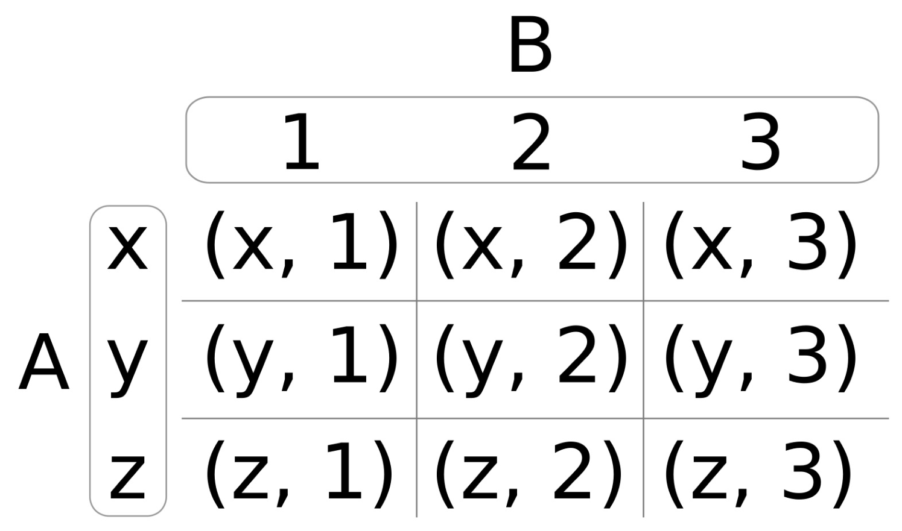
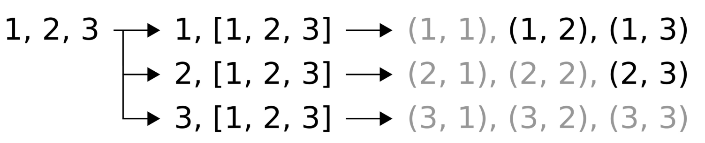

# 编译时生成笛卡尔乘积

Lambda表达式结合参数包一起使用，可以用来解决比较复杂的问题。本节中，我们将实现一个函数对象，其能接受任意多的输入参数，然后生成相应的**笛卡尔乘积**。

笛卡尔乘积是一个数学运算。其可以表示为`A x B`，其意思为使用集合A和集合B来结算笛卡尔乘积。结果为另一个单独的集合，其包含集合A和集合B一一对应的组对。这个运算的意义在于，将两个集合中的元素进行匹配。下图就描述了这种运算操作：



图中，`A = (x, y, z)`，`B = (1, 2, 3)`，所产生的笛卡尔乘积为`(x, 1)` , ` (x, 2)` ,`  (x, 3) `,`  (y, 1)` ,`  (y, 2)`等等。如果A和B为同一个集合，比如说是`(1, 2)`，那么其笛卡尔乘积为`(1, 1)` , ` (1, 2)` ,` (2, 1) `, 和` (2, 2)`。有时候，这样的操作却十分冗余，比如集合`(1, 1)`，或是刚才例子中的`(1, 2)`和`(2, 1)`。笛卡尔乘积可以通过一个简单的条件，对结果进行过滤。

## How to do it...

我们实现了一个函数对形象，其能接受一个函数`f`，以及一组参数。该函数对象将会通过输出参数集合创建笛卡尔乘积，将冗余的部分进行过滤，并对每个乘积调用函数`f`。

1. 包含打印输出的头文件。

   ```c++
   #include <iostream>
   ```

2. 然后，我们定义一个简单的辅助函数，用来对组对中的值进行打印：

   ```c++
   static void print(int x, int y)
   {
   	std::cout << "(" << x << ", " << y << ")\n";
   }
   
   int main()
   {
   ```

3. 复杂的地方到了。我们先实现了一个辅助函数`cartesian`，我们将在下一步实现这个函数。这个函数能接受一个参数`f`，在我们使用过程中，这个`f`函数就是`print`函数。另一些参数是`x`和参数包`rest`。其包含了计算笛卡尔乘积的元素。在`f(x, rest)`表达式中：当`x=1`和`rest=2, 3, 4`，为了得到结果，我们需要调用三次:`f(1, 2); f(1, 3); f(1, 4);`。`(x < rest)`的条件，会删除冗余的组对。我们来看下代码：

   ```c++
       constexpr auto call_cart (
           [=](auto f, auto x, auto ...rest) constexpr {
               (void)std::initializer_list<int>{
                   (((x < rest)
                       ? (void)f(x, rest)
                       : (void)0)
                   ,0)...
               };
           });
   ```

4.  `cartesian`函数在本节中，算是最复杂的部分了。其能接受一个参数包`xs`，并返回一个其捕获的函数对象。返回的函数对象能接受一个函数对象`f`。参数包，比如`xs = 1, 2, 3`，其内部Lambda表达式将会生成如下调用：call_cart(f, **1**, 1, 2, 3); call_cart(f, **2**, 1, 2, 3); call_cart(f, **3**, 1, 2, 3);。通过对这些函数的调用，我们能得到我们想要的所有笛卡尔乘积。我们使用`...`对`xs`参数包扩展了两次，第一次看起来有些奇怪。调用`call_cart`时，我们第一次对`xs`进行了扩展。第二次扩展将会使得`call_cart`调用多次，并且每次的第二个参数都会不同。

   ```c++
       constexpr auto cartesian ([=](auto ...xs) constexpr {
           return [=] (auto f) constexpr {
               (void)std::initializer_list<int>{
               	((void)call_cart(f, xs, xs...), 0)...
               };
           };
       });
   ```

5. 那么，现在让我们使用数字集` 1, 2, 3`来生成笛卡尔乘积，并对组对进行打印。过滤了冗余的组对，所剩的结果应该为 `(1, 2)` , ` (2, 3)` , 和 `(1, 3)`。我们对很多的结果进行了过滤，并且不考虑结果中组对中的数字顺序。这也就是说，我们不需要`(1, 1)`，并且认为`(1, 2)`和`(2, 1)`为同一个组对。首先，我们让`cartesian`函数产生一个函数对象，其会包含所有可能的组对，并且能够接受我们的打印函数。然后，我们将所产生的组对，使用打印函数进行打印输出。我们将`print_cart`变量声明为`constexpr`，这样我们就能在编译时获得所有的乘积结果:

   ```c++
       constexpr auto print_cart (cartesian(1, 2, 3));
   
       print_cart(print);
   }
   ```

6. 编译并运行程序，我们就会得到如下的输出。通过`call_cart`中的`x < rest`判断条件，我们可以将一些冗余组对结果进行删除：

   ```c++
   $ ./cartesian_product
   (1, 2)
   (1, 3)
   (2, 3)
   ```

## How it works...

另一个看起来比较复杂的地方就是Lambda表达式了。但当我们充分的了解后，我们就不会再对Lambda表达式有任何的困惑了！

那么，让我们来仔细的了解一下吧。我们将所发生的事情，画了一张图来说明：



这里有3步：

1. 我们将`1, 2, 3`作为新集合中的三个元素，其报了三个新的集合。第一个则是集合中的每一个单独向，而第二部分则是整个集合本身。
2. 我们可以将第一个元素与每一个元素相组合(包括自己)，就能得到很多组对。
3. 对于三个结果组对来说，我们只需要将其中不冗余的部分取出就好。

好了，回到我们例子：

```c++
constexpr auto cartesian ([=](auto ...xs) constexpr {
    return [=](auto f) constexpr {
        (void)std::initializer_list<int>{
        	((void)call_cart(f, xs, xs...), 0)...
        };
    };
});	
```

内部表达式` call_cart(xs, xs...) `将会对集合`1, 2, 3`分别进行表示，比如：`1, [1, 2, 3]`。整个表达式`((void)call_cart(f, xs, xs...), 0)...`其将`...`放在外部，其会将集合进行拆解，我们将会得到`2，[1, 2, 3]`和`3, [1, 2, 3]`。

`call_cart`完成了第2和第3步：

```c++
auto call_cart ([](auto f, auto x, auto ...rest) constexpr {
    (void)std::initializer_list<int>{
        (((x < rest)
            ? (void)f(x, rest)
            : (void)0)
        ,0)...
    };
});
```

参数`x`始终包含从这个集合中挑出的但选值，并且`rest`包含了整个集合。让我么先忽略`x < rest`这个条件。这里，`f(x, rest)`表达式与`...`参数包展开所得到的调用`f(1, 1)`，`f(1, 2)`等等，其就会生成将被打印的组对。这就是第2步完成的事。

第3步中，就是用`x < rest`条件来过滤冗余的组对了。

我们先给所有Lambda表达式和持有变量声明成`constexpr`。通过这样做，我们可以在运行时对代码进行评估，这样编译出的二进制文件将会包含所有组对，而无需在运行时对其进行计算。需要注意的是，这里需要传入常量函数的参数为已知量，这样才能在运行时让编译器知道，并对函数进行执行。