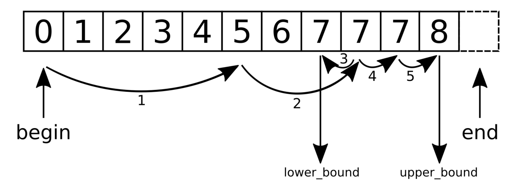

# 在有序和无序的vector中查找元素

通常，需要确定某种元素在某个容器范围内是否存在。如果存在，我们会对这个值进行修改，或者访问与其相关的值。

查找元素的目的是不同的。当想要让在一段已排序的元素中进行查找，可以使用二分查找法，这种方法要比线性查找快的多。如果没有排序，那么就只能进行线性遍历来查找对应的值。

传统的STL查找算法我们都可以使用，所以了解一下这些算法。本节将会使用两个不同的算法，线性查找算法`std::find`，二分查找算法`std::equal_range`。

## How to do it...

本节，我们将对一个比较小的数据集进行线性和二分查找：

1. 包含必要的头文件，以及声明所使用的命名空间。

   ```c++
   #include <iostream>
   #include <vector>
   #include <list>
   #include <algorithm>
   #include <string>
   
   using namespace std;
   ```

2. 数据集会包含`city`结构体，只是存储的城市的名字和人口数量：

   ```c++
   struct city {
       string name;
       unsigned population;
   };	
   ```

3. 搜索算法需要将元素与目标对象进行对比，所以我们需要重载`city`结构体的`==`操作符：

   ```c++
   bool operator==(const city &a, const city &b) {
   	return a.name == b.name && a.population == b.population;
   }
   ```

4. 我们也需要将`city`实例进行打印，所以我们对其输出操作符`<<`也进行了重载：

   ```c++
   ostream& operator<<(ostream &os, const city &city) {
       return os << "{" << city.name << ", "
       	<< city.population << "}";
   }
   ```

5. 查找函数通常会返回迭代器。当函数找到相应的元素时，会返回指向其的迭代器，否则就会返回容器的`end`迭代器。第二种情况下，我们就不能对该迭代器进行访问。因为要打印输出结果，所以需要实现一个函数，这个函数会返回另一个函数对象，并会将数据结构的`end`迭代器进行包装。当要对结果进行打印时，会与容器的`end`迭代器相比较，如果不是`end`，那么打印出查找到的值；如果是`end`，则仅打印`<end>`：

   ```c++
   template <typename C>
   static auto opt_print (const C &container)
   {
       return [end_it (end(container))] (const auto &item) {
           if (item != end_it) {
           	cout << *item << '\n';
           } else {
           	cout << "<end>\n";
           }
       };
   }
   ```

6. 我们使用德国的一些城市对`vector`进行实例化：

   ```c++
   int main()
   {
       const vector<city> c {
           {"Aachen", 246000},
           {"Berlin", 3502000},
           {"Braunschweig", 251000},
           {"Cologne", 1060000}
       };
   ```

7. 使用这个辅助函数构造一个城市打印函数，其会获取到城市`vector`容器的`end`迭代器`c`：

   ```c++
   	auto print_city (opt_print(c));
   ```

8. 使用`std::find`在`vector`中找到相应的元素——科隆(Cologne)。因为可以直接获得这个元素，所以这个搜索看起来毫无意义。不过，在查找之前并不知道这个元素在`vector`中的位置，而`find`函数告诉我们这个元素的具体位置。我们也可以写一个循环，仅对城市名进行比较，而无需比较人口数量。不过，这是个不是很好的设计。下一步，我们将做另外一个实验：

   ```c++
       {
           auto found_cologne (find(begin(c), end(c),
           	city{"Cologne", 1060000}));
           print_city(found_cologne);
       }
   ```

9. 当不需要知道对应城市的人口数量时，就不需要使用`==`操作符，只需要比较城市名称就好。`std::find_if`函数可以接受一个函数对象作为谓词函数。这样，就能只使用城市名来查找“科隆”了：

   ```c++
       {
           auto found_cologne (find_if(begin(c), end(c),
           	[] (const auto &item) {
           	return item.name == "Cologne";
           	}));
           print_city(found_cologne);
       }
   ```

10. 为了让搜索更加优雅，可以实现谓词构建器。`population_higher_than`函数对象能接受一个人口数量，并且返回人口数量比这个数量多的城市。在这个小数据集中找一下多于2百万人口的城市。例子中，只有柏林(Berlin)符合条件：

   ```c++
   {
       auto population_more_than ([](unsigned i) {
           return [=] (const city &item) {
           	return item.population > i;
           };
       });
       auto found_large (find_if(begin(c), end(c),
       	population_more_than(2000000)));
       print_city(found_large);
   }
   ```

11. 使用的查找函数，线性的遍历容器，查找的时间复杂度为O(n)。STL也有二分查找函数，其时间复杂度为O(log(n))。让我们生成一个新的数据集，其包含了一些整数，并构建了另一个`print`函数:

    ```c++
        const vector<int> v {1, 2, 3, 4, 5, 6, 7, 8, 9, 10};
        
        auto print_int (opt_print(v));
    ```

12. `std::binary_search`函数会返回一个布尔值，这个布尔值会告诉你函数是否找到了相应的元素，但是不会将指向元素的迭代器返回。二分查找需要查找的列表是已排序的，否则二分查找将出错：

    ```c++
    	bool contains_7 {binary_search(begin(v), end(v), 7)};
    	cout << contains_7 << '\n';
    ```

13. 如果需要获得查找的元素，就需要使用其他STL函数。其中之一就是`std::equal_range`。其不会返回对应元素的迭代器给我们，不过会返回一组迭代器。第一个迭代器是指向第一个不小于给定值的元素。第二个迭代器指向第一个大于给定值的元素。我们的范围为数字1到10，那么第一个迭代器将指向7，因为其是第一个不小于7的元素。第二个迭代器指向8，因为其实第一个大于7的元素：

    ```c++
    	auto [lower_it, upper_it] (
    		equal_range(begin(v), end(v), 7));
    	print_int(lower_it);
    	print_int(upper_it); 
    ```

14. 当需要其中一个迭代器，可以使用`std::lower_bound`或`std::upper_bound`。`lower_bound`函数只会返回第一个迭代器，而`upper_bound`则会返回第二个迭代器：

    ```c++
    	print_int(lower_bound(begin(v), end(v), 7));
    	print_int(upper_bound(begin(v), end(v), 7));
    }
    ```

15. 编译并运行这个程序，我们看到如下输出：

    ```c++
    $ ./finding_items
    {Cologne, 1060000}
    {Cologne, 1060000}
    {Berlin, 3502000}
    1
    7
    8
    7
    8
    ```

## How it works...

本节使用的STL查找算法：

| 算法函数                                                     | 作用                                                         |
| ------------------------------------------------------------ | ------------------------------------------------------------ |
| [std::find](https://zh.cppreference.com/w/cpp/algorithm/find) | 可将一个搜索范围和一个值作为参数。函数将返回找到的第一个值的迭代器。线性查找。 |
| [std::find_if](https://zh.cppreference.com/w/cpp/algorithm/find) | 与`std::find`原理类似，不过其使用谓词函数替换比较值。        |
| [std::binary_search](https://zh.cppreference.com/w/cpp/algorithm/binary_search) | 可将一个搜索范围和一个值作为参数。执行二分查找，当找到对应元素时，返回true；否则，返回false。 |
| [std::lower_bound](https://zh.cppreference.com/w/cpp/algorithm/lower_bound) | 可将一个查找返回和一个值作为参数，并且执行二分查找，返回第一个不小于给定值元素的迭代器。 |
| [std::upper_bound](https://zh.cppreference.com/w/cpp/algorithm/upper_bound) | 与`std::lower_bound`类似，不过会返回第一个大于给定值元素的迭代器。 |
| [std::equal_range](https://zh.cppreference.com/w/cpp/algorithm/equal_range) | 可将一个搜索范围和一个值作为参数，并且返回一对迭代器。其第一个迭代器和`std::lower_bound`返回结果一样，第二个迭代器和`std::upper_bound`返回结果一样。 |

所有这些函数，都能接受一个自定义的比较函数作为可选参数传入。这样就可以自定义的进行查找，就如我们在本章做的那样。

来看一下`std::equal_range`是如何工作的。假设我们有一个`vector`，` v = {0, 1, 2, 3, 4, 5, 6, 7, 7, 7, 8}`，并且调用`equal_range(begin(v), end(v), 7);`，为了执行对7的二分查找。如`equal_range`要返回一对上下限迭代器那样，这个结果将返回一段区域`{7, 7, 7}`，因为原始`vector`中有很多7，所以这个子队列中也有很多7。下图能说明其运行的原理：



首先，`equal_range`会使用典型的二分查找，直到其找到那个不小于查找值的那个元素。而后，另一个迭代器也是用同样的方式找到。如同分开调用`lower_bound`和`upper_bound`一样。

为了获得一个二分查找函数，并返回其第一个适配条件的元素。我们可以按照如下的方式实现：

```c++
template <typename Iterator, typename T>
Iterator standard_binary_search(Iterator it, Iterator end_it, T value)
{
    const auto potential_match (lower_bound(it, end_it, value));
    if (potential_match != end_it && value == *potential_match) {
    	return potential_match;
    }
    return end_it;
}
```

这个函数使用`std::lower_bound`，为的就是找到第一个不大于`value`的元素。返回结果`potential_match`，有三种情况：

- 没有值不小于`value`。这样，返回值和`end_it`(`end`迭代器)一样。
- 遇到的第一个不小于`value`的元素，同时也大于`value`。因此需要返回`end_it`，表示没有找到相应的值。
- `potential_match`指向的元素与`value`相同。这个匹配没毛病。因此就返回相应的迭代器。

当类型T没有`==`操作符时，需要为二分查找提供一个`<`操作实现。然后，可以将比较重写为`!(value < *potential_match) && !(*potential_match < value)`。如果它们不小于，也不大于，那么必定等于。

STL中因为缺少对多次命中的“定义”，所以并没有提供相应的函数来适配多次命中。

> Note：
>
> 需要留意`std::map`和`std::set`等数据结构，它们有自己的`find`函数。它们携带的`find`函数要比通用的算法快很多，因为他们的实现与数据结构强耦合。