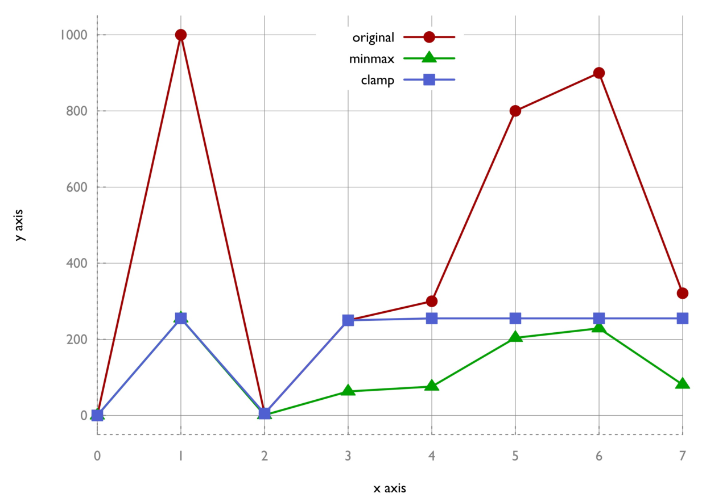

# 使用std::clamp将vector中的值控制在特定数值范围内

在很多应用中，我们需要获得相应的数据。在我们对其进行绘制或进行其他处理前，我们会先对这些数据进行归一化，因为这些数据的差距很大。

通常我们可以使用std::transform通过传入一个谓词函数，对数据结构中的所有数据进行处理。不过，当我们不知道这些值有多大时或多小时，我们需要通过相应的函数找到数值的范围。

STL就包含这样的函数，比如std::minmax_element和std::clamp。将这些函数与Lambda函数相结合，可以解决一些简单的任务。

## How to do it...

本节，我们将vector中的值使用两种不同的方式进行归一化，一种使用std::minmax_element，另一种使用std::clamp：

1. 包含必要的头文件，并声明所使用的命名空间。

   ```c++
   #include <iostream>
   #include <vector>
   #include <algorithm>
   #include <iterator>

   using namespace std;
   ```

2. 我们将实现一个获得最大值和最小值的函数。我们这里最大值和最小值会更新，以便我们进行处理。函数对象会获取最大最小值，并返回另一个函数对象，这个返回的函数对象会做一些实际的转换。为了简单起见，新的最小值为0，所以旧值不需要进行偏移，并且值的归一化都是相对于0。为了有更好的可读性，这里我们忽略了最大值和最小值可能是一个值的可能性，不过在实际程序中需要格外注意这点，否则就会遇到除零问题：

   ```c++
   static auto norm (int min, int max, int new_max)
   {
       const double diff (max - min);
       return [=] (int val) {
       	return int((val - min) / diff * new_max);
       };
   }
   ```

3. 另一个函数对象构造器成为clampval，其会返回一个函数对象用于捕获最小值和最大值，并调用std::clamp将值控制在一定范围内：

   ```c++
   static auto clampval (int min, int max)
   {
       return [=] (int val) -> int {
       	return clamp(val, min, max);
       };
   }
   ```

4. vector中需要归一化的值大小不一。这些数据可能是热度数据、海拔高度或股票金额：

   ```c++
   int main()
   {
   	vector<int> v {0, 1000, 5, 250, 300, 800, 900, 321};
   ```

5. 为了对这些值进行归一化，我们需要找到这个vector中的最大值和最小值。std::minmax_element函数将帮助我们获得这两个值。其会返回一组迭代器来代表这两个值：

   ```c++
   	const auto [min_it, max_it] (
   		minmax_element(begin(v), end(v)));
   ```

6. 我们会将所有值从第一个vector拷贝到另一个中。让我们实例化第二个vector，并且让其接收第一个vector中的值：

   ```c++
       vector<int> v_norm;
       v_norm.reserve(v.size());
   ```

7. 使用std::transform从第一个vector拷贝到第二个vector。拷贝过程中，我们将会使用到归一化辅助函数。之前的最大值和最小值为0和1000。在归一化之后，为0和255：

   ```c++
       transform(begin(v), end(v), back_inserter(v_norm),
       	norm(*min_it, *max_it, 255));
   ```

8. 在我们实现另一个归一化策略之前，我们先将这个操作过后的结果进行打印：

   ```c++
   	copy(begin(v_norm), end(v_norm),
   		ostream_iterator<int>{cout, ", "});
   	cout << '\n'; 
   ```

9. 我们对已经归一化的vector使用clampval，这时的最大值和最小值分别为255和0：

    ```c++
   	transform(begin(v), end(v), begin(v_norm),
   		clampval(0, 255));
    ```

10. 完成之后，打印所有元素：

    ```c++
    	copy(begin(v_norm), end(v_norm),
    		ostream_iterator<int>{cout, ", "});
    	cout << '\n';
    }	
    ```

11. 编译并运行程序。当前值的范围都在0到255之间，我们可以将其认为是RGB颜色的亮度值：

    ```c++
    $ ./reducing_range_in_vector
    0, 255, 1, 63, 76, 204, 229, 81,
    0, 255, 5, 250, 255, 255, 255, 255,
    ```

12. 我们将对应的数据进行绘制，就得到了如下的图像。我们可以看到，使用最大最小值对原始数据进行变换，得到的数据时线性的。clamp曲线会损失一些信息。两种不同的结果在不同的情况下会很有用：

    

## How it works...

除了std::transform我们使用量两个算法：

std::minmax_element能接受一对begin和end迭代器作为输入。其会对这个范围进行遍历，然后找到这个范围内的最大值和最小值。其返回值是一个组对，我们会在我们的缩放函数中使用这个组对。

std::clamp函数无法对一个范围进行可迭代操作。其接受三个值作为参数：一个给定值，一个最小值，一个最大值。这个函数的返回值则会将对应的值截断在最大值和最小值的范围内。我们也能使用`max(min_val, min(max_val, x))`来替代` std::clamp(x, min_val, max_val) `。

