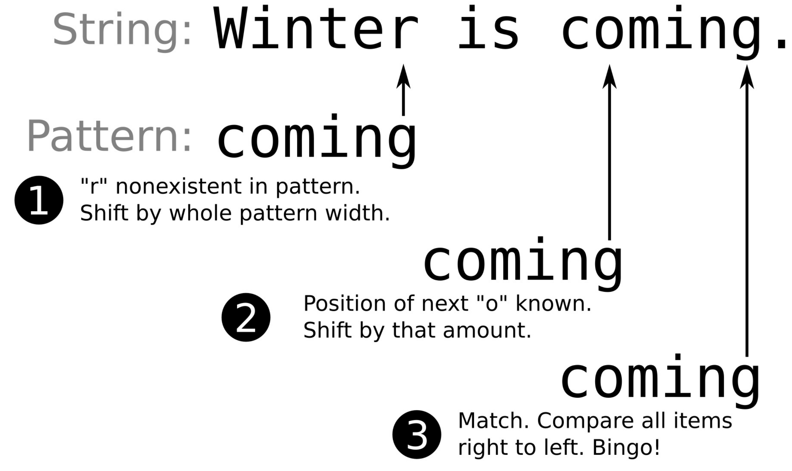

# 在字符串中定位模式并选择最佳实现——std::search

在一个字符串中查找另一个字符串，与在一个范围内查找一个对象有些不同。首先，字符串是可迭代的对象。另一方面，从一个字符串中查询另一个字符串，就意味着就是在一个范围内查询另一个范围。所以在查找过程中，有多次的比较，所以我们需要其他算法参与。

`std::string`就包含`find`函数，其能实现我们想要的；不过，本节我们将使用`std::search`来完成这个任务。虽然，`std::search`在字符串中会大量的用到，不过很多种容器都能使用这个算法来完成查找任务。C++17之后，`std::search`添加了更多有趣的特性，并且其本身可使用简单地交换搜索算法。这些算法都优化过，并且免费提供给开发者使用。另外，我们可以实现自己的搜索算法，并且可以将我们实现的算法插入`std::search`中。

## How to do it...

我们将对字符串使用新`std::search`函数，并且尝试使用其不同的查找对象进行应用：

1. 首先，包含必要的头文件，和声明所要使用的命名空间。

   ```c++
   #include <iostream>
   #include <string>
   #include <algorithm>
   #include <iterator>
   #include <functional>

   using namespace std;
   ```

2. 我们将实现一个辅助函数，用于打印查找算法所范围的位置，从而输出子字符串。

   ```c++
   template <typename Itr>
   static void print(Itr it, size_t chars)
   {
       copy_n(it, chars, ostream_iterator<char>{cout});
       cout << '\n';
   }
   ```

3. 我们例子输入的一个勒庞风格的字符串，其中包含我们要查找的字符串。本例中，这个需要查找的字符串为"elitr":

   ```c++
   int main()
   {
       const string long_string {
           "Lorem ipsum dolor sit amet, consetetur"
           " sadipscing elitr, sed diam nonumy eirmod"};
       const string needle {"elitr"};
   ```

4. 旧`std::search`接口接受一组`begin`和`end`迭代器，用于确定子字符串的查找范围。这个接口会返回一个迭代器指向所查找到的子字符串。如果接口没有找到对应的字符串，其将返回该范围的`end`迭代器：

   ```c++
       {
           auto match (search(begin(long_string), end(long_string),
           				 begin(needle), end(needle)));
           print(match, 5);
       }
   ```

5. C++17版本的`std::search`将会使用一组`begin/end`迭代器和一个所要查找的对象。`std::default_searcher`能接受一组子字符串的`begin`和`end`迭代器，再在一个更大的字符串中，查找这个字符串：

   ```c++
       {
           auto match (search(begin(long_string), end(long_string),
           	default_searcher(begin(needle), end(needle))));
           print(match, 5);
       }
   ```

6. 这种改变就很容易切换搜索算法。`std::boyer_moore_searcher`使用Boyer-Moore查找算法进行快速的查找：

   ```c++
       {
           auto match (search(begin(long_string), end(long_string),
               boyer_moore_searcher(begin(needle), end(needle))));
           print(match, 5);
       }	
   ```

7. C++17标准中，有三种不同的搜索器对象实现。其中还有一种是Boyer-Moore-Horspool查找算法实现：

   ```c++
       {
           auto match (search(begin(long_string), end(long_string),
               boyer_moore_horspool_searcher(begin(needle),
               end(needle))));
           print(match, 5);
       }
   }
   ```

8. 我们编译并运行这个程序。我们可以看到相同的字符串输出：

   ```c++
   $ ./pattern_search_string
   elitr
   elitr
   elitr
   elitr
   ```

## How it works...

我们在`std::search`中使用了4种查找方式，得到了相同的结果。这几种方式适用于哪种情况呢？

让我们假设大字符串为`s`，要查找的部分为`p`。然后，调用`std::search(begin(s), end(s), begin(p), end(p));`和`std::search(begin(s), end(s), default_searcher(begin(p), end(p));`做相同的事情。

其他搜索方式将会以更复杂的方式实现：

- `std::default_searcher`：其会重定向到`std::search`的实现。
- `std::boyer_moore_searcher`：使用Boyer-Moore查找算法。
- `std::boyer_moore_horspool_searcher`：使用Boyer-Moore-Horspool查找算法。

为什么会有这些特殊的算法呢？Boyer-Moore算法起源于一个特殊想法——查找部分与原始字符串进行比较，其始于查找字符串的尾部，并且从右到左查找。如果查找的字符多个位置不匹配，并且对应部分没有出现，那么就需要在整个字符串进行平移，然后在进行查找。下图可能会看的更加明白一些。先来看一下第一步发生了什么：因为算法已知所要匹配字符串的长度，所以需要对相应位置上的字符进行比较，然后在平移到下一个长度点进行比较。在图中，这发生在第二步。这样Boyer-Moore算法就能避免对不必要的字符进行比较。



当然，在我们没有提供新的比较查找算法时，Boyer-Moore为默认的查找算法。其要比原先默认的算法快很多，不过其需要快速查找的数据结果进行支持，以判断搜索字符是否存在于查找块中，以及以多少为偏移进行定位。编译器将选择不同复杂度的算法实现，这取决于其所使用到的数据类型(对复杂类型的哈希映射和类型的原始查找表进行更改)。最后，默认的查找算法在查询不是很长的字符串也是非常的快。如果需要查找算法提高性能，那么Boyer-Moore将会是个不错的选择。

Boyer-Moore-Horspool为简化版的Boyer-Moore算法。其丢弃了“坏字符”规则，当对应字符串没有找到时，将会对整个查找块进行偏移。需要权衡的是，这个算法要比Boyer-Moore算法慢，但是其不需要对那么多特殊的数据结构进行操作。

> Note：
>
> 不要试图尝试比较哪种算法在哪种情况下更快。你可以使用自己实际的例子进行测试，并且基于你得到的结果进行讨论。

