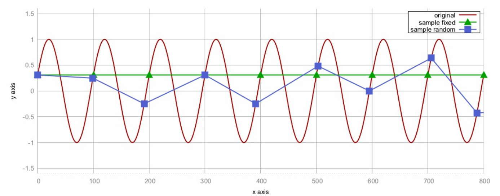
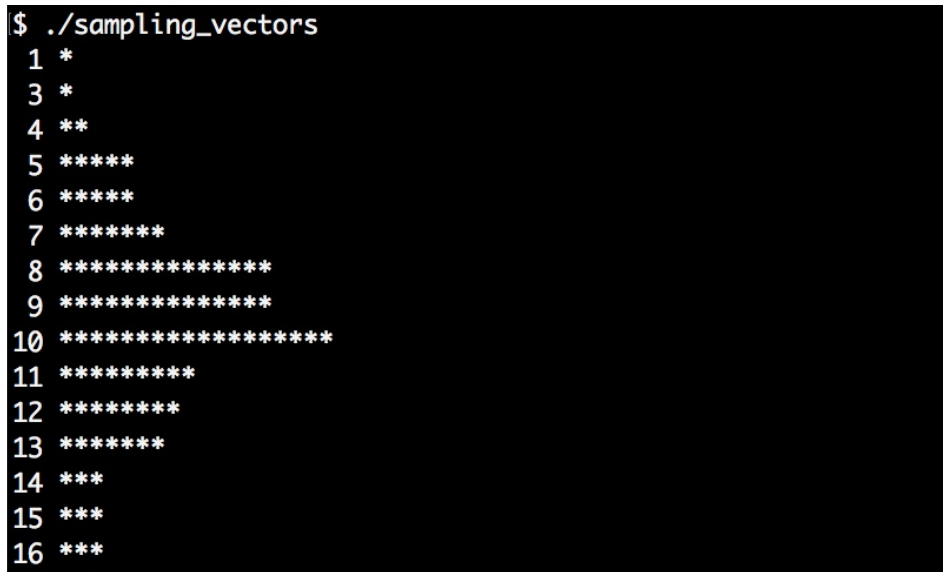

# 对大vector进行采样

有时我们需要处理非常庞大的数据量，不可能在短时间内处理完这些数据。这样的话，数据可能就需要采样来减少要处理的数据量，从而加速整个处理过程。另一些情况下，不减少数据量也能加快程序处理的速度，不过这需要对一些数据进行存储或变换。

采样最原始的方式是每隔N个数据点，采样一次。在大多数情况下这样做没有问题，但是在信号处理中，其会引发一种称为**混淆**的数学情况。当减少两个随机采样点的距离时，这种现象会减弱。我们看一下下面的图，这张图就很能说明问题——当原始信号为一个sin波时，图例为三角的曲线就表示对这个曲线进行每隔100个点的取样。



不幸的是，其采样得到的值都是同一个Y值！连接起来就是与X轴平行的一条线。平方点采样，其每隔`100+random(-15,  +15)`个值进行采样。不过，这样连接起来的曲线看起来和原始的曲线还是相差很远，所以在这个例子中就不能以固定的步长进行采样。

`std::sample`函数不会添加随机值来改变采样的步长，而是采用完全随机的点进行采样。所以其工作方式与上图所显示的大为不同。

## How to do it...

我们将对一个具有随机值的大vector进行采样。随机数据符合正态分布。采样结果也要符合正态分布，来让我们看下代码：

1. 首先包含必要的头文件，以及声明所使用的命名空间。

   ```c++
   #include <iostream>
   #include <vector>
   #include <random>
   #include <algorithm>
   #include <iterator>
   #include <map>
   #include <iomanip>

   using namespace std; 
   ```

2. 使用常数直接对变量进行初始化。第一个值代表了`vector`的的长度，第二个数代表了采样的步长：

   ```c++
   int main()
   {
       const size_t data_points {100000};
       const size_t sample_points {100};
   ```

3. 我们要使用符合正态分布的随机值生成器来将`vector`填满。这里先来确定正太分布的平均值和标准差：

   ```c++
   	const int mean {10};
   	const size_t dev {3};
   ```

4. 现在，我们来设置随机数生成器。首先，我们实例化一个随机设备，然后给定一个随机种子，对生成器进行初始化。然后，就可以得到对应分布的随机生成器：

   ```c++
   	random_device rd;
   	mt19937 gen {rd()};
   	normal_distribution<> d {mean, dev};
   ```

5. 对`vector`进行初始化，并用随机值将`vector`进行填充。这里会使用到`std::generate_n`算法，其会将随机值，通过`back_inserter`迭代器插入`vector`中。生成函数对象包装成了`d(gen)`表达式，其能生成符合分布的随机值：

   ```c++
       vector<int> v;
       v.reserve(data_points);
       
   	generate_n(back_inserter(v), data_points,
       	[&] { return d(gen); });
   ```

6. 我们再实例化另一个`vector`，其来放采样过后的数值：

   ```c++
   	vector<int> samples;
   	v.reserve(sample_points);
   ```

7. `std::sample`算法与`std::copy`的原理类似，不过其需要两个额外的参数：采样数量和随机值生成对象。前者确定输入范围，后者去确定采样点：

   ```c++
   	sample(begin(v), end(v), back_inserter(samples),
   		sample_points, mt19937{random_device{}()});
   ```

8. 这样就完成了采样。代码的最后展示一下我们的采样结果。输入数据符合正态分布，如果采样算法可行，那么其采样的结果也要符合正态分布。为了展示采样后的值是否符合正态分布，我们将数值的直方图进行打印：

   ```c++
   	map<int, size_t> hist;

   	for (int i : samples) { ++hist[i]; }
   ```

9. 最后，我们使用循环打印出直方图：

   ```c++
       for (const auto &[value, count] : hist) {
       	cout << setw(2) << value << " "
       		<< string(count, '*') << '\n';
       }
   }
   ```

10. 编译并运行程序，我们将看到采样后的结果，其也符合正态分布：

## How it works...

 `std::sample`算法是C++17添加的。其函数签名如下：

```c++
template<class InIterator, class OutIterator,
class Distance, class UniformRandomBitGenerator>
OutIterator sample(InIterator first, InIterator last,
				 SampleIterator out, Distance n,
				 UniformRandomBitGenerator&& g);
```

其输入范围有first和last迭代器确定，`out`迭代器作为采样输出。这些迭代器对于该函数来说和`std::copy`类似，元素从一个容器拷贝到另一个。`std::sample`算法只会拷贝输入中的一部分，因为采样结果只有n个元素。其在内部使用均匀分布，所以能以相同的概率选择输入范围中的每个数据点。