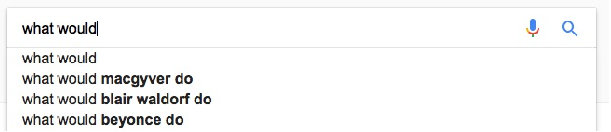

# 使用树实现搜索输入建议生成器

上网时，在搜索引擎中输入要查找的东西时，对应下拉选项中会尝试猜测你想要查找什么。这种猜测是基于之前相关主题被查找的数量。有时搜索引擎十分有趣，其会显示一些奇怪的主题。



本章，我们将使用树类实现一个简单的搜索建议引擎。

## How to do it...

本节，我们将实现一个终端应用，其能接受输入，并且能对所要查找的内容进行猜测，当然猜测的依据是我们用文本完成的“数据库”。

1. 包含必要的头文件和声明所使用的命名空间：

   ```c++
   #include <iostream>
   #include <optional>
   #include <algorithm>
   #include <functional>
   #include <iterator>
   #include <map>
   #include <list>
   #include <string>
   #include <sstream>
   #include <fstream>
   
   using namespace std;
   ```

2. 我们将使用上一节实现的trie类：

   ```c++
   template <typename T>
   class trie
   {
   	map<T, trie> tries;
   public:
   	template <typename It>
   	void insert(It it, It end_it) {
   		if (it == end_it) { return; }
   		tries[*it].insert(next(it), end_it);
   	}
   
       template <typename C>
   	void insert(const C &container) {
   		insert(begin(container), end(container));
   	}
       
   	void insert(const initializer_list<T> &il) {
   		insert(begin(il), end(il));
   	}
       
   	void print(list<T> &l) const {
   		if (tries.empty()) {
   			copy(begin(l), end(l),
   				ostream_iterator<T>{cout, " "});
   			cout << '\n';
   		}
   		for (const auto &p : tries) {
   			l.push_back(p.first);
   			p.second.print(l);
   			l.pop_back();
   		}
   	}
      	 
   	void print() const {
   		list<T> l;
   		print(l);
   	}
       
   	template <typename It>
   	optional<reference_wrapper<const trie>>
   	subtrie(It it, It end_it) const {
   		if (it == end_it) { return ref(*this); }
   		auto found (tries.find(*it));
   		if (found == end(tries)) { return {}; }
   
           return found->second.subtrie(next(it), end_it);
   	}
       
   	template <typename C>
   	auto subtrie(const C &c) const {
   		return subtrie(begin(c), end(c));
   	}
   };
   ```

3. 实现一个简单的辅助函数，这个函数将用于提示用户输入他们想要查找的东西：

   ```c++
   static void prompt()
   {
   	cout << "Next input please:\n > ";
   } 
   ```

4. 主函数中，我们打开一个文本文件，其作为我们的基础数据库。我们逐行读取文本文件的内容，并且将数据放入trie中解析：

   ```c++
   int main()
   {
       trie<string> t;
       fstream infile {"db.txt"};
       for (string line; getline(infile, line);) {
           istringstream iss {line};
           t.insert(istream_iterator<string>{iss}, {});
       }
   ```

5. 现在可以使用构建好的trie类，并且需要实现接收用户查询输入的接口。会提示用户进行输入，并且将用户的输入整行读取：

   ```c++
       prompt();
       for (string line; getline(cin, line);) {
       	istringstream iss {line};
   ```

6. 通过文本输入，可以使用trie对其子trie进行查询。如果在数据库中已经有相应的语句，那么会对输入进行建议，否则会告诉用户没有建议给他们：

   ```c++
       if (auto st (t.subtrie(istream_iterator<string>{iss}, {}));
       	st) {
       	cout << "Suggestions:\n";
       	st->get().print();
       } else {
       	cout << "No suggestions found.\n";
       }
   ```

7. 之后，将打印一段分割符，并且再次等待用户的输入：

   ```c++
           cout << "----------------\n";
           prompt();
       }
   }
   ```

8. 运行程序之前，我们需要将db.txt文件进行设置。查找的输入可以是任何字符，并且其不确保是已经排过序的。进入trie类的所有语句：

   ```c++
   do ghosts exist
   do goldfish sleep
   do guinea pigs bite
   how wrong can you be
   how could trump become president
   how could this happen to me
   how did bruce lee die
   how did you learn c++
   what would aliens look like
   what would macgiver do
   what would bjarne stroustrup do
   ...
   ```

9. 创建完db.txt之后，我们就可以运行程序了。其内容如下所示：

   ```c++
   hi how are you
   hi i am great thanks
   do ghosts exist
   do goldfish sleep
   do guinea pigs bite
   how wrong can you be
   how could trump become president
   how could this happen to me
   how did bruce lee die
   how did you learn c++
   what would aliens look like
   what would macgiver do
   what would bjarne stroustrup do
   what would chuck norris do
   why do cats like boxes
   why does it rain
   why is the sky blue
   why do cats hate water
   why do cats hate dogs
   why is c++ so hard
   ```

10. 编译并运行程序，然后进行输入查找：

    ```c++
    $ ./word_suggestion
    Next input please:
    > what would
    Suggestions:
    aliens look like
    bjarne stroustrup do
    chuck norris do
    macgiver do
    ----------------
    Next input please:
    > why do
    Suggestions:
    cats hate dogs
    cats hate water
    cats like boxes
    ----------------
    Next input please:
    >
    ```
## How it works...

trie是如何工作的，已经在上一节中介绍过了，不过本节我们对其进行填充和查找的过程看起来有些奇怪。让我们来仔细观察一下代码片段，其使用文本数据库文件对空trie类进行填充：

```c++
fstream infile {"db.txt"};
for (string line; getline(infile, line);) {
    istringstream iss {line};
    t.insert(istream_iterator<string>{iss}, {});
}
```

这段代码会逐行的将文本文件中的内容读取出来。然后，我们将字符串拷贝到一个`istringstream`对象中。我们可以根据输入流对象，创建一个`istring_iterator`迭代器，其能帮助我们查找子trie。这样，我们就不需要将字符串放入`vector`或`list`中了。上述代码中，有一段不必要的内存分配，可以使用移动方式，将`line`中的内容移动到iss中，避免不必要的内存分配。不过，`std::istringstream`没有提供构造函数，所以只能将`std::string`中的内容移动到流中。不过，这里会对输入字符串进行复制。

当在trie中查询用户的输入时，使用了相同的策略，但不使用输入文件流。我们使用`std::cin`作为替代，因为`trie::subtrie`对迭代器的操作，和`trie::insert`如出一辙。

## There's more...

这里有必要对每个trie节点添加统计变量，这样我们就能知道各种前缀被查询的频率。因此，我们就可以将程序的建议进行排序，当前的搜索引擎就是这样做的。智能手机触摸屏文本输入的建议，也可以通过这种方式实现。

这个修改就留给读者当作业了。 ：）