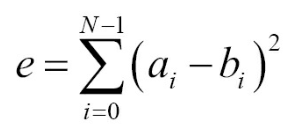
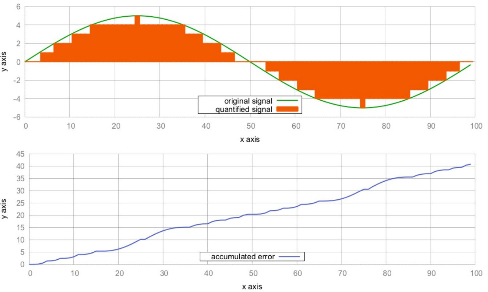

# 计算两个vector的误差和

对两个值进行计算的时候，计算机的计算结果与我们期望的结果有一定的差别。比如，测量由多个数据点组成的信号之间的差异，通常会涉及相应数据点的循环和减法等计算。

我们给出一个简单的计算信号a与信号b之间的误差公式：



对于每一个`i`，都会计算一次`a[i] - b[i]`，对差值求平方(负值和正值就能进行比较)，最后计算平方差的和。通常我们会使用循环来做这件事，但是为了让事情更加好玩，我们决定使用STL算法来完成。使用STL的好处是，无需耦合特定的数据结果。我们的算法能够适应`vector`和类似链表的数据结构，不用直接进行索引。

## How to do it...

本节，我们将创建两个信号，并计算这两个信号之间的误差：

1. 依旧是包含必要的头文件和声明所使用的命名空间。

   ```c++
   #include <iostream>
   #include <cmath>
   #include <algorithm>
   #include <numeric>
   #include <vector>
   #include <iterator>

   using namespace std; 
   ```

2.  我们将对两个信号的误差和进行计算。这两个信号一个是`sine`，另一个信号也是`sine`，不过其中之一的使用`double`类型进行保存，另一个使用`int`类型进行保存。因为`double`和`int`类型表示数值的范围有差异，就像是模拟信号`as`转换成数字信号`ds`。

   ```c++
   int main()
   {
       const size_t sig_len {100};
       vector<double> as (sig_len); // a for analog
       vector<int> ds (sig_len); // d for digital
   ```

3. 为了生成一个`sin`波形，我们事先了一个简单的Lambda表达式，并可以传入一个可变的计数变量`n`。我们可以经常在需要的时候调用表达式，其将返回下一个时间点的`sine`波形。`std::generate`可以使用信号值来填充数组，并且使用`std::copy`将数组中的`double`类型的变量，转换成`int`类型变量：

   ```c++
   	auto sin_gen ([n{0}] () mutable {
       	return 5.0 * sin(n++ * 2.0 * M_PI / 100);
       });
       generate(begin(as), end(as), sin_gen);
       copy(begin(as), end(as), begin(ds));
   ```

4. 我们可以对信号进行打印，也可以使用绘图进行显示：

   ```c++
   	copy(begin(as), end(as),
       	ostream_iterator<double>{cout, " "});
       cout << '\n';
       copy(begin(ds), end(ds),
       	ostream_iterator<double>{cout, " "});
       cout << '\n'; 
   ```

5. 现在来计算误差和，我们使用`std::inner_product`，因为这个函数能帮助我们计算两个信号矢量的差异。该函数能在指定范围内进行迭代，然后选择相应位置上进行差值计算，然后在进行平方，再进行相加：

   ```c++
       cout << inner_product(begin(as), end(as), begin(ds),
       					0.0, std::plus<double>{},
       					[](double a, double b) {
      							return pow(a - b, 2);
       					})
       	<< '\n';
   }
   ```

6. 编译并运行程序，我们就能得到两条曲线，还有一条曲线代表的是两个信号的误差和。最终这两个信号的误差为40.889。当我们使用连续的方式对误差进行统计，要对值进行逐对匹配，然后得到无法曲线，其就像我们在下图中看到的一样：

   

## How it works...

本节，我们需要将两个向量放入循环中，然后对不同位置的值计算差值，然后差值进行平方，最后使用`std::inner_product`将差的平方进行加和。这样，我们可以使用Lambda表达式来完成求差值平方的操作——`[](double a, double b){return pow(a - b), 2}`，这样就可以通过传入不同的参数来计算差值平方。

这里我们可以看下`std::inner_product`是如何工作的：

```c++
template<class InIt1, class InIt2, class T, class F, class G>
T inner_product(InIt1 it1, InIt1 end1, InIt2 it2, T val,
			   F bin_op1, G bin_op2)
{
    while(it1!= end1){
        val = bin_op1(val, bin_op2(*it1, *it2));
        ++it1;
        ++it2;
    }
    return value;
}
```

算法会接受一对`begin/end`迭代器作为第一个输入范围，另一个`begin`迭代器代表第二个输入范围。我们的例子中，这些迭代器所指向的是`vector`，并对这两个`vector`进行误差和的计算。`val`是一个初始化值。我们这里将其设置为`0.0`。然后，算法可以接受两个二元函数，分别为`bin_op1`和`bin_op2`。

我们会发现，这个算法与`std::accumulate`很相似。不过`std::accumulate`只对一个范围进行操作。当将`bin_op2(*it1, *it2)`看做一个迭代器，那么我们可以简单的是用`accumulate`算法进行计算了。所以，我们可以将`std::inner_product`看成是带有打包输入范围的`std::accumulate`。

例子中，打包函数就是`pow(a - b, 2)`。因为我们需要将所有元素的差平方进行加和，所以我们选择`std::plus<double>`作为`bin_op1`。

