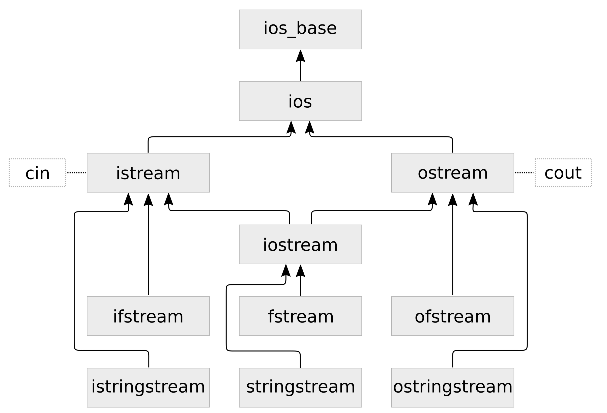

# 第7章 字符串, 流和正则表达

本章，我们将对字符串的处理进行介绍，其中包括处理、解析和打印任意的数据。对于这样的需求，STL提供了I/O流库进行支持。这些库由以下的类组成，对应的类使用灰色框表示：

箭头的指向代表了每个类之间的继承关系。这里面类的数量还挺多，本章中，我们会逐个来熟悉。我们使用类型名称在STL的手册中进行查找时，不一定能直接找到这些类。因为图中的这些名字是对于应用开发者来说的，其中大多数类型的名称都是以`basic_`为前缀(例如：我们能很容易的在STL文档章找到`basic_istream`，而`istream`却很难找到)。以`basic_`为前缀的I/O流类型为模板类，可以将其特化成不同的字符类型。图中的类型都可以以`char`类型进行特化。我们将会在本书剩下的章节中，使用以`char`为特化的版本。当我们看到类型名前面以`w`开头时(例如：`wistream`，`wostream`)，将使用`wchar_t`类型代替`char`类型。

图的最顶端，能看到`std::ios_base`类。我们不能直接对其进行使用，不过其他的类型都是其子类。其一种特化为`std::ios`，这个类型对象会包含流数据，其能通过`good`成员函数对流的状态进行查询，还能通过`empty`成员函数数据状态是否为(EOF)。

我们经常使用的特化类有两个：`std::istream`和`std::ostream`。两个类型的前缀`i`和`o`代表着输入和输出。我们在之前的代码使用使用其`std::cout`和`std::cin`(还有`std::cerr`)对象对字符串进行过输入和输出。其都是这些类型的实例，也是非常通用的。我们通过`ostream`进行数据输出，使用`istream`进行数据输入。

`iostream`类则是对`istream`和`ostream`的继承，其将输入和输出的能力进行合并。当我们要对流数据进行输入和输出的时候，我们就有三个类可供使用。

`ifstream`，`ofstream`和`fstream`继承于`istream`，`ostream`和`iostream`，不过为I/O流添加了文件的读入写出功能。

`istringstream`,  `ostringstream`和`iostringstream`原理十分类似，会将字符串读入内存中，并在内存中对数据进行处理。