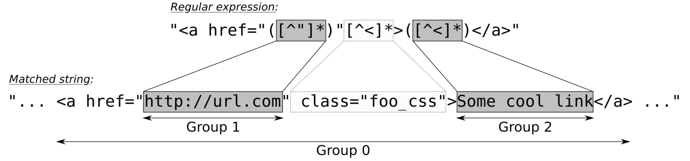

# 使用正则表达式库标记输入

当我们需要使用一些较为复杂的方式解析或转换字符串时，正则表达式是个不错的选择。因为非常好用，很多编程语言中都会内置正则表达式。

如果你还对正则表达式不太了解，可以去维基百科的相关页面进行了解。我相信其会扩展你的视野，正则表达式对于文本解析来说十分好用。正则表达式能用来检查一个电子邮件或IP地址是否合法，也能从长字符串中找到对应的子字符串等等。

本节中，我们将提取HTML文件中的链接，并且将这些链接为使用者罗列出来。因为正则表达式在C++11标准中正式加入C++ STL，所以例程很短。

## How to do it...

我们将定义一个正则表达式来检测链接，并且将其作用于一个HTML文件，并将获得的链接打印出来：

1. 包含必要的头文件，并声明所使用的命名空间：

   ```c++
   #include <iostream>
   #include <iterator>
   #include <regex>
   #include <algorithm>
   #include <iomanip>
   
   using namespace std; 
   ```

2. 在后面将会生成一段可迭代器的区间，这个区间中只包含字符串。这里会以链接地址字符串和链接描述字符串配对出现。因此，我们也要写一个辅助函数来打印这些字符串：

   ```c++
   template <typename InputIt>
   void print(InputIt it, InputIt end_it)
   {
   	while (it != end_it) {
   ```

3. 每次循环中，我们对迭代器增加了两次，这是因为要对链接地址和链接描述进行拷贝。两个迭代器解引用间，我们添加了一个if条件，为了保证程序的安全，这个条件句会检查迭代器是否过早的到达了最后：

   ```c++
   		const string link {*it++};
   		if (it == end_it) { break; }
   		const string desc {*it++};
   ```

4. 现在我们就可以对链接和其描述进行打印：

   ```c++
           cout << left << setw(28) << desc
           	<< " : " << link << '\n';
       }
   }
   ```

5. 主函数中，我们将从标准输入中获取所要读取的数据。这样，需要将全部标准输入通过一个输入流迭代器构造为一个字符串。为了避免符号化，为了确保我们所得到的输入与用户输入的一样，我们使用了`noskipws`控制符。这个控制符将会禁用空格跳过和符号化：

   ```c++
   int main()
   {
       cin >> noskipws;
       const std::string in {
           istream_iterator<char>{cin}, {} 
       };
   ```

6. 现在我们需要定义一个正则表达式，来对HTML文件进行查找。小括号在正在表达式中代表的是组，这里我们要获取我们想要访问的链接——其为URL地址，并且还要获取其描述：

   ```c++
   	const regex link_re {
   		"<a href=\"([^\"]*)\"[^<]*>([^<]*)</a>"};
   ```

7.  `sregex_token_iterator`类具有相同的功能，并且能对`istream_iterator`直接操作。我们将可迭代的输入范围和刚刚定义的正则表达式传给它。不过，这里还有第三个参数`{1, 2}`。其表示我们想要表达式组1和组2中的结果：

   ```c++
   	sregex_token_iterator it {
   		begin(in), end(in), link_re, {1, 2}
       };
   ```

8. 现在我们有一个迭代器，如果找到了连接，其会返回连接地址和相应的描述。这里对第二个参数直接进行初始化，其类型与第一个参数类型相同，然后传入我们之前实现的`print`函数中：

   ```c++
   	print(it, {});
   }
   ```

9. 编译并运次那个程序，就会得到如下的输出。我们使用curl获取ISO C++首页的信息，其会将HTML页面直接从网上下载下来。当然，这里也能写成` cat some_html_file.html | ./link_extraction `。正则表达式可以很方便对硬编码进行解析，通过HTML固定的格式对其进行解析。当然，你可以让其变得更加通用：

   ```c++
   $ curl -s "https://isocpp.org/blog" | ./link_extraction
   Sign In / Suggest an Article : https://isocpp.org/member/login
   Register : https://isocpp.org/member/register
   Get Started! : https://isocpp.org/get-started
   Tour : https://isocpp.org/tour
   C++ Super-FAQ: https://isocpp.org/faq
   Blog : https://isocpp.org/blog
   Forums : https://isocpp.org/forums
   Standardization: https://isocpp.org/std
   About: https://isocpp.org/about
   Current ISO C++ status : https://isocpp.org/std/status
   (...and many more...)
   ```

## How it works...

正则表达式非常有用，看起来好像特别神秘，但值得学习。一个短小的表达式就能节省对我们多行的代码进行手动匹配的时间。

本节中，我们第一次实例化了一个正则类型的对象。我们使用一个用于描述的字符串对正则表达式进行构造。最简单的正则表达式是"."，其会对每个字符进行匹配，因为它是正则表达式的通配符。表达式为"a"时，其就只会对'a'字符进行匹配。表达式为"ab*"时，其表示"只有一个a，和零个或若干个b"，以此类推。正则表达式本身是一个很大的主题，维基百科和一些教学网站，还有一些学术论文中，对其都有非常详尽的描述。

让我们来看一下本节中的正则表达式，是如何对HTML连接进行匹配的。一个简单HTML连接可写为`  <a href="some_url.com/foo">A great link</a> `。我们只需要`some_url.com/foo`和`A great link`部分。所以，我们可以使用如下的正则表达式进行匹配，其会将字符串对应每个组，从而分解成多个字符串：



字符串本身为**第0组**，也就是整个字符串。引号中`href`的URL地址部分分在**第1组**中。正则表达式中，使用小括号来定义组，所以这个表达式中有两个组。另一个组则获取的是连接描述。

有很多STL函数可以接受正则对象，不过直接使用一个正则字符迭代器适配器，其是对使用`std::regex_search`进行自动化匹配的高阶抽象。我们可用如下的代码对其进行实例化：

```c++
sregex_token_iterator it {begin(in), end(in), link_re, {1, 2}};
```

开始和结束部分表示我们的输入字符串，正则迭代器则在该字符串上进行迭代，并匹配所有链接。`link_re`则为用于匹配连接的正则表达式，`{1, 2}`可用来表示我们需要的部分。其第一组匹配的是我们想要的连接，进行自增后，就到了第二组，匹配的则是我们想要的连接描述，依次循环。其能非常智能的帮助我们对多行数据进行处理。

让我们来看另一个例子，以确保我们明白了上面的内容。让我们创建一个正则表达式`"a(b*)(c*)"`。其会对具有一个'a'字符，之后有或没有'b'字符，再之后有或没有'c'字符的字符串进行匹配：

```c++
const string s {" abc abbccc "};
const regex re {"a(b*)(c*)"};

sregex_token_iterator it {
    begin(s), end(s), re, {1, 2} 
};

print( *it ); // prints b
++it;
print( *it ); // prints c
++it;
print( *it ); // prints bb
++it;
print( *it ); // prints ccc
```

当然也可以使用`std::regex_iterator`类，其会将匹配的子字符串进行直接输出。