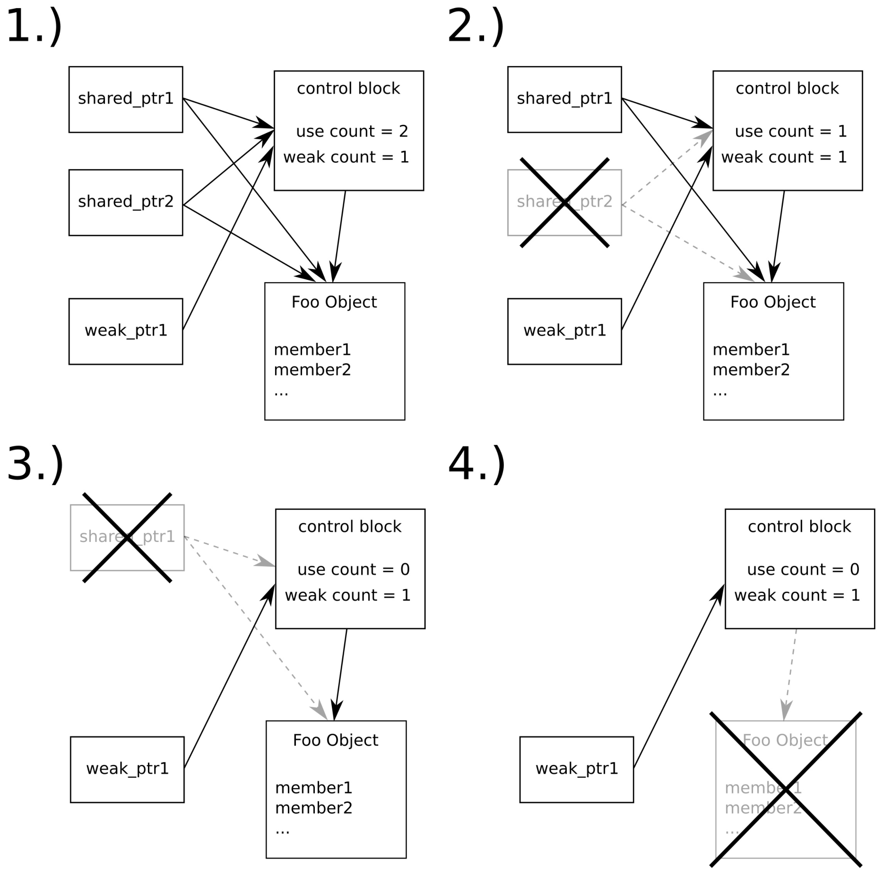

# 对共享对象使用弱指针

本节和`shared_ptr`有关，我们已经了解了如何使用共享指针。和`unique_ptr`一样，其提升了C++对动态分配对象的管理能力。

拷贝`shared_ptr`时，我们会将内部计数器加1。当持有共享指针的拷贝时，其指向的对象则不会被删除。但是，当使用某种弱指针时，其能像普通指针一样对指向对象进行操作，但依旧能让所指向对象被销毁？然而，销毁之后我们应该如何确定对象是否存在呢？

这种情况下`weak_ptr`就是我们最佳的选择。其相对于`unique_ptr`和`shared_ptr`来说有些复杂，但是在本节随后的内容中，我们将会对其进行使用。

## How to do it...

我们将使用`shared_ptr`对一个实例进行管理，然后我们将`weak_ptr`混入其中，从而了解对`weak_ptr`的操作对智能指针的内存处理有何影响：

1. 包含必要的头文件，并声明所使用的命名空间：

   ```c++
   #include <iostream>
   #include <iomanip>
   #include <memory>
   
   using namespace std; 
   ```

2. 接下来，我们将实现一个类，将在析构函数的实现中进行打印。当类型被析构时，我们可以从打印输出进行判断：

   ```c++
   struct Foo {
       int value;
       
       Foo(int i) : value{i} {}
       ~Foo() { cout << "DTOR Foo " << value << '\n'; }
   };
   ```

3. 让我们来实现一个函数用于对弱指针的信息进行打印，这样我们就可以了解弱指针不同指向时的状态。`expired`成员函数会告诉我们，弱指针指向的对象是否依旧存在，因为使用弱指针持有这个对象并无法让其生命周期延长！`use_count`计数器告诉我们，当前`shared_ptr`实例中对象的引用次数：

   ```c++
   void weak_ptr_info(const weak_ptr<Foo> &p)
   {
       cout << "---------" << boolalpha
           << "\nexpired: " << p.expired()
           << "\nuse_count: " << p.use_count()
           << "\ncontent: "; 
   ```

4. 当我们要访问一个实际对象时，需要调用`lock`函数，会返回一个指向对象的共享指针。当对象不存在时，返回的共享指针则是一个空指针。我们将对其进行检查，然后对其进行访问：

   ```c++
       if (const auto sp (p.lock()); sp) {
       	cout << sp->value << '\n';
       } else {
       	cout << "<null>\n";
       }
   }
   ```

5. 主函数中实例化一个空的弱指针，并且对其内容进行打印：

   ```c++
   int main()
   {
       weak_ptr<Foo> weak_foo;
       weak_ptr_info(weak_foo);
   ```

6. 新的代码段中，使用`Foo`类实例化了一个共享指针，再将其拷贝给弱指针。需要注意的是，这个操作并不会对共享指针的引用计数有任何影响。其引用计数依旧为1，因为只有共享指针对其具有所有权：

   ```c++
   	{
   		auto shared_foo (make_shared<Foo>(1337));
   		weak_foo = shared_foo;
   ```

7. 离开代码段前，我们对弱指针的状态进行打印；离开时候，再打印一次。虽然弱指针依旧指向`Foo`的对象，但是`Foo`实例还是会在离开代码段时立即被销毁：

   ```c++
           weak_ptr_info(weak_foo);
       }
   
       weak_ptr_info(weak_foo);
   }
   ```

8. 编译并运行程序，就会看到`weak_ptr_info`函数的输出。第一次，是弱指针为空的时候。第二次，是其指向我们创建的`Foo`实例，并在弱指针锁定后对其进行解引用。第三次调用之前，我们离开了内部代码区域，会触发`Foo`类型的析构。之后，我们就无法通过弱指针获取已经删除的`Foo`对象，并且在这时弱指针也意识到，原先指向的对象已经不存在了：

   ```c++
   $ ./weak_ptr
   ---------
   expired: true
   use_count: 0
   content: <null>
   ---------
   expired: false
   use_count: 1
   content: 1337
   DTOR Foo 1337
   ---------
   expired: true
   use_count: 0
   content: <null>
   ```

## How it works...

弱指针为我们提供了一种指向共享指针对象，但不会增加其引用计数的方式。Okay，一个裸指针也可以做这样的事，不过裸指针无法告诉我们其是否处于悬垂的状态，而弱指针可以！

为了能更好的了解弱指针为共享指针添加的功能，我们画了一张图供大家参考：



流程与共享指针的图类似。第1步中，我们有两个共享指针和一个弱指针，都指向`Foo`类型的实例。虽然有三个指针指向这个对象，但是其共享指针引用数依旧为2，弱指针在控制块有属于自己的计数器。第2和3步中，共享指针的实例被销毁，这步将会让引用计数归0。第4步，`Foo`对象也被销毁了，不过控制块依旧存在。因为弱指针依旧需要控制块来对其是否悬垂进行判断。只有当最后一个指向对象的弱指针被销毁，那么控制块才会被销毁。

也可以说处于悬垂状态的弱指针是无效的。为了对这个属性进行检查，我们可以调用`weak_ptr`指针的`expired`成员函数，其将会为我们返回一个布尔值。当其返回true时，我们就不能对这个弱指针进行解引用，因为其说明这个对象已经不存在了。

为了对弱指针解引用，我们需要调用`lock()`函数。这是种安全和方便的方法，因为函数返回给我们一个共享指针。当持有这个共享指针时，我们对其进行了锁定，所以这时对象的计数器无法进行变化。`lock()`之后，对象被删除，我们将会得到一个空的共享指针。

