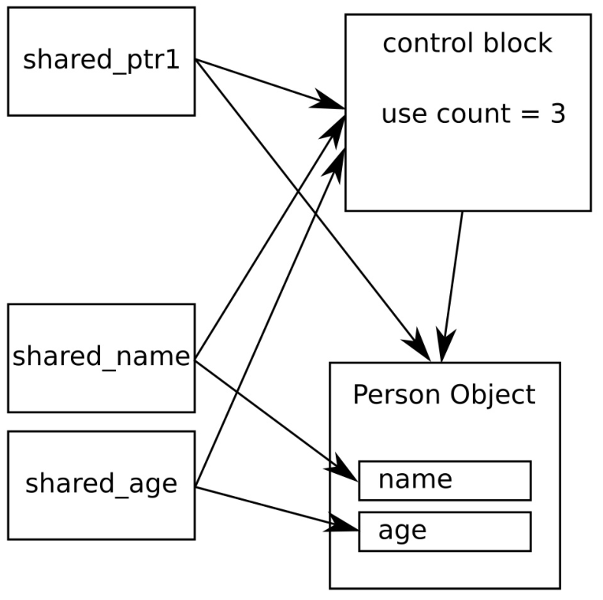

# 共享同一对象的不同成员

试想我们在一个共享指针中持有一个组成非常复杂的动态分配对象，然后使用新的线程完成一些特别耗时的任务。当我们想要对共享指针所持有的对象进行释放时，线程很有可能仍旧会对这个对象进行访问。当然，我们并不想把这个非常复杂的对象交给线程，因为这样的设计有违我们的初衷。那么就意味着我们要手动对内存进行管理了么？

非也！这个问题可以由共享指针来解决，指向一个非常大的共享对象。另外，可以在初始化阶段就接管对对象的内存管理任务。

在这个例子中，我们将模拟这样一种情况(为了简单，不使用线程)，让我们来看一下`shared_ptr`是如何来解决这个问题的。

## How to do it...

我们将定义一个结构体，其中包含了多个成员。然后，我们会使用共享指针来管理这个类型的动态分配实例。对于共享指针来说，不会直接指向这个对象的本身，而会指向其成员：

1. 包含必要的头文件，并声明所使用的命名空间：

   ```c++
   #include <iostream>
   #include <memory>
   #include <string>
   
   using namespace std;
   ```

2.  定义一个类型，其中包含了不同的成员，将使用共享指针指向这些成员。为了能清晰的了解类型实例何时被创建与销毁，我们让构造和析构函数都打印一些信息：

   ```c++
   struct person {
       string name;
       size_t age;
       
       person(string n, size_t a)
       	: name{move(n)}, age{a}
       { cout << "CTOR " << name << '\n'; }
       
       ~person() { cout << "DTOR " << name << '\n'; }
   };
   ```

3. 再来创建几个共享指针，用于指向`person`类型实例中的`name`和`age`成员变量：

   ```c++
   int main()
   {
       shared_ptr<string> shared_name;
       shared_ptr<size_t> shared_age;
   ```

4. 接下来，创建一个新代码段，并创建一个`person`对象，并且用共享指针对其进行管理：

   ```c++
   	{
   		auto sperson (make_shared<person>("John Doe", 30));
   ```

5. 使用之前定义的两个共享指针，分别指向`name`和`age`成员。使用了`shared_ptr`的特定构造函数，其能接受一个共享指针和一个共享指针持有对象的成员变量。这样就能对整个对象进行管理，但不指向其本身！

   ```c++
   		shared_name = shared_ptr<string>(sperson, &sperson->name);
   		shared_age = shared_ptr<size_t>(sperson, &sperson->age);
   	}
   ```

6. 离开代码段后，我们将会打印`person`的`name`和`age`的值。这个操作只是用来验证，对象是否依旧存在：

   ```c++ 
   	cout << "name: " << *shared_name
   		<< "\nage: " << *shared_age << '\n';
   }	
   ```

7. 编译并运行程序，我们就是会看到如下的输出。从析构函数的信息中，我们看到通过指向成员的智能指针，打印`person`的`name`和`age`时，对象依旧存在：

   ```c++
   $ ./shared_members
   CTOR John Doe
   name: John Doe
   age:30
   DTOR John Doe
   ```

## How it works...

本节中，我们首先动态创建了一个`person`对象，交给共享指针进行管理。然后，我们创建两个智能指针，分别指向`person`对象的两个成员变量。

为了描述我们创建了一个什么样的情景，可以看一下下面的图：



注意`shared_ptr1`是直接指向`person`对象，而`shared_name`和`shared_age`则指向的是同一个对象的`name`和`age`成员变量。显然，这些指针管理着整个对象的生命周期。可能是因为内部控制块都指为同一个控制块，这样就无所谓是否仅指向对象的子对象了。

这种情况下，控制块中的使用计数为3。`person`对象在`shared_ptr1`销毁时，其对象也不会被销毁，因为还有其他指针指向它。

创建指向对象成员的指针的写法，看起来有些奇怪。为了让`shared_ptr<string>`指向`person`对象的`name`成员，我们的代码需要这样写：

```c++
auto sperson (make_shared<person>("John Doe", 30));
auto sname (shared_ptr<string>(sperson, &sperson->name));
```

为了得到指向共享对象成员的指针，我们使用成员的类型对共享指针进行特化，以便其能对成员进行访问。这也就是为什么我们在上面的代码中，创建智能指针的部分写成`shared_ptr<string>`的原因。构造函数中，我们提供了持有`person`对象的原始共享指针，第二个参数则是新共享指针所要指向对象的地址。