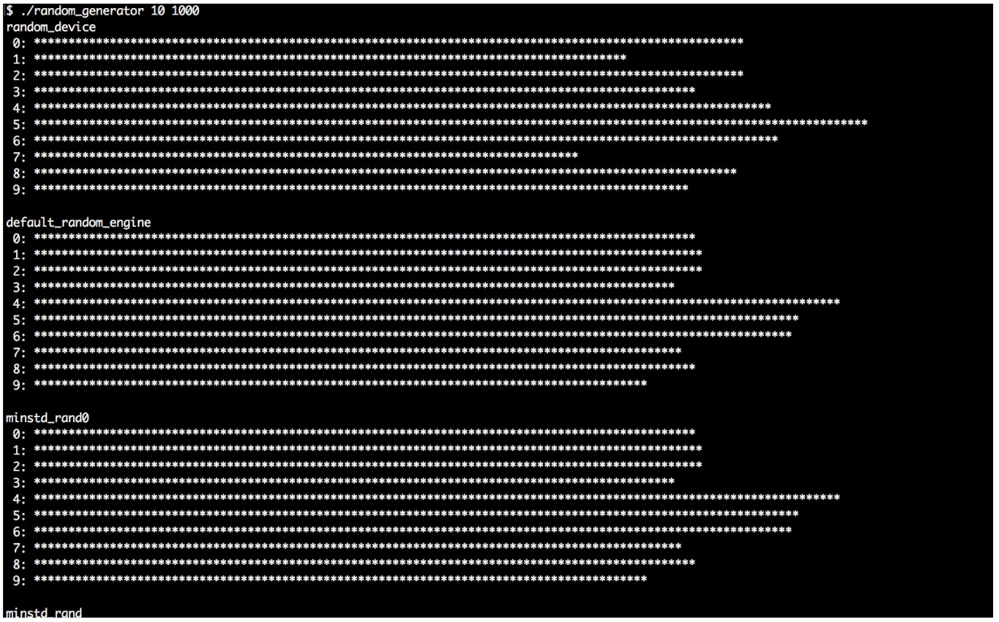
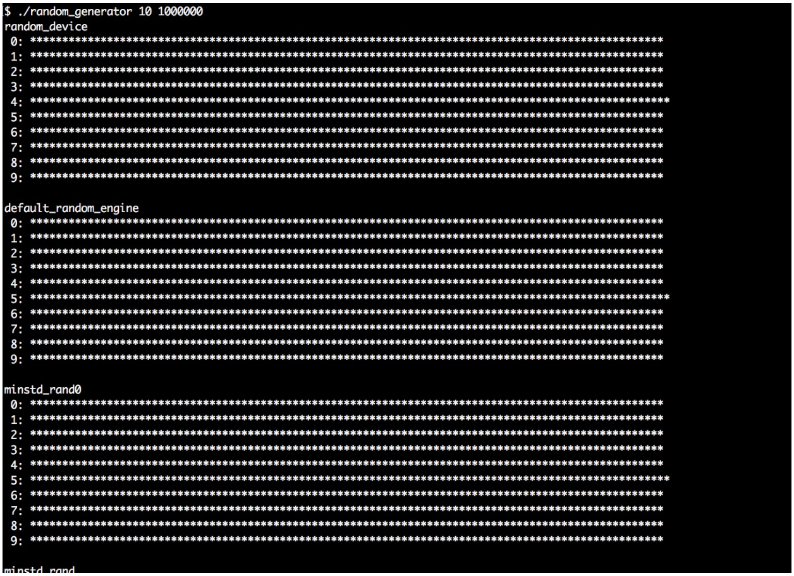

# 选择合适的引擎生成随机数

有时我们在写程序的时候需要用随机数，C++11之前开发者通常会使用C函数`rand()`获取随机数。在C++11之后，STL中添加了一整套随机数生成器，每一个随机数生成器都有自己的特性。

这些生成器并非都是以自解释的方式命名，所以我们要在本节对它们进行了解。本节最后，我们会了解它们有什么不同，哪种情况下应该选择哪一个。不过，这么多生成器，我们不会全部用到。

## How to do it...

我们将实现一个生产者，通过随机生成器画出漂亮的直方图。然后，我们将通过这个生成器运行STL中所有的随机值生成引擎，并且对其产生的结果进行了解。这个程序有很多重复的代码，所以你可以从本书的代码库中直接对源码进行拷贝，这样要比手动输入快得多。

1. 包含必要的头文件，并声明所使用的命名空间：

   ```c++
   #include <iostream>
   #include <string>
   #include <vector>
   #include <random>
   #include <iomanip>
   #include <limits>
   #include <cstdlib>
   #include <algorithm>
   
   using namespace std;
   ```

2. 然后，实现一个辅助函数，其能帮助我们将各种类型的随机数生成引擎的结果进行统计。其接受两个参数：一个`partitions`数和一个`samples`数。随机生成器的类型是通过模板参数`RD`定义的。这个函数中做的第一件事，就是给结果数值类型进行别名。我们同样要保证至少要将所有数字分成10份：

   ```c++
   template <typename RD>
   void histogram(size_t partitions, size_t samples)
   {
       using rand_t = typename RD::result_type;
       partitions = max<size_t>(partitions, 10);
   ```

3. 接下来，我们将使用`RD`类型实例化一个生成器。然后，我们定义一个除数变量`div`。所有随机数引擎所产生的随机数都在`0`到`RD::max()`之间。函数参数`partitions`，允许我们将生成数分成几类。通过对可能的最大值进行分组，我们就能了解每一类的大小如何：

   ```c++
   	RD rd;
   	rand_t div ((double(RD::max()) + 1) / partitions); 
   ```

4. 接着，将使用一个`vector`对生成数进行计数，与我们类型的个数相同。然后，从随机引擎中获取很多随机值，其个数与`samples`数一致。`rd()`表达式会从生成器中得到一个随机数，并且调整内部状态以生成下一个随机数。每个随机数都会与`div`进行相除，这样我们就得到了其所在类的索引号，然后将`vector`对应位置的计数器进行加1：

   ```c++
   	vector<size_t> v (partitions);
       for (size_t i {0}; i < samples; ++i) {
       	++v[rd() / div];
       } 
   ```

5. 现在就有了一个粗粒度的直方图。为了将其进行打印，就要知道实际计数器的值。可以使用`max_element`算法提取计数器的最大值。然后，将计数器的最大值除以100。这样就可以将所有计数器的值除以`max_div`，得到的结果就在0到100的范围内，我们要打印多少星号。当计数器最大值小于100时，因为我们采样的数量也不是很多，所以我们使用`max`函数将被除数的值设置为1：

   ```c++
       rand_t max_elm (*max_element(begin(v), end(v)));
       rand_t max_div (max(max_elm / 100, rand_t(1)));
   ```

6. 将直方图打印在终端上，每个类都有自己的一行。通过对`max_div`的除法确定有多少`*`要进行打印，我们将会在终端上得到一段固定长度的直方图打印：

   ```c++
       for (size_t i {0}; i < partitions; ++i) {
           cout << setw(2) << i << ": "
           	<< string(v[i] / max_div, '*') << '\n';
       }
   }
   ```

7. 现在可以来完成主函数了。我们让用户来确定分成多少类，并对多少数进行采样：

   ```c++
   int main(int argc, char **argv)
   {
       if (argc != 3) {
           cout << "Usage: " << argv[0]
           	<< " <partitions> <samples>\n";
           return 1;
       }
   ```

8. 然后，就可以从命令行来获取这两个值。当然，从命令行获取到的是字符串，我们需要使用`std::stoull`将其转换成数字(stoull为“**s**tring **to u**nsigned **l**ong **l**ong”的缩写)：

   ```c++
   	size_t partitions {stoull(argv[1])};
   	size_t samples {stoull(argv[2])};
   ```

9. 现在我们就可以为STL提供的每种随机数引擎，使用我们的直方图辅助函数。这里就是本节代码最长的部分。你可以选择从代码库中直接拷贝代码过来。然后对程序的输出进行观察。我们从`random_device`开始。这个设备试图将所有随机值均匀分配：

   ```c++
   	cout << "random_device" << '\n';
   	histogram<random_device>(partitions, samples);
   ```

10. 下一个随机引擎为`default_random_engine`，这种引擎的具体实现需要用实现来指定。其可能是后面任何一种随机引擎：

   ```c++
   	cout << "\ndefault_random_engine" << '\n';
   	histogram<default_random_engine>(partitions, samples);
   ```

11. 然后，我们将尝试其他引擎：

    ```c++
        cout << "\nminstd_rand0" << '\n';
        histogram<minstd_rand0>(partitions, samples);
        cout << "\nminstd_rand" << '\n';
        histogram<minstd_rand>(partitions, samples);
    
        cout << "\nmt19937" << '\n';
        histogram<mt19937>(partitions, samples);
        cout << "\nmt19937_64" << '\n';
        histogram<mt19937_64>(partitions, samples);
    
        cout << "\nranlux24_base" << '\n';
        histogram<ranlux24_base>(partitions, samples);
        cout << "\nranlux48_base" << '\n';
        histogram<ranlux48_base>(partitions, samples);
    
        cout << "\nranlux24" << '\n';
        histogram<ranlux24>(partitions, samples);
        cout << "\nranlux48" << '\n';
        histogram<ranlux48>(partitions, samples);
    
        cout << "\nknuth_b" << '\n';
        histogram<knuth_b>(partitions, samples);
    }
    ```

12. 编译并运行程序，就会得到我们想要的结果。我们将看到一段很长的打印信息，并且将看到所有引擎的不同特点。这里我们将类别分为10个，并对1000个数进行采样：

    

13. 然后我们再次执行程序。这次我们仍旧分成10类，但是对1,000,000个数进行采样。其将会生成非常直观的直方图，能更加清晰表现各种引擎的不同点。所以，对于这个程序来说，观察很重要：

    

## How it works...

通常，任何随机数生成器都需要在使用前进行实例化。生成的对象可以像函数一样调用，并无需传入参数，因为其对`operator()`操作符进行了重载。每一次调用都会产生一个新的随机数。其使用起来非常的简单。

本节中，我们写了一个比较复杂的程序，从而对各种随机数生成器进行了了解。可以使用我们的程序，在命令行传入不同的参数，得到如下的结论：

- 我们进行的采样次数越多，计数器分布就越均匀。
- 各个引擎中，计数器的分布有很大差异。
- 进行大量的样本采样时，每个随机数引擎所表现出的性能也是不同的。
- 用少量的采样进行多次的执行。每个分布生成的图形，每次都是一样的——因为随机引擎在每一次重复时，都会生成同样的随机数，这就意味着其生成的不是真正的随机数。这样的引擎具有某种确定性，因为其生成的随机数可以进行预测。唯一的例外就是`std::random_device`。

如同我们所看到的，这里有一些需要进行考量的特性。对于大多数标准应用来说，`std::default_random_engine`完全够用。对于密码学专家或是类似安全敏感的课题，都会有更加多的引擎可供选择。不过，对于一般开发者来说，这里的是否真正随机，对我们的影响并不大。

我们需要从本节总结出三个实际情况：

1. 通常，选择使用`std::default_random_engine`就够用了。
2. 需要生成不确定的随机数时，我们可以使用`std::random_device`。
3. 通过`std::random_device`(或从系统时钟获取的时间戳)对随机数引擎进行初始化，这是为了让其在每次调用时，生成不同的随机数。这种方式也叫做“设置种子”。

> Note：
>
> 如果实际实现库对不确定的随机引擎不支持，那么`std::random_device`将退化成其他随机数引擎。

