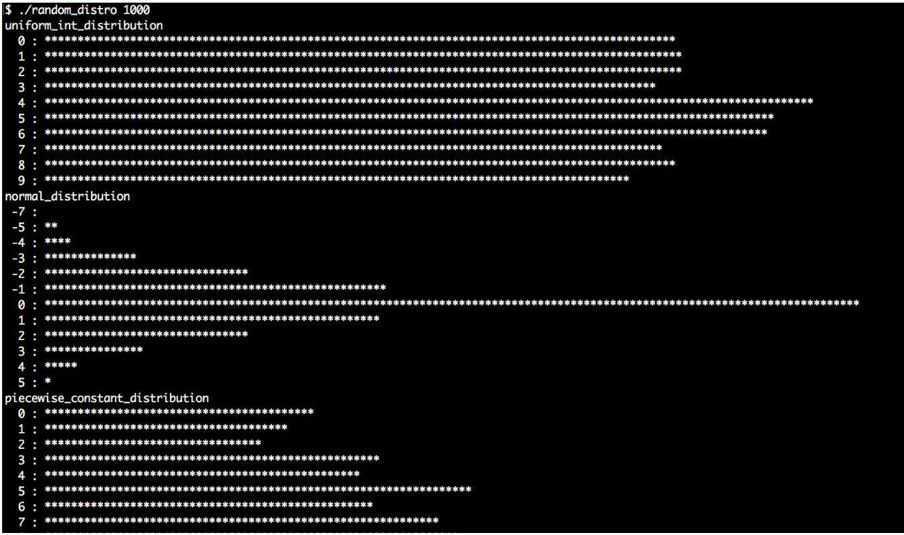

# 让STL以指定分布方式产生随机数

上一节中，我们了解了STL中的随机数引擎。使用引擎或其他方式生成随机数，只是完成了一半的工作。

另一个问题就是，我们需要怎么样的随机数？如何以编码的方式进行掷硬币？通常都会使用`rand()%2`的方式进行，因为其结果为0或1，也就分别代表着硬币的正反面。很公平，不是么；这样就不需要任何多余的库(估计只有数学专业知道，这样的方式获取不到高质量随机数)。

如果我们想要做成一个模型要怎么弄？比如：写成`(rand() % 6) + 1`，这个就表示所要生成的结果。对于这样简单的任务，有没有库进行支持？

当我们想要表示某些东西，并明确其概率为66%呢？Okay，我们可以写一个公式出来`bool yesno = (rand() % 100 > 66)`。(这里需要注意，是使用`>=`合适？还是使用`>`合适？)

如何设置一个不平等的模型，也就是生成数的概率完全不同呢？或是，让我们生成的随机数符合某种复杂的分布？有些问题会很快发展为一个科学问题。为了回到我们的关注点上，让我们了解一下STL所提供的具体工具。

STL有超过10种分布算法，能用来指定随机数的生成方式。本节中，我们将简单的了解一下这些分布，并且近距离了解一下其使用方法。

## How to do it...

我们生成随机数，对生成数进行统计，并且将其分布部分在终端上进行打印。我们将了解到，当想要以特定的分布获取随机值时，应该使用哪种方式：

1. 包含必要的头文件，并声明所使用的命名空间：

   ```c++
   #include <iostream>
   #include <iomanip>
   #include <random>
   #include <map>
   #include <string>
   #include <algorithm>
   
   using namespace std; 
   ```

2. 对于STL所提供的分布来说，我们将从打印出的直方图中看出每种分布的不同。随机采样时，可以将某种分布作为参数传入随机数生成器。然后，我们将实例化默认随机引擎和一个`map`。这个`map`将获取的值与其计数器进行映射，计数器表示这个数产生的频率。我们使用一个限定函数作为随机引擎的指定分布，然后通过随机引擎生成对应分布的随机值：

   ```c++
   template <typename T>
   void print_distro(T distro, size_t samples)
   {
       default_random_engine e;
       map<int, size_t> m;
   ```

3. 使用`samples`变量来表示我们要进行多少次采样，并且在采样过程中对`map`中的计数器进行操作。这样，就能获得非常漂亮的直方图。单独调用`e()`时，随机数引擎将生成一个随机数，`distro(e)`会通过分布对象对随机数的生成进行限定。

   ```c++
       for (size_t i {0}; i < samples; ++i) {
       	m[distro(e)] += 1;
       }
   ```

4. 为了输出到终端窗口中的数据的美观性，需要了解计数器的最大值。`max_element`函数能帮助我们找到`map`中所有计数器中的最大的那一个，然后返回指向具有最大计数器那个节点的迭代器。知道了最大值，就可以让所有计数器对其进行除法，这样就能在终端窗口生成固定长度的图像了：

   ```c++
   	size_t max_elm (max_element(begin(m), end(m),
   		[](const auto &a, const auto &b) {
   			return a.second < b.second;
   		})->second);
   	size_t max_div (max(max_elm / 100, size_t(1)));
   ```

5. 现在来遍历`map`，然后对`*`进行打印，对于每一个计数器来说都有一个固定的长度：

   ```c++
       for (const auto [randval, count] : m) {
           if (count < max_elm / 200) { continue; }
           
           cout << setw(3) << randval << " : "
           	<< string(count / max_div, '*') << '\n';
       }
   }
   ```

6. 主函数中，会对传入的参数进行检查，我们会指定每个分布所使用的采样率。如果用户给定的参数不合适，程序将报错：

   ```c++
   int main(int argc, char **argv)
   {
       if (argc != 2) {
           cout << "Usage: " << argv[0]
           	<< " <samples>\n";
           return 1;
       } 
   ```

7. `std::stoull`会将命令行中的参数转换成数字：

   ```c++
   	size_t samples {stoull(argv[1])};
   ```

8. 首先，来尝试`uniform_int_distribution`和`normal_distribution`，这两种都是用来生成随机数的经典分布。学过概率论的同学应该很熟悉。均匀分布能接受两个值，确定生成随机数的上限和下限。例如，0和9，那么生成器将会生成`[0, 9]`之间的随机数。正态分布能接受平均值和标准差作为传入参数：

   ```c++
       cout << "uniform_int_distribution\n";
       print_distro(uniform_int_distribution<int>{0, 9}, samples);
       
   	cout << "normal_distribution\n";
       print_distro(normal_distribution<double>{0.0, 2.0}, samples);
   ```

9. 另一个非常有趣的分布是`piecewise_constant_distribution`。其能接受两个输入范围作为参数。比如定义为`0, 5, 10, 30`，那么其中的间隔就是0到4，然后是5到9，最后一个间隔是10到29。另一个输入范围定义了权重。比如权重`0.2, 0.3, 0.5`，那么最后生成随机数落在以上三个间隔中的概率为20%，30%和50%。在每个间隔内，生成数的概率都是相同的：

   ```c++
       initializer_list<double> intervals {0, 5, 10, 30};
       initializer_list<double> weights {0.2, 0.3, 0.5};
       cout << "piecewise_constant_distribution\n";
       print_distro(
           piecewise_constant_distribution<double>{
               begin(intervals), end(intervals),
               begin(weights)},
           samples); 
   ```

10. `piecewise_linear_distribution`的构造方式与上一个类似，不过其权重值的特性却完全不同。对于每一个间隔的边缘值，只有一种权重值。从一个边界转换到另一个边界中，概率是线性的。这里我们使用同样的间隔列表，但权重值不同的方式对分布进行实例化：

    ```c++
        cout << "piecewise_linear_distribution\n";
        initializer_list<double> weights2 {0, 1, 1, 0};
        print_distro(
            piecewise_linear_distribution<double>{
                begin(intervals), end(intervals), begin(weights2)},
            samples);
    ```

11. 伯努利分布是另一个非常重要的分布，因为其分布只有“是/否”，“命中/未命中”或“头/尾”值，并且这些值的可能性是指定的。其输出只有0或1。另一个有趣的分布，就是`discrete_distribution`。例子中，我们离散化了一组值`1, 2, 4, 8`。这些值可被解释为输出为0至3的权重：

    ```c++
        cout << "bernoulli_distribution\n";
        print_distro(std::bernoulli_distribution{0.75}, samples);
        
    	cout << "discrete_distribution\n";
        print_distro(discrete_distribution<int>{ {1, 2, 4, 8} }, samples);
    ```

12. 不同分布引擎之间有很大的不同。都非常特殊，也都在特定环境下非常有用。如果你没有听说过这些分布，应该对其特性不是特别的了解。不过，我们的程序中会生成非常漂亮的直方图，通过打印图，你会对这些分布有所了解：

    ```c++
    	cout << "binomial_distribution\n";
        print_distro(binomial_distribution<int>{10, 0.3}, samples);
        cout << "negative_binomial_distribution\n";
        print_distro(
            negative_binomial_distribution<int>{10, 0.8},
            samples);
        cout << "geometric_distribution\n";
        print_distro(geometric_distribution<int>{0.4}, samples);
        cout << "exponential_distribution\n";
        print_distro(exponential_distribution<double>{0.4}, samples);
        cout << "gamma_distribution\n";
        print_distro(gamma_distribution<double>{1.5, 1.0}, samples);
        cout << "weibull_distribution\n";
        print_distro(weibull_distribution<double>{1.5, 1.0}, samples);
        cout << "extreme_value_distribution\n";
        print_distro(
            extreme_value_distribution<double>{0.0, 1.0},
            samples);
        cout << "lognormal_distribution\n";
        print_distro(lognormal_distribution<double>{0.5, 0.5}, samples);
        cout << "chi_squared_distribution\n";
        print_distro(chi_squared_distribution<double>{1.0}, samples);
        cout << "cauchy_distribution\n";
        print_distro(cauchy_distribution<double>{0.0, 0.1}, samples);
        cout << "fisher_f_distribution\n";
        print_distro(fisher_f_distribution<double>{1.0, 1.0}, samples);
        cout << "student_t_distribution\n";
        print_distro(student_t_distribution<double>{1.0}, samples);
    }
    ```

13. 编译并运行程序，就可以得到如下输入。首先让我们对每个分布进行1000个的采样看看：

     

14. 然后在用1,000,000个采样，这样获得的每个分布的直方图会更加的清楚。不过，在生成随机数的过程中，我们也会了解到那种引擎比较快，哪种比较慢：

    

## How it works...

我们通常都不会太在意随机数引擎，不过随着我们对随机数分布的要求和对生成速度的要求，我们就需要通过随机数引擎来解决这个问题。

为了使用任意的分布，首先实例化一个分布对象。会看到不同分布的构造函数所需要的构造参数并不相同。本节的描述中，只使用了一部分分布引擎，因为其中大部分的用途非常特殊，或是使用起来非常复杂。不用担心，所有分布的描述都可以在C++ STL文档中查到。

不过，当具有一个已经实例化的分布时，我们可以像函数一样对其进行调用(只需要一个随机数引擎对象作为参数)。然后，随机数生成引擎会生成一个随机数，通过特定的分布进行对随机值进行限定，然后得到了所限定的随机数。这就导致不同的直方图具有不同的分布，也就是我们程序输出的结果。

可以使用我们刚刚编写的程序，来确定不同分布的功能。另外，我们也对几个比较重要的分布进行了总结。程序中使用到分布并不都会在下表出现，如果你对某个没出现的分布感兴趣，可以查阅C++ STL文档的相关内容。


| 分布                                                         | 描述                                                         |
| ------------------------------------------------------------ | ------------------------------------------------------------ |
| [uniform_int_distribution](http://zh.cppreference.com/w/cpp/numeric/random/uniform_int_distribution) | 该分布接受一组上下限值作为构造函数的参数。之后得到的随机值就都是在这个范围中。我们可能得到的每个值的可能性是相同的，直方图将会是一个平坦的图像。这个分布就像是掷骰子，因为掷到骰子的每一个面的概率都是相等的。 |
| [normal_distribution](http://zh.cppreference.com/w/cpp/numeric/random/normal_distribution) | 正态分布或高斯分布，自然界中几乎无处不在。其STL版本能接受一个平均值和一个标准差作为构造函数的参数，其直方图的形状像是屋顶一样。其分布于人类个体高度或动物的IQ值，或学生的成绩，都符合这个分布。 |
| [bernoulli_distribution](http://zh.cppreference.com/w/cpp/numeric/random/bernoulli_distribution) | 当我们想要一个掷硬币的结果时，使用伯努利分布就非常完美。其只会产生0和1，并且其构造函数的参数是产生1的概率。 |
| [discrete_distribution](http://zh.cppreference.com/w/cpp/numeric/random/discrete_distribution) | 当我们有一些限制的时候，我们就可以使用离散分布，需要我们为每个间隔的概率进行定义，从而得到离散集合的值。其构造函数会接受一个权重值类别，并且通过权重值的可能性产生相应的随机数。当我们想要对血型进行随机建模时，每种血型的概率是不一样，这样这种引擎就能很完美地契合这种需求。 |

