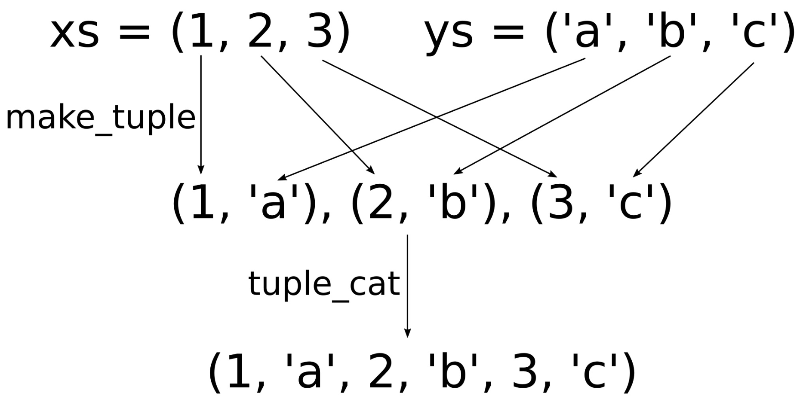

# 使用元组快速构成数据结构

我们已经在上一节中了解元组的基本使用方法。现在我们使用一个结构体，对一些变量进行捆绑：

```c++
struct Foo {
  int a;
  string b;
  float c;
};
```

之前的章节中，为了替代定义结构体，我们可以定义一个元组：

```c++
using Foo = tuple<int, string, float>;
```

我们可以根据类型列表中的索引，从而获取相应变量的具体值。如要访问元组他的第一个类型变量，可以使用`std::get<0>(t)`，第二个类型变量为`std::get<1>(t)`，以此类推。如果索引值过大，编译器会在编译时进行报错。

之前的章节中已经展示了C++17对元组的分解能力，允许我们使用如下的方式快速分解元素，并能对单独元素进行访问：

```c++
auto [a, b, c] = some_tuple
```

绑定和分解单个数据结构，只是元组能力之一。我们也可以想尽办法对元组进行连接和分割。本节中，我们将学习如何完成这样的任务。

## How to do it...

本节，我们将完成对任意元组进行打印的任务。另外，我们将完成一个函数，可以对元组进行zip操作：

1. 包含必要的头文件，并声明所使用的命名空间：

   ```c++
   #include <iostream>
   #include <tuple>
   #include <list>
   #include <utility>
   #include <string>
   #include <iterator>
   #include <numeric>
   #include <algorithm>
   
   using namespace std;
   ```

2. 我们对要处理的元组中的内容非常感兴趣，所以想要对其内容进行展示。因此，将实现一个非常通用的函数，能对任意具有可打印变量的元组进行打印。这个函数能接受一个输出流引用`os`和一个可变的参数列表，其中具有元组中的所有成员。为了解析这些参数，我们将一个参数放在`v`中，其余的放在参数包`vs...`中：

   ```c++
   template <typename T, typename ... Ts>
   void print_args(ostream &os, const T &v, const Ts &...vs)
   {
   	os << v;
   ```

3. 然后，我们就对参数包vs进行处理，其会使用逗号将`initializer_list`中的元素进行隔开。你可以回看一下第4章的[使用同一输入调用多个函数](content/chapter4/chapter4-5-chinese.md)，了解下如何使用Lambda表达式来完成这个操作：

   ```c++
   	(void)initializer_list<int>{((os << ", " << vs), 0)...};
   }
   ```

4. 现在就可以对任意的变量进行打印了，例如：`print_args(cout, 1, 2, "foo", 3, "bar")`。不过，依旧无法对元组进行处理。为了实现打印元组的功能，我们会对输出操作符`<<`进行重载，通过实现一个模板函数来匹配任意元组类型：

   ```c++
   template <typename ... Ts>
   ostream& operator<<(ostream &os, const tuple<Ts...> &t)
   {
   ```

5. 接下来会有些复杂。首先，使用Lambda表达式来接收任意多个参数。当调用Lambda表达式时，启用`os`参数就会传入`print_args`函数中组成新的参数列表。这也就意味着，对`capt_tup(...some parameters...)`的调用，会形成对`print_args(os, ...some parameters...)`的调用：

   ```c++
   	auto print_to_os ([&os](const auto &...xs) {
   		print_args(os, xs...);
   	});
   ```

6. 现在就可以来完成对元组解包的工作了。使用`std::apply`对元组进行解包，所有值将会解析成单独的变量，然后传入到所调用的函数中。当元组t为`(1, 2, 3)`时，调用`apply(capt_tup, t)`等价于`capt_tup(1, 2, 3)`的调用，随后就会调用`print_args(os, 1, 2, 3)`。最后，我们用小括号来包围所要打印的信息：

   ```c++
       os << "(";
       apply(print_to_os, t);
       return os << ")";
   }
   ```

7. Okay，现在已经完成打印元组代码的编写，这将让后续的工作会变得更容易。不过，需要为元组做更多的事情。例如，编写一个可以接受迭代范围的函数。这个函数可以帮助对对应范围进行迭代，然后返回这段范围中所有值的加和，并且找到这个范围内的最小值和最大值，还要能对所有值求平均。并将这四个值打包入一个元组中，我们可以不添加任何新的结构体类型类，来获取其中每一个成员的值：

   ```c++
   template <typename T>
   tuple<double, double, double, double>
   sum_min_max_avg(const T &range)
   {
   ```

8. `std::minmax_element`会返回一对迭代器，其分别表示输入范围内的最小值和最大值。`std::accumulate`将会返回输入范围内所有值的加和。这样就能获得我们元组中的所有元素了！

   ```c++
       auto min_max (minmax_element(begin(range), end(range)));
       auto sum (accumulate(begin(range), end(range), 0.0));
       return {sum, *min_max.first, *min_max.second,
       		sum / range.size()};
   }
   ```

9. 实现主函数之前，我们将实现最后一个神奇辅助函数。为什么说这个函数神奇呢？因为这个函数看起来非常复杂，但当了解工作原理后，你就能理解了，这个函数会对两个元组进行zip操作。也就是说，当传入两个元组`(1, 2, 3)`和`('a', 'b', 'c')`时，函数将会返回一个值为`(1, 'a', 2, 'b', 3, 'c')`的元组：

   ```c++
   template <typename T1, typename T2>
   static auto zip(const T1 &a, const T2 &b)
   {
   ```

10. 接下来，我们将会看到本节中最为复杂的几行代码。我们会创建一个函数对象`z`，其能接受任意数量的参数。其会返回另一个函数对象，返回的函数对象将获取的所有参数打包成`xs`，不过其也能接受任意数量的参数。其内部的函数对象可以对参数列表包`xs`和`ys`进行访问。现在就让我们看一下，如何对这两个参数列表包进行操作。` make_tuple(xs, ys)... `会将参数分组。当`xs = 1, 2, 3`并且`ys = 'a', 'b', 'c'`时，我们将会返回一个新的参数包`(1, 'a'), (2, 'b'), (3, 'c')`。三个元组中，用逗号来对每个成员进行区分。为了获取分组后的元组，我们使用了`std::tuple_cat`，其能接受任意数量的元组，并且将其解包后放入一个元组中。这样我们就可以获得一个新元组`(1, 'a', 2, 'b', 3, 'c')`：

   ```c++
       auto z ([](auto ...xs) {
           return [xs...](auto ...ys) {
           	return tuple_cat(make_tuple(xs, ys) ...);
           };
       });
   ```

11. 最后一步就是将所有输入元组中的成员解包出来，也就是将`a`和`b`进行解包后放入`z`中。`apply(z, a)`就表示将`a`中的所有值放入`xs`中，`apply(..., b) `就表示将`b`中的所有值放入`ys`中。最后的结果元组就是zip后的一个非常大的元组，其会返回给调用者：

    ```c++
    	return apply(apply(z, a), b);
    } 
    ```

12. 我们写了非常多的辅助代码。现在，我们就来使用这些辅助函数。首先，构造出一些元组。`student`类型包括ID，名字，和[GPA](https://zh.wikipedia.org/wiki/%E6%88%90%E7%B8%BE%E5%B9%B3%E5%9D%87%E7%A9%8D%E9%BB%9E)分数。`student_desc`使用人类可读的格式对学生进行介绍。`std::make_tuple`是一个非常不错的工厂函数，因为其能通过传入的参数，自适应的生成对应的元组类型：

    ```c++
    int main()
    {
        auto student_desc (make_tuple("ID", "Name", "GPA"));
        auto student (make_tuple(123456, "John Doe", 3.7)); 
    ```

13. 我们对这些信息进行打印。因为已经对输出流操作符进行过重载，所以打印并不是什么难事：

    ```c++
    	cout << student_desc << '\n'
    		<< student << '\n';
    ```

14. 我们也可以通过`std::tuple_cat`将所有元组进行连接，然后进行打印：

    ```c++
    	cout << tuple_cat(student_desc, student) << '\n';
    ```

15. 我们有可以通过我们的zip函数创建新的元组：

    ```c++
    	auto zipped (zip(student_desc, student));
    	cout << zipped << '\n';
    ```

16. 别忘记`sum_min_max_avg`函数。我们将初始化列表中具有一些数字，并且会将这些数字传入这个函数中。创建了另一个同等大小的元组，其包含了一些描述字符串，这可能会让程序变得复杂一些。通过zip这些元组，并将这些元组交错的存储在了一起：

    ```c++
        auto numbers = {0.0, 1.0, 2.0, 3.0, 4.0};
        cout << zip(
                make_tuple("Sum", "Minimum", "Maximum", "Average"),
                sum_min_max_avg(numbers))
            << '\n';
    }
    ```

17. 编译并运行程序，我们就会得到如下输出。前两行是`student`和`student_desc`元组的打印结果。第3行是使用`tuple_cat`组合后的输出结果。第4行是将学生元组进行`zip`后的结果。最后一行我们将会看到对应数字列表的和值、最小值、最大值和均值。因为有`zip`操作，我们可以清楚地了解这些数字的意义：

    ```c++
    $ ./tuple
    (ID, Name, GPA)
    (123456, John Doe, 3.7)
    (ID, Name, GPA, 123456, John Doe, 3.7)
    (ID, 123456, Name, John Doe, GPA, 3.7)
    (Sum, 10, Minimum, 0, Maximum, 4, Average, 2)
    ```

## How it works...

本节的有些代码的确比较复杂。我们对元组的`operator<<`操作符进行了重载实现，这样看起来比较复杂，但是这样就能对元组中的成员进行打印。然后我们实现`sum_min_max_avg`函数，其会返回一个元组。另外，`zip`应该是个比较复杂的函数。

这里最简单的函数是`sum_min_max_avg`。当我们定义一个函数`tuple<Foo, Bar, Baz> f()`时，我们可以将返回语句写成`return {foo_instance, bar_instance, baz_instance};`，这样函数将会自动的构建一个元组进行返回。如果你对`sum_min_max_avg`中所使用的STL函数有疑问，那可以回看一下第5章，其中有一些STL的基本函数操作。

其他较为复杂的部分，就是一些辅助函数：

**operator<< for tuples**

使用`operator<<`对输出流进行输出时，我们实现了`print_args`函数。其可以接受任意个参数，不过第一个参数必须是一个`ostream`实例：

```c++
template <typename T, typename ... Ts>
void print_args(ostream &os, const T &v, const Ts &...vs)
{
	os << v;
    
	(void)initializer_list<int>{((os << ", " << vs), 0)...};
}
```

这个函数打印的第一个元素是`v`，然后会将参数包`vs`中的元素进行打印。我们将第一个元素单独拎出来的原因是要使用逗号将所有元素进行分隔，但是我们不确定哪个参数是头或是尾(也就是要打印成“1, 2, 3”或是“,1, 2, 3”)。我们在第4章了解到使用Lambda表达式对`initializer_list`进行扩展，也就是[使用同一输入调用多个函数](content/chapter4/chapter4-5-chinese.md)这一节。这个函数，就能帮我们对元组进行打印。`operator<<`实现如下所示：

```c++
template <typename ... Ts>
ostream& operator<<(ostream &os, const tuple<Ts...> &t)
{
    auto capt_tup ([&os](const auto &...xs) {
    	print_args(os, xs...);
    });
    
    os << "(";
    apply(capt_tup, t);
    return os << ")";
}
```

首先我们定义了一个函数对象`capt_tup`。当我们调用`capt_tup(foo, ar, whatever)`时，其实际调用的是print_args(**os**, foo, bar, whatever)。这个函数只会做一件事，就是将可变列表中的参数输出到输出流对象`os`中。

之后，我们使用`std::apply`对元组`t`进行解包。如果这步看起来很复杂，那么可以看一下前一节，以了解`std::apply`的工作原理。

**元素的zip函数**

zip函数能够接收两个元组，虽然其实现很清晰，但是看起来还是异常复杂：

```c++
template <typename T1, typename T2>
auto zip(const T1 &a, const T2 &b)
{
    auto z ([](auto ...xs) {
        return [xs...](auto ...ys) {
        	return tuple_cat(make_tuple(xs, ys) ...);
        };
    });
    return apply(apply(z, a), b);
}
```

为了能更好的了解这段代码，我们可以假设有两个元组，一个元组a为(1, 2, 3)，另一个元组b为('a', 'b', 'c')。

例程中，我们调用了`apply(z, a)`，也就相当于调用函数`z(1, 2, 3)`，其会构造一个哈数对象将这些参数捕获后进行返回，这样1，2，3就被放入参数包`xs`中了。这里会再次调用，`apply(z(1, 2, 3), b)`，会将'a', 'b', 'c'放入参数包`ys`中。

Okay，现在`xs = (1, 2, 3)`，`ys = ('a', 'b', 'c')`，然后会发生什么呢？`tuple_cat(make_tuple(xs, ys) ...)`就会完成下图所描述的过程：



首先，`xs`和`ys`中的成员将会被zip到一起，也就是交叉配对在一起。这个交叉配对发生在`  make_tuple(xs, ys)... `部分，这会将两个元组组成一个元组。为了获得一个大元组，我们使用了`tuple_cat`，通过对元组的级联获取一个大的元组，其包含了所有元组中的成员，并进行了交叉配对。