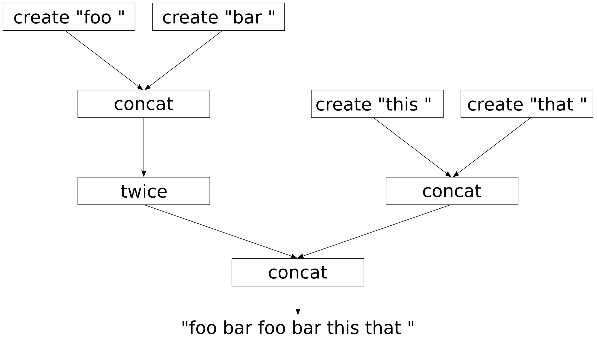
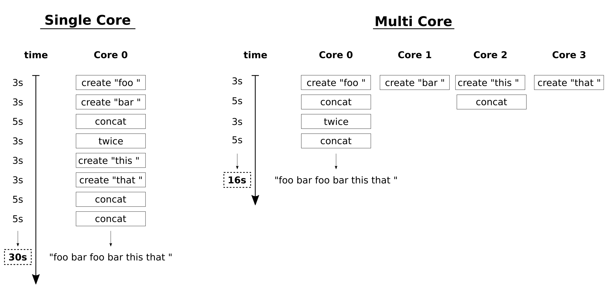

# 实现一个小型自动化并行库——std::future

大多数复杂的任务都能分解为很多子任务。对于所有子任务，我们可以通过画一张有向图无环图来描述哪些子任务键是有依赖的。我们来看一个例子，假设我们想要产出一个字符串`"foo bar foo barthis that "`，我们只能通过一个个字符进行产生，然后将这些词汇拼接在一起。为了完成这项工作，我们提供了三个函数`create`，`concat`和`twice`。

考虑到这一点，我们可以通过绘制DAG图来看一下词组间相互的依赖关系：



实现过程中，当一个CPU核上串行的完成这些工作并没有什么问题。通过依赖关系在多个CPU核上执行任务，当所依赖的任务未完成时，只能处于等待状态。

即使使用`std::async`，这样写出的代码也太无趣了。因为子任务间的依赖关系需要提前建模。本节中，我们将实现两个简单的辅助库，帮助我们将`create`，`concat`和`twice`函数转换成异步的。这样，我们就能找到一种更为优雅的方式，来设置依赖关系图。执行过程中，代码将会以一种智能的方式进行并行计算，并尽快将整个图完成。

## How to do it...

本节中，我们将实现一些函数用来模拟计算敏感型任务，这些任务会互相依赖，我们的任务就是让这些任务尽可能的并行执行：

1. 包含必要的头文件，并声明所使用的命名空间：

   ```c++
   #include <iostream>
   #include <iomanip>
   #include <thread>
   #include <string>
   #include <sstream>
   #include <future>
   
   using namespace std;
   using namespace chrono_literals;
   ```

2. 需要对输出进行同步，所以可以使用之前章节中的同步辅助函数来帮助我们：

   ```c++
   struct pcout : public stringstream {
       static inline mutex cout_mutex;
       
       ~pcout() {
           lock_guard<mutex> l {cout_mutex};
           cout << rdbuf();
           cout.flush();
       }
   };
   ```

3. 现在，我们对三个字符串转换函数进行实现。第一个函数会通过一个C风格的字符串来创建一个`std::string`对象。我们会让这个函数休眠3秒，以模拟计算复杂度：

   ```c++ 
   static string create(const char *s)
   {
       pcout{} << "3s CREATE " << quoted(s) << '\n';
       this_thread::sleep_for(3s);
       return {s};
   }
   ```

4. 下一个函数需要两个字符串对象作为参数，并且返回拼接后的结果。我们让其休眠5秒：

   ```c++
   static string concat(const string &a, const string &b)
   {
       pcout{} << "5s CONCAT "
               << quoted(a) << " "
               << quoted(b) << '\n';
       this_thread::sleep_for(5s);
       return a + b;
   }
   ```

5. 最后一个函数接收一个字符串作为参数，并返回自己和自己拼接后的结果。我们让其休眠3秒：

   ```c++
   static string twice(const string &s)
   {
       pcout{} << "3s TWICE " << quoted(s) << '\n';
       this_thread::sleep_for(3s);
       return s + s;
   }
   ```

6. 对于串行任务来说，这就已经准备好了，但是我们想使用并行的方式来完成。所以，我们还需要实现一些辅助函数。这里需要注意了，下面三个函数看起来有些复杂。`asynchronize`能接收一个函数`f`，并返回一个其捕获到的可调用对象。我们可以传入任意数量的参数到这个可调用的对象中，然后其会将这些参数连同`f`捕获到另一个可调用对象中，并且将这个可调用对象返回给我们。最后一个可调用对象不需要任何参数。之后，其会将参数传入`f`中，并异步的执行函数`f`:

   ```c++
   template <typename F>
   static auto asynchronize(F f)
   {
       return [f](auto ... xs) {
           return [=] () {
           	return async(launch::async, f, xs...);
           };
       };
   } 
   ```

7. 接下来这个函数，将会使用下一步(也就是第8步)中我们声明的函数。其能接受一个函数`f`，并且将该函数捕获到一个可调用的对象中并返回。该对象可以被多个`future`对象所调用。然后，对`future`对象使用`.get()`，来获取`f`中的结果：

   ```c++
   template <typename F>
   static auto fut_unwrap(F f)
   {
       return [f](auto ... xs) {
       	return f(xs.get()...);
       };
   }
   ```

8. 最后一个辅助函数能够接受一个函数`f`。其会返回一个持有`f`函数的可调用对象。这个可调用对象可以传入任意个参数，并且会将函数`f`与这些参数让另一个可调用对象获取。最后，返回给我们的可调用对象无需任何参数。然后，就可以调用`xs...`包中获取到所有可调用对象。这些对象会返回很多`futrue`，这些`future`对象需要使用`fut_unwarp`进行展开。`future`展开，并会通过`std::async `对实际函数`f`进行执行，在通过`future`返回函数`f`执行的结果：

   ```c++
   template <typename F>
   static auto async_adapter(F f)
   {
       return [f](auto ... xs) {
           return [=] () {
               return async(launch::async,
               			fut_unwrap(f), xs()...);
           };
       };
   }
   ```

9. OK，完成以上工作的感觉就是“疯狂”，这种表达式的嵌套让我想起了电影《盗梦空间》的场景(上一步的代码中，Lambda表达式会继续返回一个Lambda表达式)。这段带有魔法的代码，我们会在后面来详细的了解。现在，让我们异步的使用`create`，`concat`和`twice`函数。`async_adapter`是一个非常简单的函数，其会等待`future`参数，并返回一个`future`的结果，其会将同步世界转换成异步世界。我们对`concat`和`twice`使用这个函数。我们必须对`create`使用`asynchronize`，因为其会返回一个`future`，不过我们会使用`future`对象获取到的值，而非`future`对象本身。任务的依赖链，需要从`create`开始：

   ```c++
   int main()
   {
       auto pcreate (asynchronize(create));
       auto pconcat (async_adapter(concat));
       auto ptwice (async_adapter(twice));
   ```

10. 现在我们有了可以自动并行化的函数，其与同步代码的函数名相同，不过添加了前缀`p`。现在，让我们来设置一些比较复杂依赖关系树。首先，我们创建两个字符串`"foo"`和`"bar"`，然后进行拼接，返回`"foo bar"`。在`twice`中，字符串将会和自身进行拼接。然后，创建了字符串`"this"`和`"that"`，拼接得到`"this that"`。最后，我们拼接的结果为`"foo bar foo bar this that"`，结果将会保存在变量`callable`中。最后，调用`callable().get()`进行计算，并等待返回值，然后将返回值进行打印。我们没有调用`callable()`时，计算不会开始，在我们对其进行调用后，就是见证奇迹的时刻：

    ```c++
        auto result (
            pconcat(
                ptwice(
                pconcat(
                    pcreate("foo "),
                    pcreate("bar "))),
                pconcat(
                    pcreate("this "),
                    pcreate("that "))));
    
        cout << "Setup done. Nothing executed yet.\n";
    
        cout << result().get() << '\n';
    }
    ```

11. 编译并运行程序，我们就会看到`create`每一次调用所产生的字符串，然后其他函数也开始执行。这个过程好像是通过智能调度来完成的，整个程序使用16秒完成。如果使用串行的方式，将会使用30s完成。需要注意的是，我们使用4核的机器来运行程序，也就是有4次`create`调用在同时进行。如果机器没有太多和CPU，那么运行时间会更长：

    ```c++
    $ ./chains
    Setup done. Nothing executed yet.
    3s CREATE "foo "
    3s CREATE "bar "
    3s CREATE "this "
    3s CREATE "that "
    5s CONCAT "this " "that "
    5s CONCAT "foo " "bar "
    3s TWICE"foo bar "
    5s CONCAT "foo bar foo bar " "this that "
    foo bar foo bar this that
    ```

## How it works...

本节例子的串行版本，可能看起来如下：

```c++
int main()
{
    string result {
        concat(
            twice(
                concat(
                    create("foo "),
                    create("bar "))),
            concat(
                create("this "),
                create("that "))) };
    
    cout << result << '\n';
}
```

本节中，我们完成了一些辅助函数，`async_adapter`和`asynchronize`，其能帮助我们对`create`，`concat`和`twice`函数进行包装。然后调用其异步版本`pcreate`，`pconcat`和`ptwice`。

先不看这两个函数复杂的实现，我们先来看一下我们获得了什么。

串行版本的代码可能类似如下写法：

```c++
string result {concat( ... )};
cout << result << '\n';
```

并行版本的写法：

```c++
auto result (pconcat( ... ));
cout << result().get() << '\n';
```

好了！现在就是最复杂的环节了。并行最后的结果并不是`string`，而是一个能够返回一个`future<string>`实例的可调用对象，我们可以对返回值调用`get()`得到函数运算后的值。这看起来可能很疯狂。

所以，我们为什么要返回`future`对象呢？问题在于我们的`create`，`concat`和`twice`函数运行起得来都非常慢。不过，我们通过依赖关系树可以看到，数据流还是有可以独立的部分，也就是可并行的部分。让我们来看一下下面两个例子的流水：



左侧边是单核的流水。所有函数一个接一个的在CPU上进行。这样时间累加起来就是30秒。

右侧边是多核的流水。函数会通过依赖关系并行的运行。在有4个核的机器上，我们将同时创建4个子字符串，然后对其进行拼接，等等的操作。并行版本需要16秒就能完成任务。如果我们没法让函数本身变的更快，则我们无法再进行加速。4个CPU的情况下，我们能有如此的加速，其实我们可以以更好的方式进行调度。

应该怎么做？

我们通常会写成如下的模式：

```c++
auto a (async(launch::async, create, "foo "));
auto b (async(launch::async, create, "bar "));
auto c (async(launch::async, create, "this "));
auto d (async(launch::async, create, "that "));
auto e (async(launch::async, concat, a.get(), b.get()));
auto f (async(launch::async, concat, c.get(), d.get()));
auto g (async(launch::async, twice, e.get()));
auto h (async(launch::async, concat, g.get(), f.get()));
```

`a` , ` b` , ` c `和 ` d `都可以作为一个不错的开始，因为会创建对应的子字符串，并且会在后台同时进行创建。不幸的是，这段代码将会在初始化`e`的时候被阻塞。为了拼接`a`和`b`，我们需要调用`get()`函数来获取这两个值，函数会对程序进行阻塞，直到获得相应的值为止。这明显不是一个好方法，因为并行代码会在第一个`get()`调用时阻塞。我们需要更好的策略来解决这个问题。

OK，现在让我们来看看我们在例子中完成的比较复杂的辅助函数。第一个就是`asynchronize`：

```c++
template <typename F>
static auto asynchronize(F f)
{
    return [f](auto ... xs) {
        return [=] () {
        	return async(launch::async, f, xs...);
        };
    };
}
```

当我们有一个函数`int f(int, int) `时，我们可以进行如下的操作：

```c++
auto f2 ( asynchronize(f) );
auto f3 ( f2(1, 2) );
auto f4 ( f3() );
int result { f4.get() };
```

`f2 `就是异步版本的`f`。其调用方式与`f`完全相同。之后，其会返回可调用对象，并保存在`f3`中。现在`f3`得到了`f`和参数`1`和`2`，不过函数还没运行，只是捕获过程。

我们调用`f3()`时，最后就会得到一个`future`实例，因为`f3`中的返回值是`async(launch::async, f, 1, 2);`的返回值。某种意义上来说`f3`表示为*集获取函数和函数参数，与抛出`std::async`返回值与一身的变量*。

内部Lambda表达式只通过捕获进行获取，但不接受任何输入参数。因此，可以让任务并行的方式分发，而不会遭遇任何方式的阻塞。我们对同样复杂的`async_adapter`函数采取同样的策略：

```c++
template <typename F>
static auto async_adapter(F f)
{
    return [f](auto ... xs) {
        return [=] () {
        	return async(launch::async, fut_unwrap(f), xs()...);
        };
    };
}
```

函数能够返回一个函数`f`的模拟函数，因为其能接受相同的参数。然后，函数会返回一个可调用对象，并且也不接受任何参数，这里返回的可调用对象与其他辅助函数所返回的有所不同。

` async(launch::async, fut_unwrap(f), xs()...);`是什么意思呢？其中`xs()...`部分意味着，所有参数都保存在`xs`包中，供可调用对象使用，并且返回的可调用对象都不需要参数。那些可调用对象通过自身的方式生产`future`变量，通过对`future`变量调用`get()`获得实际返回值。这也就是`fut_unwrap`所要完成的事情：

```c++
template <typename F>
static auto fut_unwrap(F f)
{
    return [f](auto ... xs) {
    	return f(xs.get()...);
    };
}
```

`fut_unwrap`会将函数`f`转换为一个可调用对象，其能接受一组参数。函数对象执行之后可以对所有的`future`对象调用`.get()`，从而获得`f`函数实际的执行结果。

我们花点时间来消化一下上面的内容。当主函数中调用这些函数，使用`auto result (pconcat(...));`的方式创建调用链，将所有子字符串最后拼接成一个长字符串。这时对`async`的调用还未完成。然后，当调用`result()`时，我们则获得`async`的返回值，并对其返回值调用`.get()`，这就能保证任何线程不会发生阻塞。实际上，在`async`调用前，不会有`get()`的调用。

最后，我们可以对`result()`的返回值调用`.get()`，从而获取最终的结果字符串。