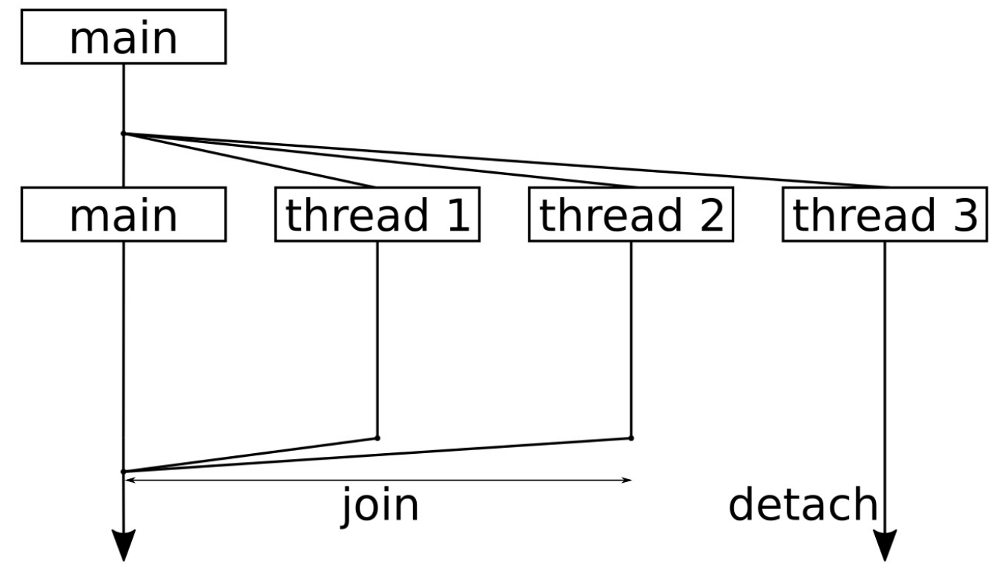

# 启动和停止线程

C++11中添加了`std::thread`类，并能使用简洁的方式能够对线程进行启动或停止，线程相关的东西都包含在STL中，并不需要额外的库或是操作系统的实现来对其进行支持。

本节中，我们将实现一个程序对线程进行启动和停止。如果是第一次使用线程的话，就需要了解一些细节。

## How to do it...

我们将会使用多线程进行编程，并且会了解到，当程序的某些部分使用多线程时，代码会如何进行操作：

1. 包含必要的头文件，并声明所使用的命名空间：

   ```c++
   #include <iostream>
   #include <thread>
   
   using namespace std;
   using namespace chrono_literals;
   ```

2. 启动一个线程时，我们需要告诉代码如何执行。所以，先来定义一个函数，这个函数会在线程中执行。这个函数可接受一个参数`i`，可以看作为线程的ID，这样就可以了解打印输出对应的是哪个线程。另外，我们使用线程ID来控制线程休眠的时间，避免多个线程在同时执行`cout`。如果出现了同时打印的情况，那就会影响到输出。本章的另一个章节会来详述这个问题：

   ```c++
   static void thread_with_param(int i)
   {
       this_thread::sleep_for(1ms * i);
       
       cout << "Hello from thread " << i << '\n';
       
       this_thread::sleep_for(1s * i);
       
       cout << "Bye from thread " << i << '\n';
   }
   ```

3. 主函数中，会先了解在所使用的系统中能够同时运行多少个线程，使用`std::thread::hardware_concurrency`进行确定。这个数值通常依赖于机器上有多少个核，或是STL实现中支持多少个核。这也就意味着，对于不同机器，这个函数会返回不同的值：

   ```c++
   int main()
   {
       cout << thread::hardware_concurrency()
       	<< " concurrent threads are supported.\n";
   ```

4. 现在让我们来启动线程，每个线程的ID是不一样的，这里我们启动三个线程。我们使用实例化线程的代码行为`thread t {f, x}`，这就等于在新线程中调用`f(x)`。这样，在不同的线程中就可以给于`thread_with_param`函数不同的参数：

   ```c++
   	thread t1 {thread_with_param, 1};
       thread t2 {thread_with_param, 2};
       thread t3 {thread_with_param, 3};
   ```

5. 当启动线程后，我们就需要在其完成其工作后将线程进行终止，使用`join`函数来停止线程。调用`join`将会阻塞调用线程，直至对应的线程终止为止：

   ```c++
   	t1.join();
   	t2.join();
   ```

6. 另一种方式终止的方式是分离。如果不以`join`或`detach`的方式进行终止，那么程序只有在`thread`对象析构时才会终止。通过调用`detech`，我们将告诉3号线程，即使主线程终止了，你也可以继续运行：

   ```c++
   	t3.detach();
   ```

7. 主函数结束前将打印一段信息：

   ```c++
   	cout << "Threads joined.\n";
   }
   ```

8. 编译并运行程序，就会得到如下的输出。我们可以看到我们的机器上有8个CPU核。然后，我们可以看到每个线程中打印出的*hello*讯息，但是在主线程最后，我们只对两个线程使用`join`。第3个线程等待了3秒，但是再主线程结束的时候，其只完成了2秒的等待。这样，我们就没有办法看到线程3的结束信息，因为主函数在结束之后，我们就没有任何机会将其进行杀死了：

   ```c++
   $ ./threads
   8 concurrent threads are supported.
   Hello from thread 1
   Hello from thread 2
   Hello from thread 3
   Bye from thread 1
   Bye from thread 2
   Threads joined.
   ```

## How it works...

启动和停止线程其实没有什么困难的。多线程编程的难点在于，如何让线程在一起工作(共享资源、互相等待，等等)。

为了启动一个线程，我们首先定义一些执行函数。没有特定的规定，普通的函数就可以。我们来看一个简化的例子，启动线程并等待线程结束：

```c++
void f(int i) { cout << i << '\n'; }

int main()
{
    thread t {f, 123};
    t.join();
}
```

`std::thread`的构造函数允许传入一个函数指针或一个可调用的对象，通过这个参数，我们就可以对函数进行调用。当然，我们也可以使用没有任何参数的函数。

如果系统中有多个CPU核，那么线程就可以并行或并发的运行。并行与并发之间有什么区别呢？当计算机只有一个CPU核时，也可以有很多线程并行，但就不可能是并发的了，因为在单核CPU上，每个时间片上只有一个线程在执行。线程在单核上交错着运行，当一个时间片结束后，会对下一个线程进行执行(不过对于使用者来说，看起来就像是同时在运行)。如果线程间可以不去分享一个CPU和，那么这些线程就是并发运行。其实**并发**才是真正的同时运行。

这样，以下几点是我们绝对无法控制的：

- 共享一个CPU核时，无法控制线程交替运行的顺序。
- 线程也是有优先级的，优先级会影响线程执行的顺序。
- 实际上线程是分布在所有CPU核上的，当然操作系统也可以将线程绑定在一个核上。这也就意味着所有的线程可以运行在单核上，也可以运行在具有100个CPU核的机器上。

大多数操作系统都会提供对多线程编程提供一些可能性，不过这些特性并没包含在STL中。

在启动和停止线程的时候，告诉他们要做什么样的工作，并且什么时候线程停止工作。对于大多数应用来说就够用了。本节中，我们启动的3个线程。之后，对其中两个进行了`join`，另一个进行`detach`。让我们使用一个简单的图来总结一下本节的代码：



这幅图的顺序是自顶向下，你会看到我们将整个程序分成了4个线程。一开始，启动了额外3个线程来完成一些事情，之后主线程仅等待其他线程的结束。

线程结束对函数的执行后，会从函数中返回。标准库会进行相关的操作，将线程从操作系统的中删除，或用其他方式销毁，所以这里就不用操心了。

我们需要关心的就是`join`。当对线程对象调用函数`x.join()`时，其会让调用线程休眠，直至`x`线程返回。如果线程处于一个无限循环中，就意味着程序无法终止。如果想要一个线程继续存活，并持续到自己结束的时候，那就可以调用`x.detach()`。之后，就不会在等这个线程了。不管我们怎么做——都必须`join`或`detach`线程。如果不想使用这两种方式，可以在线程对象的析构函数中调用`std::terminate()`，这个函数会让程序“突然死亡”。

主函数返回时，整个程序也就结束了。不过，第3个线程`t3`还在等待，并将对应的信息打印到终端。操作系统才不会在乎——会直接将我们的程序终止，并不管是否有线程还未结束。要怎么解决这个这个问题，就是开发者要考虑的事情了。