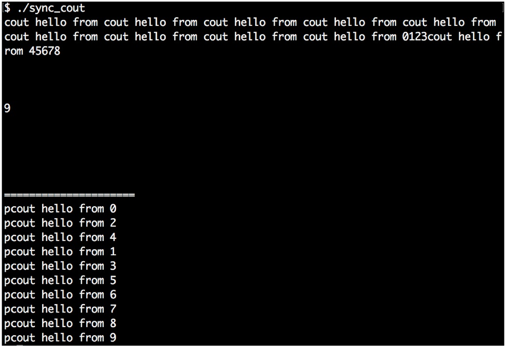

# 同步并行中使用std::cout

多线程中的一个麻烦的地方在于，需要对并发线程所要访问的共享数据使用互斥量或其他方式进行保护，以避免让多线程修改失控。

其中`std::cout`打印函数通常被使用到。如果多个线程同时调用`cout`，那么其输出将会混合在一起。为了避免输出混在一起，我们将要用我们的函数进行并发安全的打印。

我们将会了解到，如何完成对`cout`的包装，并使用最少量的代码进行最优的打印。

## How to do it...

本节中，将实现一个并发打印安全的函数。避免将打印信息全部混在一起，我们实现了一个辅助类来帮助我们在线程间同步打印信息。

1. 包含必要的头文件，并声明所使用的命名空间：

   ```c++
   #include <iostream>
   #include <thread>
   #include <mutex>
   #include <sstream>
   #include <vector>
   
   using namespace std;
   ```

2. 然后实现辅助类，其名字为`pcout`。其中字母p代表parallel，因为其会将并发的上下文进行同步。`pcout`会`public`继承于`stringstream`。这样，我们就能直接对其实例使用`<<`操作符了。当`pcout`实例销毁时，其析构函数会对一个互斥量进行加锁，然后将`stringstream`缓冲区中的内容进行打印。我们将在下一步了解，如何对这个类进行使用：

   ```c++
   struct pcout : public stringstream {
       static inline mutex cout_mutex;
      
       ~pcout() {
           lock_guard<mutex> l {cout_mutex};
           cout << rdbuf();
           cout.flush();
       }
   };
   ```

3. 现在，让我们来完成两个函数，这个两函数可运行在额外的线程上。每个线程都有一个线程ID作为参数。这两个函数的区别在于，第一个就是简单的使用`cout`进行打印。另一个使用`pcout`来进行打印。对应的实例都是一个临时变量，只存在于一行代码上。在所有`<<`调用执行完成后，我们想要的字符流则就打印在屏幕上了。然后，调用`pcout`实例的析构函数。我们可以了解到析构函数做了什么事：其对一个特定的互斥量进行上锁，所有`pcout`的实例都会这个互斥量进行共享：

   ```c++
   static void print_cout(int id)
   {
   	cout << "cout hello from " << id << '\n';
   }
   
   static void print_pcout(int id)
   {
   	pcout{} << "pcout hello from " << id << '\n';
   }
   ```

4. 首先，我们使用`print_cout`，其会使用`cout`进行打印。我们并发的启动10个线程，使用其打印相应的字符串，并等待打印结束：

   ```c++
   int main()
   {
       vector<thread> v;
       
       for (size_t i {0}; i < 10; ++i) {
       	v.emplace_back(print_cout, i);
       }
      
       for (auto &t : v) { t.join(); }
   ```

5. 然后，使用`print_pcout`来完成同样的事情：

   ```c++
       cout << "=====================\n";
   
       v.clear();
       for (size_t i {0}; i < 10; ++i) {
       	v.emplace_back(print_pcout, i);
       }
       
   	for (auto &t : v) { t.join(); }
   }
   ```

6. 编译并运行程序，我们就会得到如下的输出。如我们所见，前10行打印完全串行了。我们无法了解到哪条信息是由哪个线程所打印的。后10行的打印中，我们使用`print_pcout`进行打印，就不会造成任何串行的情况。可以清楚的看到不同线程所打印出的信息，因为每次运行的时候打印顺序都是以类似随机数的方式出现：

   

## How it works...

OK，我们已经构建了“cout包装器”，其可以在并发程序中串行化的对输出信息进行打印。其是如何工作的呢？

当我们一步一步的了解`pcout`的原理，就会发现其工作的原理并不神奇。首先，实现一个字符流，能接受我们输入的字符串：

```c++
stringstream ss;
ss << "This is some printed line " << 123 << '\n';
```

然后，其会对全局互斥量进行锁定：

```c++
{
	lock_guard<mutex> l {cout_mutex};
```

锁住的区域中，其能访问到字符流`ss`，并对其进行打印。离开这个代码段时，对互斥锁进行释放。`cout.flush()`这会告诉字符流对象立即将其内容打印到屏幕上。如果没有这一行，程序将会运行的更快，因为多次的打印可能会放在一起打印。我们的代码中，想立即看到打印信息，所以我们使用了`flush`：

```c++
    cout << ss.rdbuf();
    cout.flush();
}
```

OK，这就很简单了吧，但每次都写这几行代码，就会让整体的代码变的很冗长。我们可以将`stringstream`的实例化简写为如下的方式：

```c++
stringstream{} << "This is some printed line " << 123 << '\n';
```

这个字符串流对象的实例，可以容纳我们想打印的任何字符，最后对字符串进行析构。字符串流的声明周期只在这一行内存在。之后，我们无法打印任何东西，因为我们无法对其进行访问。最后，哪段代码能访问流的内容呢？其就是`stringstream`的析构函数。

我们无法对`stringstream`实例的成员函数进行修改，但是可以对通过继承的方式包装成我们想要的类型：

```c++
struct pcout : public stringstream {
    ~pcout() {
        lock_guard<mutex> l {cout_mutex};
        cout << rdbuf();
        cout.flush();
    }
};
```

这个类依旧是一个字符串流，并且可以像字符串流一样对这个类型进行使用。不同的是，其会对互斥量进行上锁，并且将其内容使用`cout`进行输出。

我们也会将`cout_mutex`对象作为静态实例移入`pcout`结构体中，所以可以让不同的实例共享一个互斥量。

